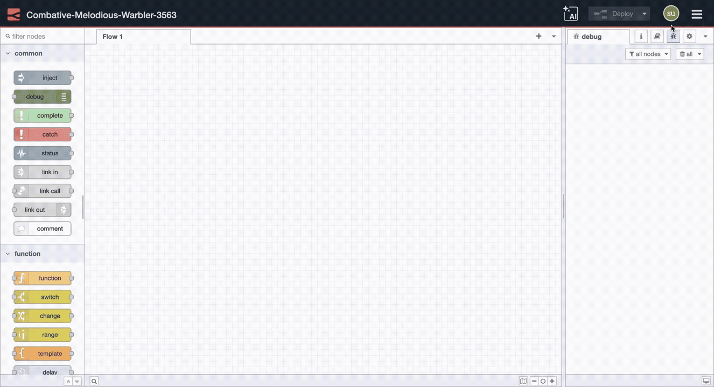

---
eleventyNavigation:
  key: Node-RED Library
  parent: Getting Started
  order: 3
meta:
   title: Node-RED Library – A Curated and Actively Maintained List of Nodes
   description: Browse the Node-RED Library for community-built nodes and integrations. FlowFuse's curated catalog offers tested, documented, enterprise-ready solutions with professional support for critical deployments.
   keywords: node-red library, node-red nodes, node-red integrations, community nodes, node-red packages, custom nodes, node-red flows
---

# Node-RED Library

The Node-RED library contains thousands of community-contributed nodes that extend Node-RED's core functionality. These pre-built nodes enable connections to hardware devices, cloud services, databases, APIs, and industrial protocols without requiring custom development.

The library operates as a central repository where developers share installable packages. Each package adds new nodes to your Node-RED palette, from basic utility functions to sophisticated enterprise integrations. If you need to connect to a specific system or protocol, there's likely an existing node available.

## FlowFuse Integration Catalog

While the community library offers extensive options, finding production-ready integrations can be challenging. Documentation quality varies significantly, maintenance is inconsistent, and enterprise scalability isn't always guaranteed.

The **[FlowFuse Integration Catalog](/integrations/)** provides vetted, production-grade integrations designed for industrial and enterprise deployments. Created and curated by FlowFuse and the Node-RED community, the catalog includes:

- **Tested integrations** verified for enterprise-scale applications
- **Complete documentation** with implementation examples and troubleshooting guides
- **Security-focused** configurations following industry best practices
- **Active maintenance** with regular updates and version compatibility
- **Professional support** available for critical implementations

Our catalog covers databases, communication protocols, IoT devices, and automation workflows. Each integration includes detailed setup instructions, real-world use cases, and configuration recommendations. New nodes are continuously being added to expand the catalog's capabilities.

To strengthen the ecosystem and ensure high-quality nodes, FlowFuse launched the **Certified Nodes 2.0** program, which partners with expert node developers and provides financial rewards for maintaining enterprise-grade nodes.

FlowFuse takes full responsibility for maintaining and supporting these integrations. If you need a specific integration or feature added to the catalog, [reach out to us](/contact-us/)—we're here to help ensure you have the tools needed for your production deployments.

## Installing Nodes from the Library

### Using the Palette Manager

To install nodes through the Node-RED editor:

1. Open your Node-RED editor
2. Click the menu icon (☰) in the top-right corner
3. Select **Manage palette**
4. Navigate to the **Install** tab
5. Search for the required node
6. Click **Install** next to the package

{data-zoomable}

Installed nodes appear in your palette immediately and are ready for use in your flows.

### Using Command Line (npm)

For automated deployments or when working directly on the server, you can install nodes using npm. 

Navigate to your Node-RED user directory (typically `~/.node-red` or `/opt/flowfuse-device` if using [flowfuse agent](/product/device-agent/)) and run:

```bash
npm install node-red-contrib-example
```

After installation, restart Node-RED to load the new nodes into your palette.
