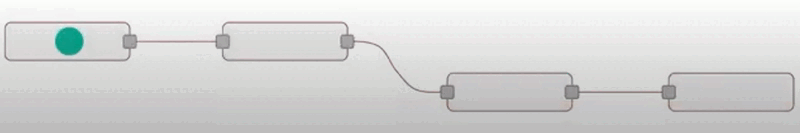
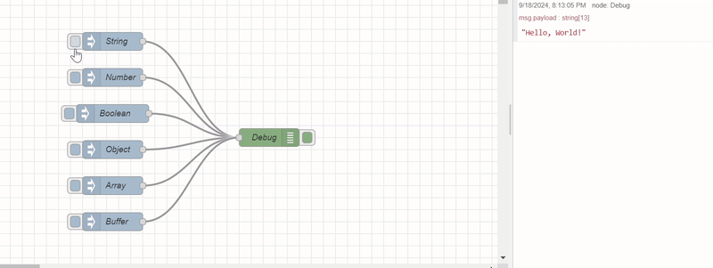
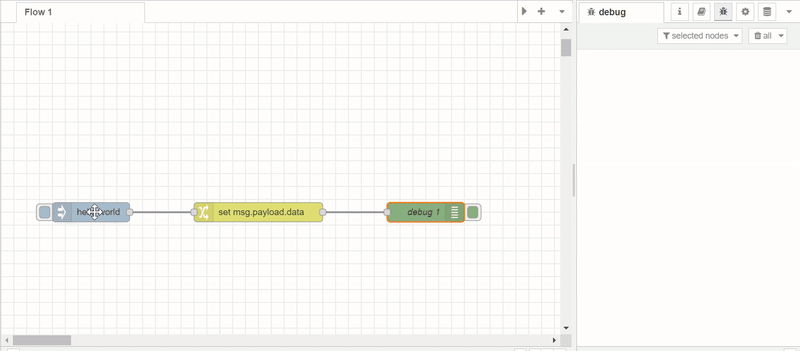
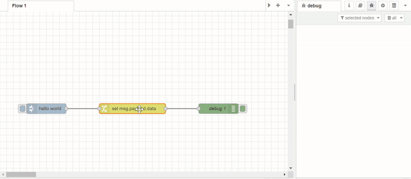

---
eleventyNavigation:
  key: Working with Messages
  order: 5
  parent: Getting Started
meta:
  title: Understanding Node-RED Messages
  description: A comprehensive guide to working with Node-RED messages, ensuring error-free flows and optimized data handling.
  keywords: msg.payload node red, node red message structure, node-red messages, node red msg.payload, msg.payload, node red msg.payload array
---

# {{ meta.title }}

Node-RED operates by passing messages between nodes to create dynamic IoT, automation, and data-processing workflows. Each message transports data that nodes read, modify, process, or analyze. Understanding message structure and handling is essential for building reliable flows. Poor message management can cause subtle bugs like data overwrites, infinite loops, or system crashes.

This guide explores Node-RED message mechanics, common pitfalls, and best practices for maintaining smooth, error-free data flow.

## What Are Node-RED Messages?

Messages in Node-RED are data packets that flow between nodes in your workflow. Node-RED follows an event-driven architecture where nodes act as both event emitters and listeners, with messages serving as the communication medium between them.

{data-zoomable}
_Node-RED message passing visualization_

Messages carry the data that powers your workflows—sensor readings, user inputs, API responses, and more. Fundamentally, Node-RED messages are JavaScript objects, providing a flexible structure for managing and transferring data throughout your flows.

### JavaScript Objects Primer

A [JavaScript object](https://www.youtube.com/watch?v=BRSg22VacUA) is a data structure that stores multiple values in key-value pairs. Each key (property) associates with a specific value, allowing organized access to related data.

Example:

```javascript
{
  name: "Bob",
  age: 24,
  married: true
}
```

Here, `name`, `age`, and `married` are object properties. Node-RED messages use this same structure to organize and transport data within flows.

## Anatomy of Node-RED Messages

Node-RED messages are referenced as `msg` by default, and nodes are designed around this convention.

Key message properties include:

- **`msg._msgid`**: A unique identifier automatically assigned by Node-RED for tracking and debugging messages within flows.
- **`msg.payload`**: The primary data container. This holds the main information that nodes process—sensor readings, user input, computed results, etc.
- **`msg.topic`**: An optional property for categorizing or identifying messages, useful for routing or filtering based on context.

These are the most frequently used properties, though additional custom properties can be added as needed.

The `_msgid` property appears automatically, even when sending an empty object between nodes. However, `payload` and `topic` are not always present—their inclusion depends on whether nodes append them. Most Node-RED nodes, including community-contributed ones, use `payload` as the standard communication property.

## Data Types in Node-RED Messages

Understanding data types is crucial when working with Node-RED messages. Messages themselves must always be JavaScript objects, or Node-RED will throw an error.

One exception: you can send `null` as a message. This effectively stops message propagation, preventing data from flowing to subsequent nodes.

Message property values can be any JavaScript-supported data type:
- [String](https://developer.mozilla.org/en-US/docs/Web/JavaScript/Reference/Global_Objects/String)
- [Number](https://developer.mozilla.org/en-US/docs/Web/JavaScript/Reference/Global_Objects/Number)
- [Array](https://developer.mozilla.org/en-US/docs/Web/JavaScript/Reference/Global_Objects/Array)
- [Boolean](https://developer.mozilla.org/en-US/docs/Web/JavaScript/Reference/Global_Objects/Boolean)
- [Object](https://developer.mozilla.org/en-US/docs/Web/JavaScript/Reference/Global_Objects/Object)
- [Buffer](https://developer.mozilla.org/en-US/docs/Web/JavaScript/Reference/Global_Objects/ArrayBuffer)
- Other complex data types

{data-zoomable}
_Various data types supported by Node-RED_

## How to Clone Messages and Properties

Cloning creates an independent copy of a message or its properties, allowing modifications without affecting the original. This is essential when sending different versions of data to multiple flow branches or when preserving original data for comparison.

### Using the Change Node

The **Change** node provides a visual interface for modifying and cloning message properties. Note that you cannot clone the entire `msg` object in change node at once—properties must be copied individually. The Change node can clone properties to other `msg` properties, or to flow/global context.

Steps to clone using the Change node:

1. Double-click on the **Change** node to open its configuration dialogue.
2. You will see an interface with an existing item added by default.
3. On the left side of the field, you will see options like **"Set"**, **"Change"**, **"Delete"**, and **"Move"**. You can use these options to perform the corresponding operations on the message.
4. To clone the property `msg.payload` to `flow.data`, select the **"Set"** action. In the first **"Property"** field, enter `payload`, and in the **"to the value"** field, select **flow** and enter `data`. For cloning `msg` properties to new `msg` properties, select **msg** in the second field and specify the new property name.

For comprehensive information on Change node capabilities, including Delete, Move, and Change actions, refer to the [Change Node documentation](https://nodered.org/docs/user-guide/nodes).

### Using the Function Node

The Function node offers programmatic control over message cloning using JavaScript:

```js
// Clone the entire message
var newMsg = RED.util.cloneMessage(msg);

// Modify the clone safely (original remains unchanged)
newMsg.payload = "Modified data";

// Return the original message
return msg;
```

**Critical Note:** Direct assignment like `let newMsg = msg;` does **not** create a true clone. It creates a reference to the same object, meaning changes to `newMsg` will affect `msg` as both point to the same data.

```js
// This creates a reference, NOT a clone
var newMsg = msg;

// Modifying newMsg also modifies the original msg
newMsg.payload = "Modified data";

return msg; // The original is now changed!
```

To clone specific properties only:

```js
// Clone selective properties
var newMsg = {};
newMsg.payload = msg.payload;  // Copy payload
newMsg.topic = msg.topic;      // Copy topic

return newMsg;
```

## Adding New Properties to Messages

Node-RED messages are JavaScript objects, making them highly flexible for customization. You can add unlimited properties to carry additional data through your flow—metadata, tags, timestamps, configuration details, and more.

### Using the Change Node

The Change node allows property addition without coding:

1. Drag a **Change** node into your flow and open configuration.
2. Select the **Set** action.
3. In the **Property** field, enter the new property name (e.g., `msg.customData`).
4. In the **To** field, enter the value—this can be a string, number, boolean, JSONata expression, or reference to another property.

### Using the Function Node

For programmatic control, add properties in a Function node:

```js
// Add custom properties to the message
msg.customData = {
    description: "Sensor reading from device A",
    timestamp: new Date().toISOString(),
    location: "Building 3, Floor 2"
};

// Return the enhanced message
return msg;
```

## Deleting and Moving Message Properties

In addition to adding and cloning properties, you may need to remove or relocate properties within messages. 

### Deleting Properties

#### Using the Change Node

Use the **Delete** action to remove unwanted properties from messages:

1. Double-click on the **Change** node to open its configuration dialogue.
2. Select the **"Delete"** action from the dropdown.
3. In the **"Property"** field, specify the property to remove (e.g., `msg.tempData`).

#### Using the Function Node

To delete properties programmatically in a Function node, use the `delete` operator:
```js
// Delete a single property
delete msg.tempData;

// Delete multiple properties
delete msg.tempData;
delete msg.oldPayload;
delete msg.metadata;

return msg;
```

### Moving Properties

#### Using the Change Node

Use the **Move** action to relocate a property to a new location while removing it from the original location:

1. Double-click on the **Change** node to open its configuration dialogue.
2. Select the **"Move"** action from the dropdown.
3. In the first **"Property"** field, specify the source property (e.g., `msg.payload`).
4. In the **"to"** field, specify the destination property (e.g., `msg.oldPayload`).

#### Using the Function Node

To move a property programmatically in a Function node, copy the property to its new location and then delete it from the original:
```js
// Move msg.payload to msg.oldPayload
msg.oldPayload = msg.payload;
delete msg.payload;

// Or move a nested property
msg.backup = {
    data: msg.tempData
};
delete msg.tempData;

return msg;
```

**Important Note:** Just like with cloning, if you need to move a property that contains an object or array and want to ensure the original is completely removed from memory, you should clone it first:
```js
// Move with cloning (for objects/arrays)
msg.oldPayload = RED.util.cloneMessage(msg.payload);
delete msg.payload;

return msg;
```

This ensures that the moved property is independent and modifications to the new location won't affect any lingering references to the old location.

## Handling JSON Messages

Working with [JSON](https://developer.mozilla.org/en-US/docs/Learn/JavaScript/Objects/JSON) is common in Node-RED, especially with APIs and IoT data. JSON (JavaScript Object Notation) is a lightweight data-exchange format.

Two forms of JSON exist in Node-RED:

1. **JSON Object**: A structured JavaScript object that can be directly manipulated—access properties, modify values, pass through nodes seamlessly.

2. **JSON String**: A serialized JSON representation, commonly used when transmitting data between systems. Unlike objects, JSON strings cannot be directly manipulated as structured data.

### Converting JSON String to JSON Object

To work with a JSON string as a JavaScript object, convert it using the **JSON** node. This node parses the string into a usable object structure.

Steps:

1. Drag the **JSON** node onto the canvas.
2. Double-click to configure.
3. Set the action to "Always convert to JavaScript Object" and click Done.
4. Connect the JSON node between the source node (sending the JSON string) and the destination node (requiring the parsed object).

The JSON node automatically converts incoming JSON strings into JavaScript objects. For more details, see the [JSON node documentation](/node-red/core-nodes/json/).

## Common Mistakes to Avoid

Avoiding these pitfalls ensures smooth flow operation:

### 1. Adding Properties to Non-Object Types

Attempting to add properties to primitive types (strings, numbers) causes errors.

**Incorrect:**
```javascript
msg.payload = 'stringValue';
msg.payload.newProperty = 'value';  // Error: Cannot add property to string
return msg;
```

**Correct:**
```javascript
msg.payload = {};  // Initialize as object
msg.payload.newProperty = 'value';
return msg;
```

This commonly occurs when an Inject node sends `msg.payload` as a string or number, then a Change node attempts to add properties to it.

{data-zoomable}
_Incorrect: Adding properties to a non-object type_

{data-zoomable}
_Correct: Initialize as object before adding properties_

### 2. Overwriting the Entire Message Object

Accidentally replacing the entire `msg` object loses important properties like `_msgid`, `topic`, and custom metadata.

**Incorrect:**
```javascript
msg = { newProperty: 'value' };  // Destroys existing msg structure
return msg;
```

**Correct:**
```javascript
msg.newProperty = 'value';  // Preserves existing properties
return msg;
```

### 3. Returning Incorrect Data Types

Node-RED expects function nodes to return message objects. Returning primitives breaks the flow.

**Incorrect:**
```javascript
return "some string";  // Error: Not a valid message
```

**Correct:**
```javascript
msg.payload = "some string";
return msg;
```

### 4. Forgetting to Return the Message

In Function nodes, forgetting the return statement halts the flow at that node.

**Incorrect:**
```javascript
msg.payload = msg.payload * 2;
// Missing return statement - flow stops here
```

**Correct:**
```javascript
msg.payload = msg.payload * 2;
return msg;  // Flow continues
```

By mastering Node-RED message handling and avoiding common mistakes, you can build robust, efficient workflows. Understanding JSON conversion, message cloning, and proper property management ensures smooth data flow between nodes and maintainable, error-free applications.