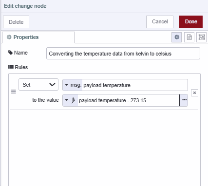
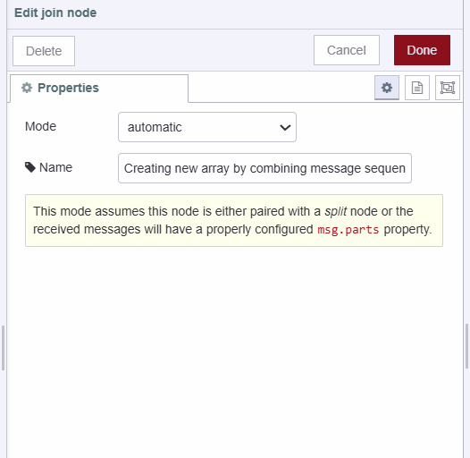
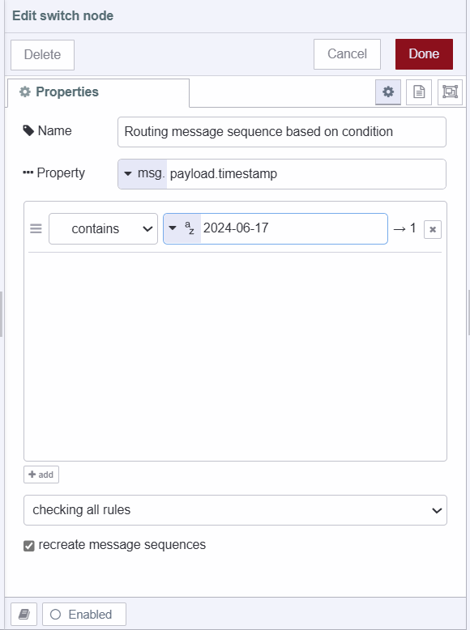
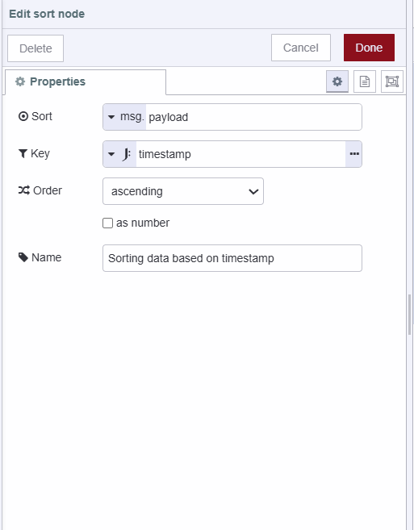
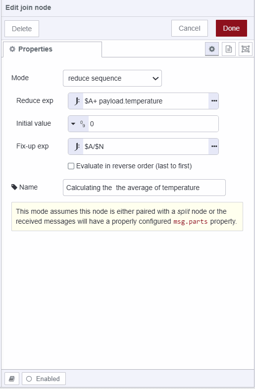

---
eleventyNavigation:
  key: Data Tranformation
  parent: Programming
meta:
  title: How to Filter, Map, Sort, and Reduce Data in Node-RED
  description:  Learn how to perform data transformation in Node-RED with a low-code approach.
  keywords: how to filter data in node-red, how to map array in node-red, how to map data in node-red, how to sort data in node-red, how to reduce data in node-red, data transformation in node-red
image: /node-red/getting-started/images/filtering-mapping-sorting-reducing-with-node-red.png
---

Data transformation is at the heart of most Node-RED applications, whether you're processing IoT sensor readings, cleaning API responses, or preparing data for visualization. While you could write JavaScript functions to handle these operations, Node-RED's visual, low-code approach offers a more maintainable and accessible alternative that anyone on your team can understand and modify.

This guide demonstrates how to perform four fundamental data operations—filtering, mapping, sorting, and reducing—using Node-RED's built-in nodes instead of custom code. Through a practical example of processing temperature sensor data, you'll learn to:

- Transform data values (converting Kelvin to Celsius)
- Filter datasets by specific criteria (selecting date ranges)
- Sort data chronologically or by any field
- Aggregate values to calculate metrics like averages

The low-code techniques covered here not only accelerate development but also make your Node-RED flows more transparent and easier to maintain. When your entire team can read and modify data transformations visually, collaboration becomes simpler and debugging becomes faster.

Let's explore why mastering these data operations matters and how Node-RED makes them straightforward.

## What is Low-Code

Low-code is a software development approach that requires little to no coding to build applications and processes. Instead of using complex programming languages, you use visual interfaces with basic logic and drag-and-drop capabilities.

> Low-code is not just about accelerating development; it’s about democratizing it. It’s about giving more people the ability to create solutions to business problems.
>
> *— Charles Lamanna, Corporate Vice President of Business Applications & Platforms at Microsoft*

For more details refer to the following articles:

- [Why Low-Code is Better](/blog/2024/03/low-code-is-better/).
- [Why you need a low-code platform](/blog/2024/05/why-you-need-a-low-code-platform/).

## Why do you need to learn to filter, map, sort, and reduce the data?

Filter, map, sort, and reduce are essential functions in data processing because they efficiently transform, extract, organize, and aggregate data, that makes it easier to analyze and derive insights from datasets. For example, consider the scenario where you have an array of sensor data retrieved from an database. The data looks something like this:

```json
[
    {
        "timestamp": "2024-06-17T10:00:00Z",
        "temperature": 298.15
    },
    {
        "timestamp": "2024-06-17T11:00:00Z",
        "temperature": 299.15
    },
    {
        "timestamp": "2024-06-17T10:30:00Z",
        "temperature": 300.15
    },
    {
        "timestamp": "2024-06-17T10:15:00Z",
        "temperature": 301.15
    },
    {
        "timestamp": "2024-06-17T10:45:00Z",
        "temperature": 303.15
    },
    {
        "timestamp": "2024-06-18T09:00:00Z",
        "temperature": 297.15
    },
    {
        "timestamp": "2024-06-18T10:00:00Z",
        "temperature": 300.15
    },
    {
        "timestamp": "2024-06-18T11:00:00Z",
        "temperature": 301.15
    },
    {
        "timestamp": "2024-06-18T12:00:00Z",
        "temperature": 302.15
    },
    {
        "timestamp": "2024-06-19T10:00:00Z",
        "temperature": 298.15
    },
    {
        "timestamp": "2024-06-19T11:00:00Z",
        "temperature": 299.15
    }
]
```

However, you've noticed that the temperature data is in Kelvin, but you need it in Celsius. Additionally, the data is not correctly ordered by timestamp, and you only need the data of June 17th. Finally, you want to calculate the average temperature for that day. Users who are not familiar with Node-RED basics can use a JavaScript function node to achieve this, as shown below:


[{"id":"306d455509a3747e","type":"inject","z":"977143edb097b685","name":"Inject the sample data","props":[{"p":"payload"}],"repeat":"","crontab":"","once":false,"onceDelay":0.1,"topic":"","payload":"[{\"timestamp\":\"2024-06-17T10:00:00Z\",\"temperature\":298.15},{\"timestamp\":\"2024-06-17T11:00:00Z\",\"temperature\":299.15},{\"timestamp\":\"2024-06-17T10:30:00Z\",\"temperature\":300.15},{\"timestamp\":\"2024-06-17T10:15:00Z\",\"temperature\":301.15},{\"timestamp\":\"2024-06-17T10:45:00Z\",\"temperature\":303.15},{\"timestamp\":\"2024-06-18T09:00:00Z\",\"temperature\":297.15},{\"timestamp\":\"2024-06-18T10:00:00Z\",\"temperature\":300.15},{\"timestamp\":\"2024-06-18T11:00:00Z\",\"temperature\":301.15},{\"timestamp\":\"2024-06-18T12:00:00Z\",\"temperature\":302.15},{\"timestamp\":\"2024-06-19T10:00:00Z\",\"temperature\":298.15},{\"timestamp\":\"2024-06-19T11:00:00Z\",\"temperature\":299.15}]","payloadType":"json","x":260,"y":200,"wires":[["c58e1653fe5511eb"]]},{"id":"c58e1653fe5511eb","type":"function","z":"977143edb097b685","name":"Filtering, mapping, reducing and sorting data with traditional coding","func":"let sensorData = msg.payload;\n\nconst filteredData = sensorData\n    .filter(item => item.timestamp.startsWith(\"2024-06-17\"))\n    .map(item => ({\n        timestamp: item.timestamp,\n        temperature: item.temperature - 273.15\n    }));\n\nfilteredData.sort((a, b) => (a.timestamp > b.timestamp) ? 1 : ((b.timestamp > a.timestamp) ? -1 : 0));\n\nconst totalTemperature = filteredData.reduce((acc, entry) => acc + entry.temperature, 0);\nconst averageTemperature = totalTemperature / filteredData.length;\n\nmsg.payload = {\n    sensorData: filteredData,\n    averageTemperature: averageTemperature\n};\n\nreturn msg;\n","outputs":1,"timeout":0,"noerr":0,"initialize":"","finalize":"","libs":[],"x":700,"y":200,"wires":[["827c7d2009eeb046"]]},{"id":"827c7d2009eeb046","type":"debug","z":"977143edb097b685","name":"debug 3","active":true,"tosidebar":true,"console":false,"tostatus":false,"complete":"false","statusVal":"","statusType":"auto","x":1060,"y":200,"wires":[]}]


Using function nodes isn't wrong, but it adds complexity to your applications, for more information refer to the [Drawbacks of using Fuction nodes](/blog/2023/03/why-should-you-use-node-red-function-nodes/#5-benefits-of-avoiding-function-nodes%3A) Article. Since not everyone on the team may be familiar with JavaScript, it can limit who can solve business problems. To keep the application flow simple, using a low-code approach to perform these operations is crucial.

In the following sections, we'll explore how to perform these operations using a low-code approach.

## Mapping

Mapping often refers to the process of applying a function to each item in a list, array, or other collection to produce a new collection of transformed items. here in our context, we need to covert the temperature data of each object from kelvin to celsius. To perform mapping we will use the Split, Change, and Join nodes. 

1. Drag a Split node onto the canvas, the Split node will Split a message into a sequence of messages which will allow us to operate on each message, additioanlly split node bind the metadata to each of the object splitted, this metadata will helps join node to merge the all of message sequence back to an array.
2. Drag a Change node onto the canvas, set the `msg.payload.temperature` to `payload.temperature - 273.15` as JSONata expression.

{data-zoomable}

3. Now drag the Join node onto the canvas and set the Mode to "Automatic". This will automatically join all the messages originating from the Split node into an array.

{data-zoomable}


[{"id":"306d455509a3747e","type":"inject","z":"977143edb097b685","name":"Inject the sample data","props":[{"p":"payload"}],"repeat":"","crontab":"","once":false,"onceDelay":0.1,"topic":"","payload":"[     {\"timestamp\":\"2024-06-17T10:00:00Z\",\"temperature\":298.15},     {\"timestamp\":\"2024-06-17T11:00:00Z\",\"temperature\":299.15},     {\"timestamp\":\"2024-06-17T10:30:00Z\",\"temperature\":300.15},     {\"timestamp\":\"2024-06-17T10:15:00Z\",\"temperature\":301.15},     {\"timestamp\":\"2024-06-17T10:45:00Z\",\"temperature\":303.15},     {\"timestamp\":\"2024-06-18T09:00:00Z\",\"temperature\":297.15},     {\"timestamp\":\"2024-06-18T10:00:00Z\",\"temperature\":300.15},     {\"timestamp\":\"2024-06-18T11:00:00Z\",\"temperature\":301.15},     {\"timestamp\":\"2024-06-18T12:00:00Z\",\"temperature\":302.15},     {\"timestamp\":\"2024-06-19T10:00:00Z\",\"temperature\":298.15},     {\"timestamp\":\"2024-06-19T11:00:00Z\",\"temperature\":299.15} ]","payloadType":"json","x":500,"y":540,"wires":[["9d9c0688468e1aae"]]},{"id":"9d9c0688468e1aae","type":"split","z":"977143edb097b685","name":"Splits a message into a sequence of messages.","splt":"\\n","spltType":"str","arraySplt":1,"arraySpltType":"len","stream":false,"addname":"","x":860,"y":540,"wires":[["785125a70fbdc554"]]},{"id":"785125a70fbdc554","type":"change","z":"977143edb097b685","name":"Converting the temperature data from kelvin to celsius","rules":[{"t":"set","p":"payload.temperature","pt":"msg","to":"payload.temperature - 273.15","tot":"jsonata"}],"action":"","property":"","from":"","to":"","reg":false,"x":1340,"y":540,"wires":[["9cd6e05b88ec26fd"]]},{"id":"9cd6e05b88ec26fd","type":"join","z":"977143edb097b685","name":"Creating new array by combining message sequence","mode":"auto","build":"array","property":"payload","propertyType":"msg","key":"topic","joiner":"\\n","joinerType":"str","accumulate":false,"timeout":"","count":"","reduceRight":false,"reduceExp":"","reduceInit":"","reduceInitType":"","reduceFixup":"","x":1820,"y":540,"wires":[["244660d81bf5e5b2"]]},{"id":"244660d81bf5e5b2","type":"debug","z":"977143edb097b685","name":"debug 3","active":true,"tosidebar":true,"console":false,"tostatus":false,"complete":"false","statusVal":"","statusType":"auto","x":2140,"y":540,"wires":[]}]


## Filtering

Filtering is the process of selecting specific items from an array to create a new array. In Node-RED, filtering is achieved using mapping and condition-based routing. Now we are familiar with mapping and have done it above, so we need to use only one more extra node which is the switch node for condition-based routing.

1. Drag a switch node and place it after the Change node and before the Join node.
2. Set the condition to check whether `msg.payload.timestamp` includes '2024-06-17' This condition ensures that only messages containing the specified date in their timestamp are sent further. 
3. Next, In the switch node checked the option "recreate message sequences" that will repair the `msg.parts` metadata added by Split node if any messages are dropped by the switch node.

{data-zoomable}


[{"id":"4e76a2328451b4c3","type":"inject","z":"977143edb097b685","name":"Inject the sample data","props":[{"p":"payload"}],"repeat":"","crontab":"","once":false,"onceDelay":0.1,"topic":"","payload":"[{\"timestamp\":\"2024-06-17T10:00:00Z\",\"temperature\":298.15},{\"timestamp\":\"2024-06-17T11:00:00Z\",\"temperature\":299.15},{\"timestamp\":\"2024-06-17T10:30:00Z\",\"temperature\":300.15},{\"timestamp\":\"2024-06-17T10:15:00Z\",\"temperature\":301.15},{\"timestamp\":\"2024-06-17T10:45:00Z\",\"temperature\":303.15},{\"timestamp\":\"2024-06-18T09:00:00Z\",\"temperature\":297.15},{\"timestamp\":\"2024-06-18T10:00:00Z\",\"temperature\":300.15},{\"timestamp\":\"2024-06-18T11:00:00Z\",\"temperature\":301.15},{\"timestamp\":\"2024-06-18T12:00:00Z\",\"temperature\":302.15},{\"timestamp\":\"2024-06-19T10:00:00Z\",\"temperature\":298.15},{\"timestamp\":\"2024-06-19T11:00:00Z\",\"temperature\":299.15}]","payloadType":"json","x":380,"y":480,"wires":[["f4e07a31f505a50c"]]},{"id":"f4e07a31f505a50c","type":"split","z":"977143edb097b685","name":"Splits a message into a sequence of messages.","splt":"\\n","spltType":"str","arraySplt":1,"arraySpltType":"len","stream":false,"addname":"","x":680,"y":480,"wires":[["fcd6a0a1497203a9"]]},{"id":"bed1a7d861fa9e3d","type":"join","z":"977143edb097b685","name":"Creating new array by combining message sequence","mode":"auto","build":"array","property":"payload","propertyType":"msg","key":"topic","joiner":"\\n","joinerType":"str","accumulate":false,"timeout":"","count":"0","reduceRight":false,"reduceExp":"","reduceInit":"","reduceInitType":"num","reduceFixup":"","x":1940,"y":480,"wires":[["2449811ec79bc220"]]},{"id":"2449811ec79bc220","type":"debug","z":"977143edb097b685","name":"debug 3","active":true,"tosidebar":true,"console":false,"tostatus":false,"complete":"true","targetType":"full","statusVal":"","statusType":"auto","x":2240,"y":480,"wires":[]},{"id":"7797594a508cfb46","type":"switch","z":"977143edb097b685","name":"Routing message sequence based on condition","property":"payload.timestamp","propertyType":"msg","rules":[{"t":"cont","v":"2024-06-17","vt":"str"}],"checkall":"true","repair":true,"outputs":1,"x":1520,"y":480,"wires":[["bed1a7d861fa9e3d"]]},{"id":"fcd6a0a1497203a9","type":"change","z":"977143edb097b685","name":"Converting the temperature data from kelvin to celsius","rules":[{"t":"set","p":"payload.temperature","pt":"msg","to":"payload.temperature - 273.15","tot":"jsonata"}],"action":"","property":"","from":"","to":"","reg":false,"x":1100,"y":480,"wires":[["7797594a508cfb46"]]}]


## Sorting 

Sorting, as the name suggests, means arranging items in a specific order. This order can be ascending (smallest to largest), descending (largest to smallest), or based on any defined criteria. In the Node-RED you can sort the numbers, alphabets, arrays, strings, and more.
To perform sorting, we have to use the Node-RED Sort Node.

1. Drag the Sort node on the canvas.
2. Set the key to `timestamp` as the JSONata expression and then set the order to 'ascending'. We set the key to timestamp because we want to sort the data based on the timestamp. You can set it to temperature if you want to sort based on that instead.

{data-zoomable}


[{"id":"8b66990baca45f2d","type":"inject","z":"977143edb097b685","name":"Inject the sample data","props":[{"p":"payload"}],"repeat":"","crontab":"","once":false,"onceDelay":0.1,"topic":"","payload":"[{\"timestamp\":\"2024-06-17T10:00:00Z\",\"temperature\":298.15},{\"timestamp\":\"2024-06-17T11:00:00Z\",\"temperature\":299.15},{\"timestamp\":\"2024-06-17T10:30:00Z\",\"temperature\":300.15},{\"timestamp\":\"2024-06-17T10:15:00Z\",\"temperature\":301.15},{\"timestamp\":\"2024-06-17T10:45:00Z\",\"temperature\":303.15},{\"timestamp\":\"2024-06-18T09:00:00Z\",\"temperature\":297.15},{\"timestamp\":\"2024-06-18T10:00:00Z\",\"temperature\":300.15},{\"timestamp\":\"2024-06-18T11:00:00Z\",\"temperature\":301.15},{\"timestamp\":\"2024-06-18T12:00:00Z\",\"temperature\":302.15},{\"timestamp\":\"2024-06-19T10:00:00Z\",\"temperature\":298.15},{\"timestamp\":\"2024-06-19T11:00:00Z\",\"temperature\":299.15}]","payloadType":"json","x":400,"y":540,"wires":[["f0d48b57cbd10fdd"]]},{"id":"f0d48b57cbd10fdd","type":"split","z":"977143edb097b685","name":"Splits a message into a sequence of messages.","splt":"\\n","spltType":"str","arraySplt":1,"arraySpltType":"len","stream":false,"addname":"","x":740,"y":540,"wires":[["fdc21a267f7583e7"]]},{"id":"fdc21a267f7583e7","type":"change","z":"977143edb097b685","name":"Correcting the temperature property","rules":[{"t":"set","p":"payload.temperature","pt":"msg","to":"payload.temperature - 273.15","tot":"jsonata"}],"action":"","property":"","from":"","to":"","reg":false,"x":1080,"y":540,"wires":[["7d4ce2d4e21cd914"]]},{"id":"c273215c8c9cebee","type":"join","z":"977143edb097b685","name":"Creating new array by combining message sequence","mode":"custom","build":"array","property":"payload","propertyType":"msg","key":"topic","joiner":"\\n","joinerType":"str","accumulate":false,"timeout":"","count":"","reduceRight":false,"reduceExp":"","reduceInit":"","reduceInitType":"num","reduceFixup":"","x":1860,"y":540,"wires":[["c423efbd0581367a"]]},{"id":"e70d15ced7405755","type":"debug","z":"977143edb097b685","name":"debug 3","active":true,"tosidebar":true,"console":false,"tostatus":false,"complete":"true","targetType":"full","statusVal":"","statusType":"auto","x":2480,"y":540,"wires":[]},{"id":"7d4ce2d4e21cd914","type":"switch","z":"977143edb097b685","name":"Routing message sequence based on condition","property":"payload.timestamp","propertyType":"msg","rules":[{"t":"cont","v":"2024-06-17","vt":"str"}],"checkall":"true","repair":true,"outputs":1,"x":1440,"y":540,"wires":[["c273215c8c9cebee"]]},{"id":"c423efbd0581367a","type":"sort","z":"977143edb097b685","name":"Sorting data based on timestamp","order":"ascending","as_num":false,"target":"payload","targetType":"msg","msgKey":"timestamp","msgKeyType":"jsonata","seqKey":"payload.timestamp","seqKeyType":"jsonata","x":2240,"y":540,"wires":[["e70d15ced7405755"]]}]


## Reducing 

Reducing refers to the process of combining elements of a data structure (such as an array) into a single value. It involves iterating over the elements of the data structure and applying a combining function repeatedly until all elements have been processed.

1. Drag another Split node onto the canvas 
2. Drag Join another node onto the canvas.
2. Select the mode to "reduce sequence", set Reduce exp to `$A+ payload.temperature`, initial value to 0 and the Fix-up exp to `$A/$N`

{data-zoomable}

In this configuration, the Join node is set to reduce sequence mode. The initial value of the accumulator ($A) is initialized to 0. As each message is processed, the current temperature (payload.temperature) is added to $A. Once all messages have been processed, the accumulated sum $A is divided by the total number of messages ($N) to compute the average temperature.


[{"id":"5ff0902202c21e85","type":"inject","z":"977143edb097b685","name":"Inject the sample data","props":[{"p":"payload"}],"repeat":"","crontab":"","once":false,"onceDelay":0.1,"topic":"","payload":"[{\"timestamp\":\"2024-06-17T10:00:00Z\",\"temperature\":298.15},{\"timestamp\":\"2024-06-17T11:00:00Z\",\"temperature\":299.15},{\"timestamp\":\"2024-06-17T10:30:00Z\",\"temperature\":300.15},{\"timestamp\":\"2024-06-17T10:15:00Z\",\"temperature\":301.15},{\"timestamp\":\"2024-06-17T10:45:00Z\",\"temperature\":303.15},{\"timestamp\":\"2024-06-18T09:00:00Z\",\"temperature\":297.15},{\"timestamp\":\"2024-06-18T10:00:00Z\",\"temperature\":300.15},{\"timestamp\":\"2024-06-18T11:00:00Z\",\"temperature\":301.15},{\"timestamp\":\"2024-06-18T12:00:00Z\",\"temperature\":302.15},{\"timestamp\":\"2024-06-19T10:00:00Z\",\"temperature\":298.15},{\"timestamp\":\"2024-06-19T11:00:00Z\",\"temperature\":299.15}]","payloadType":"json","x":580,"y":620,"wires":[["993ffc096c3e8089"]]},{"id":"993ffc096c3e8089","type":"split","z":"977143edb097b685","name":"Splits a message into a sequence of messages.","splt":"\\n","spltType":"str","arraySplt":1,"arraySpltType":"len","stream":false,"addname":"","x":900,"y":620,"wires":[["3bbb68c2dc2a0f5c"]]},{"id":"3bbb68c2dc2a0f5c","type":"change","z":"977143edb097b685","name":"Correcting the temperature property","rules":[{"t":"set","p":"payload.temperature","pt":"msg","to":"payload.temperature - 273.15","tot":"jsonata"}],"action":"","property":"","from":"","to":"","reg":false,"x":1280,"y":620,"wires":[["580210c585730f97"]]},{"id":"01e7066b3ff012e7","type":"join","z":"977143edb097b685","name":"Creating new array by combining message sequence","mode":"custom","build":"array","property":"payload","propertyType":"msg","key":"topic","joiner":"\\n","joinerType":"str","accumulate":false,"timeout":"","count":"","reduceRight":false,"reduceExp":"","reduceInit":"","reduceInitType":"num","reduceFixup":"","x":2060,"y":620,"wires":[["27cc5d5e90f7facd","6116c1efc3f7f682"]]},{"id":"580210c585730f97","type":"switch","z":"977143edb097b685","name":"Routing message sequence based on condition","property":"payload.timestamp","propertyType":"msg","rules":[{"t":"cont","v":"2024-06-17","vt":"str"}],"checkall":"true","repair":true,"outputs":1,"x":1640,"y":620,"wires":[["01e7066b3ff012e7"]]},{"id":"27cc5d5e90f7facd","type":"sort","z":"977143edb097b685","name":"Sorting data based on timestamp","order":"ascending","as_num":false,"target":"payload","targetType":"msg","msgKey":"timestamp","msgKeyType":"jsonata","seqKey":"payload.timestamp","seqKeyType":"jsonata","x":2440,"y":620,"wires":[["f1f93a7b4575daf1"]]},{"id":"362ec9c482688cf6","type":"debug","z":"977143edb097b685","name":"debug 4","active":true,"tosidebar":true,"console":false,"tostatus":false,"complete":"payload","targetType":"msg","statusVal":"","statusType":"auto","x":3140,"y":740,"wires":[]},{"id":"b9f2f83a330140ca","type":"join","z":"977143edb097b685","name":"Calculating the  the average of temperature","mode":"reduce","build":"object","property":"payload","propertyType":"msg","key":"topic","joiner":"\\n","joinerType":"str","accumulate":true,"timeout":"","count":"","reduceRight":false,"reduceExp":"$A+ payload.temperature","reduceInit":"0","reduceInitType":"num","reduceFixup":"$A/$N","x":2890,"y":740,"wires":[["362ec9c482688cf6"]]},{"id":"f1f93a7b4575daf1","type":"debug","z":"977143edb097b685","name":"debug 3","active":true,"tosidebar":true,"console":false,"tostatus":false,"complete":"true","targetType":"full","statusVal":"","statusType":"auto","x":2720,"y":620,"wires":[]},{"id":"6116c1efc3f7f682","type":"split","z":"977143edb097b685","name":"Splits a message into a sequence of messages.","splt":"\\n","spltType":"str","arraySplt":1,"arraySpltType":"len","stream":false,"addname":"","x":2460,"y":740,"wires":[["b9f2f83a330140ca"]]}]
