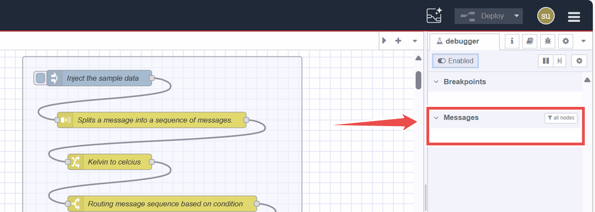
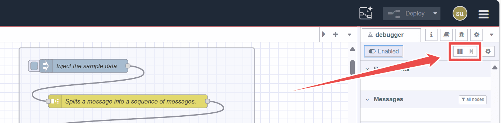
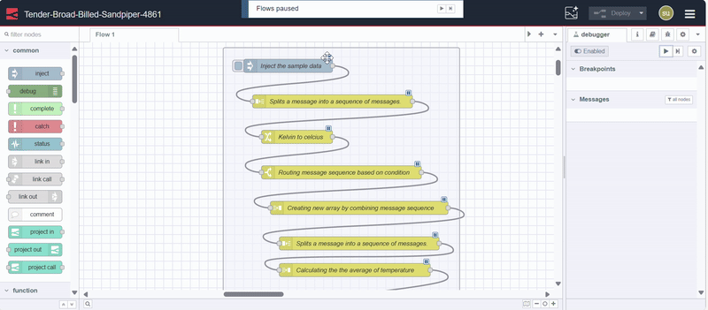
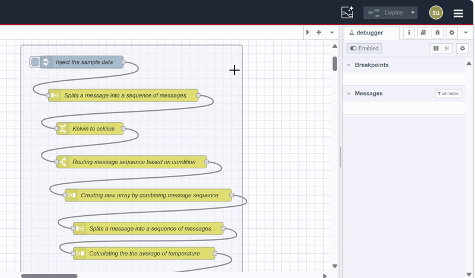
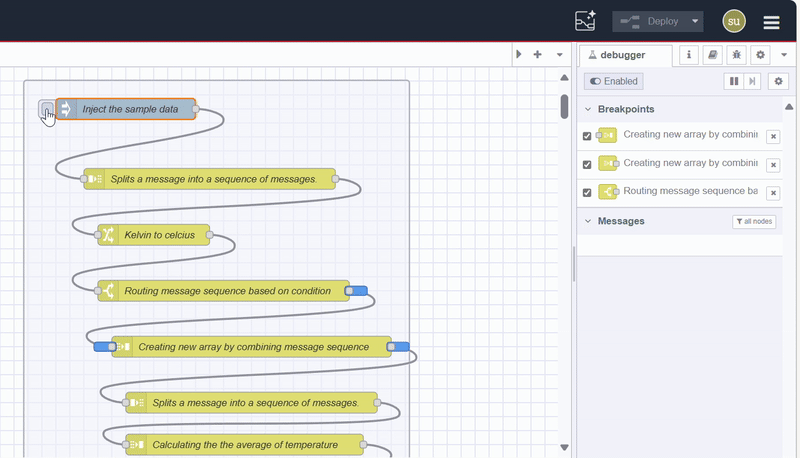
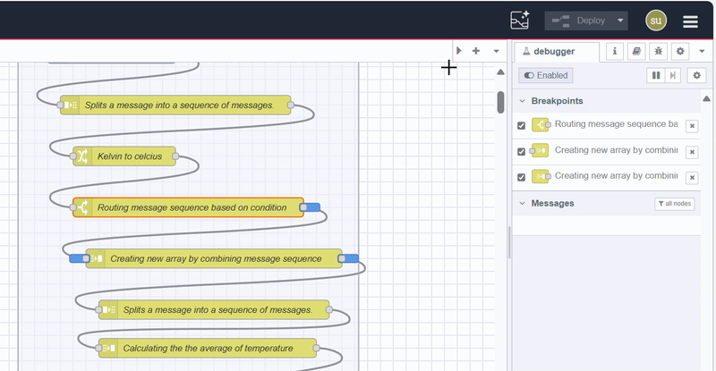
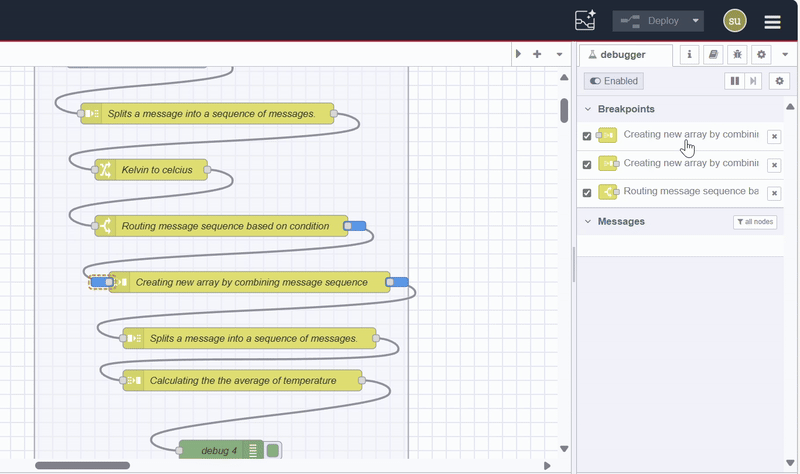

---
eleventyNavigation:
  key: Debugging
  parent: Programming
meta:
  title: How to Debug Node-RED Flows Using Debugger
  description: Debug Node-RED flows using the Debugger. Learn to set breakpoints, step through execution, and inspect messages for efficient troubleshooting.
  keywords: node-red-debugger, node red debug, nodered debug, node-red debug, how to debug nodered flows, how to debug node-red flows
---

# {{meta.title}}

When it comes to debugging application flows in Node-RED, the tool most Node-RED developers often reach for is the [Debug](/node-red/core-nodes/debug/) node. It provides a simple way to output message payloads or other data to the debug sidebar, helping you gain insights into how your flow is working. But what if you needed more control and visibility over the flow’s execution? What if you wanted to step through each node in detail, inspect variables, or pause the flow at specific points to understand what’s happening?

In these cases, using the **Node-RED Debugger** becomes invaluable. The debugger allows you to trace the execution of your flows interactively, set breakpoints, and gain deeper insights beyond what the Debug node offers. This Documentation will show you how to effectively use the Node-RED Debugger to pinpoint issues and fine-tune your applications.

> **Tip:** If your flows aren’t named or formatted properly and you're finding it difficult to understand what they do, you can use the **[FlowFuse Expert – Flow Explainer](/docs/user/assistant/#flow-explainer)** to automatically analyse the flow and generate clear documentation.

## What is Debugging, and Why is it crucial in Node-RED Flows?

Debugging is finding and fixing issues in your code or workflow. In Node-RED, debugging helps you understand how your flows function by providing insights into the data being processed and identifying where things might go wrong. 

Typically, developers use the **Debug** node to output message payloads and view them in the sidebar. While this is useful for simple debugging, it can be limiting when you need to troubleshoot more complex scenarios. As flows become larger and more interconnected, pinpointing the exact source of an issue using just a Debug node can be like searching for a needle in a haystack.

That’s where the **Node-RED Debugger** steps in, offering a more granular approach to debugging. The debugger allows you to:

- **Manual stop**: to manually stop the runtime and execution of the flow
- **Step through** the execution of nodes one by one.
- **Set breakpoints** to pause the flow at critical points.
- **Inspect messages** and data in real-time, including message payloads, context, and more.

## Installing and Enabling Node-RED Debugger

To install the Node-RED Debugger:

1. Click the menu icon in the top-right corner.
2. Select **Manage palette** and switch to the **Install** tab.
3. Search for [node-red-debugger](https://flows.nodered.org/node/node-red-debugger).
4. Click **Install** to add the package.

### Enabling the Debugger

{data-zoomable}
_Image showing the option to turn the debugger on and off in the sidebar_

Once installed, open the debugger tab in the sidebar by clicking the collapsible arrow icon in the right sidebar and selecting **Flow Debugger**.

In the new Debugger tab, toggle the switch at the sidebar's top-left corner to enable the debugger. By default, it is disabled, so enable it before proceeding further.

## Using the Debugger for Debugging Flows

To illustrate how to use the Node-RED Debugger effectively, let’s consider a flow that simulates sensor data processing. The flow consists of an Inject node that sends a set of simulated sensor data, including temperature readings in Kelvin and their corresponding dates. The subsequent nodes perform the following operations:

1. Convert the temperature from Kelvin to Celsius.
2. Filter the data to forward specific date entries.
3. Create a new array from the filtered results.
4. Split the array and calculate the average temperature.


[{"id":"3c012808d6b397e2","type":"group","z":"9cf82b68bb89e8ce","style":{"stroke":"#b2b3bd","stroke-opacity":"1","fill":"#f2f3fb","fill-opacity":"0.5","label":true,"label-position":"nw","color":"#32333b"},"nodes":["5ff0902202c21e85","993ffc096c3e8089","3bbb68c2dc2a0f5c","580210c585730f97","362ec9c482688cf6","b9f2f83a330140ca","6116c1efc3f7f682","01e7066b3ff012e7"],"x":394,"y":1899,"w":532,"h":642},{"id":"5ff0902202c21e85","type":"inject","z":"9cf82b68bb89e8ce","g":"3c012808d6b397e2","name":"Inject the sample data","props":[{"p":"payload"}],"repeat":"","crontab":"","once":false,"onceDelay":0.1,"topic":"","payload":"[{\"timestamp\":\"2024-06-17T10:00:00Z\",\"temperature\":298.15},{\"timestamp\":\"2024-06-17T11:00:00Z\",\"temperature\":299.15},{\"timestamp\":\"2024-06-17T10:30:00Z\",\"temperature\":300.15},{\"timestamp\":\"2024-06-17T10:15:00Z\",\"temperature\":301.15},{\"timestamp\":\"2024-06-17T10:45:00Z\",\"temperature\":303.15},{\"timestamp\":\"2024-06-18T09:00:00Z\",\"temperature\":297.15},{\"timestamp\":\"2024-06-18T10:00:00Z\",\"temperature\":300.15},{\"timestamp\":\"2024-06-18T11:00:00Z\",\"temperature\":301.15},{\"timestamp\":\"2024-06-18T12:00:00Z\",\"temperature\":302.15},{\"timestamp\":\"2024-06-19T10:00:00Z\",\"temperature\":298.15},{\"timestamp\":\"2024-06-19T11:00:00Z\",\"temperature\":299.15}]","payloadType":"json","x":540,"y":1940,"wires":[["993ffc096c3e8089"]]},{"id":"993ffc096c3e8089","type":"split","z":"9cf82b68bb89e8ce","g":"3c012808d6b397e2","name":"Splits a message into a sequence of messages.","splt":"\\n","spltType":"str","arraySplt":1,"arraySpltType":"len","stream":false,"addname":"","property":"payload","x":640,"y":2020,"wires":[["3bbb68c2dc2a0f5c"]]},{"id":"3bbb68c2dc2a0f5c","type":"change","z":"9cf82b68bb89e8ce","g":"3c012808d6b397e2","name":"Kelvin to celcius","rules":[{"t":"set","p":"payload.temperature","pt":"msg","to":"payload.temperature - 273.15","tot":"jsonata"}],"action":"","property":"","from":"","to":"","reg":false,"x":560,"y":2100,"wires":[["580210c585730f97"]]},{"id":"580210c585730f97","type":"switch","z":"9cf82b68bb89e8ce","g":"3c012808d6b397e2","name":"Routing message sequence based on condition","property":"payload.timestamp","propertyType":"msg","rules":[{"t":"cont","v":"2024-06-17","vt":"str"}],"checkall":"true","repair":false,"outputs":1,"x":660,"y":2180,"wires":[["01e7066b3ff012e7"]]},{"id":"362ec9c482688cf6","type":"debug","z":"9cf82b68bb89e8ce","g":"3c012808d6b397e2","name":"Result","active":true,"tosidebar":true,"console":false,"tostatus":false,"complete":"payload","targetType":"msg","statusVal":"","statusType":"auto","x":650,"y":2500,"wires":[]},{"id":"b9f2f83a330140ca","type":"join","z":"9cf82b68bb89e8ce","g":"3c012808d6b397e2","name":"Calculating the  the average of temperature","mode":"reduce","build":"object","property":"payload","propertyType":"msg","key":"topic","joiner":"\\n","joinerType":"str","useparts":true,"accumulate":true,"timeout":"","count":"","reduceRight":false,"reduceExp":"$A+ payload.temperature","reduceInit":"0","reduceInitType":"num","reduceFixup":"$A/$N","x":690,"y":2400,"wires":[["362ec9c482688cf6"]]},{"id":"6116c1efc3f7f682","type":"split","z":"9cf82b68bb89e8ce","g":"3c012808d6b397e2","name":"Splits a message into a sequence of messages.","splt":"\\n","spltType":"str","arraySplt":1,"arraySpltType":"len","stream":false,"addname":"","property":"payload","x":700,"y":2340,"wires":[["b9f2f83a330140ca"]]},{"id":"01e7066b3ff012e7","type":"join","z":"9cf82b68bb89e8ce","g":"3c012808d6b397e2","name":"Creating new array by combining message sequence","mode":"custom","build":"array","property":"payload","propertyType":"msg","key":"topic","joiner":"\\n","joinerType":"str","useparts":true,"accumulate":false,"timeout":"","count":"","reduceRight":false,"reduceExp":"","reduceInit":"","reduceInitType":"num","reduceFixup":"","x":700,"y":2260,"wires":[["6116c1efc3f7f682"]]}]


However, clicking the **Inject** node once does not produce the expected results; instead, it requires clicking again to get the output. This indicates that there might be a timing issue or a logic flaw in the flow that prevents it from processing correctly on the first click. Let's debug the flow with a debugger now.

### Understanding the Debugger sidebar tab

Before proceeding further, let's first understand the Debugger tab and its different sections. The Debugger tab contains two main areas: **Breakpoints** and **Messages**. 

{data-zoomable}
_Image showing the breakpoint section in the sidebar_

1. **Breakpoints**: This section lists all the breakpoints you have set within your flow. It allows you to manage and navigate through the breakpoints effectively.

{data-zoomable}
_Image showing the messages section in the sidebar_

2. **Messages**: This section shows any messages currently queued up in the runtime, giving you visibility into the data being processed at various stages of your flow.

{data-zoomable}
_Image showing the controls in the sidebar_

At the top of the Debugger tab, you will find controls to stop the runtime manually and buttons to resume execution and step through the flow one input or output at a time when it is paused.

### Pausing the Runtime Manually and Navigating Through Each Step

Now, let's diagnose the flow. We’ll manually pause the runtime, then step through each part of the flow using the debugger controls, observing the changes at each step.

{data-zoomable}
_Image show the execution of flow while debugger enabled and how to proceed to subsequent execution_

Follow these steps:

1. Go to the **Debugger** tab in the sidebar.
2. Click the **Pause** button in the top-right corner to halt the runtime.
3. Next, click the **Inject** button to start the execution of the flow.
4. Once paused, you'll notice that the flow executes step by step, depending on the total inputs, outputs, and number of messages they produce and the message length. Each message will be printed in the **Messages** section of the debugger tab. At the top of each message, the name of the node that generated it will be displayed.
5. To proceed, click the **step forward** button (represented as an array icon next to the pause button). As you move forward, the **Messages** field will update with the message sent by each node, and the execution will also resume at the next step. Additionally, the input/output of the node sending the message will be highlighted in the flow with a light-bordered rectangle.
6. As we progress through the execution, everything works fine up to the **Switch** node, where the message passes through correctly. However, when you reach the **Join** node, the highlighted box does not move forward, and no message is printed in the debugger tab. This indicates the issue lies between the **Switch** node and the **Join** node.

Manually stepping through the flow is useful for understanding how the flow operates, making it easier to identify where breakpoints should be placed effectively.

## Adding Breakpoints for Debugging Flows

Now that we've pinpointed the problem to be somewhere between the[Switch](/node-red/core-nodes/switch/) node and the [Join](/node-red/core-nodes/join/) node, it’s time to leverage breakpoints for a more efficient debugging experience. These breakpoints allow you to pause the flow automatically allowing you to inspect messages and context without having to step through each node manually. This is especially useful for larger or more intricate flows.

First, let’s discuss where exactly we should add breakpoints. Our previous debugging shows that all 11 messages are correctly reaching the input of the Switch node. However, we need to check how many messages pass through the Switch node's condition and whether they contain the required part object for the Join node to create a single value (array).

To do this, we should add breakpoints at the output of the Switch node to monitor how many messages pass through, as well as at the input and output of the Join node. This will help us determine how many messages are reaching the input of the Join node and whether they contain the part object necessary for the Join node to automatically convert them into an array of those objects.

{data-zoomable}
_Image showing how to add breakpoints_

To add a breakpoint:

1. In the flow, find the node where you want to add the breakpoint.
2. Hover over the input or output of the desired node; a dotted rectangle will appear.
3. Click within that rectangle to add the breakpoint. It will turn solid blue, indicating that your breakpoint has been added.
4. The breakpoint will appear in the debugger sidebar tab list once added.

### Debugging: Pinpointing the Exact Problem and Solving the Issue in the Flow

{data-zoomable}
_Image showing the execution of the flow with added breakpoints, indicating the number of each input/output being sent and received for debugging._

Start by clicking the inject node to trigger execution, which will pause at the output of the switch node. Check the blue rectangle to see how many messages have passed through; it shows only a few, not 11, indicating that only those messages met the condition. As you proceed, you will see those messages also reaching the input of the join node correctly. 

Next, look in the debugger tab's messages section to verify if these messages have the `parts` property, noting the value of `count`. You will see that the count value is 11, which means the join node is waiting for all 11 messages to create a single message; otherwise, it will not send anything. Click the arrow button to see how many messages reach the output of the join node; you’ll notice that nothing reaches the output, indicating that the join node is still waiting for the remaining messages. This is likely due to an issue with the `parts.count` property. 

While the split node previously set the count to 11 automatically, which is correct, the switch node filtered some messages, resulting in only a few passing through. Therefore, the count should be corrected to reflect the correct number of messages that passed through the switch node instead of 11.

## Disabling and Removing Breakpoints

Now that you’ve learned how to add breakpoints and pinpoint problems, lets look at how to manage them. Sometimes you may need to disable specific breakpoints to allow the flow to run without interruption, or you may want to remove them once you’ve finished debugging.

### Disabling Breakpoints

{data-zoomable}
_Image showing two ways of disabling breakpoints_

To disable a breakpoint without removing it:

1. Go to the **Debugger** tab in the sidebar.
2. Locate the list of active breakpoints; you will see a checkbox on the left side for each breakpoint.
3. Click the checkbox for the breakpoint you wish to disable. This will toggle its state and no longer pause execution when reached.
4. Alternatively, locate the breakpoints you have added to the flow. Click on the breakpoint once, and it will turn into a transparent blue rectangle with a border, indicating it is disabled.
5. To enable them again, click on the checkbox or the breakpoints again.

### Removing Breakpoints

{data-zoomable}
_Image showing two ways of removing breakpoints_

To remove a breakpoint:

1. In the **Debugger** tab, find the breakpoint you want to remove.
2. Click the **x** button located to the right of the breakpoint.
3. Alternatively, locate the breakpoint on the flow and click it twice until it is a transparent rectangle with a dotted border, indicating it is removed.

In conclusion, debugging in Node-RED is a great way to verify and improve your flows. While the Debug node is excellent for quick insights, the Node-RED Debugger adds another level of insight. Setting breakpoints can significantly streamline your troubleshooting process and help you identify issues more effectively.

## Up Next

- [Monitoring and Optimizing Node-RED Flows with Open Telemetry](/blog/2024/08/opentelemetry-with-node-red/): Learn how to Monitor and Optimize Node-RED Flows using Open Telemetry that will help you spot and fix delays in your flows quickly.

- [Format your Node-RED flows for better team collaboration](/blog/2022/12/node-red-flow-best-practice/):  Learn how to format your flows for readability to providing explicit comments on nodes and groups, a little bit of effort upfront can save your team many headaches down the road.
