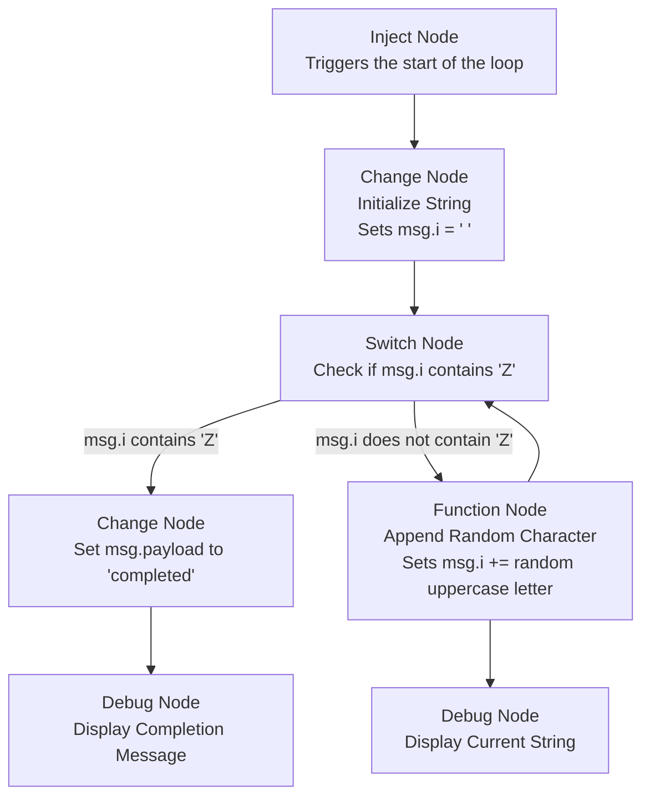
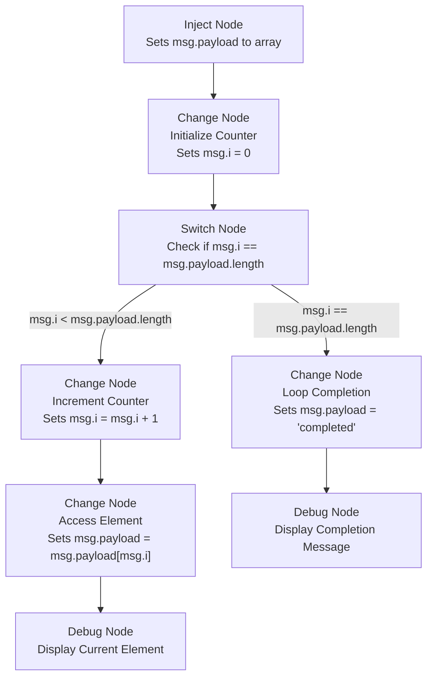
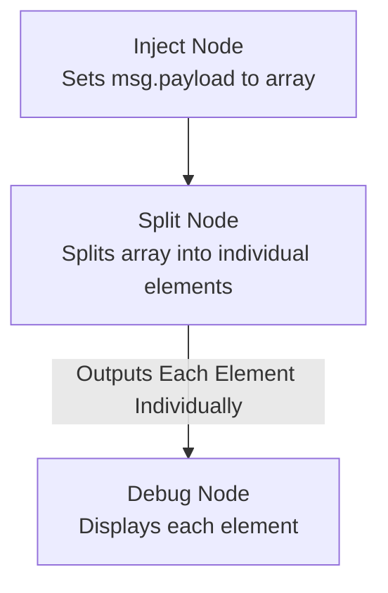

---
eleventyNavigation:
  key: Loop
  parent: Programming
meta:
  title: How to implement loops in Node-RED flows
  description: Learn how to implement while, for, and for...of loops in Node-RED with core and custom nodes for efficient data processing and automation.
  keywords: node red loop, nodered loop, node red for loop, node-red loop, nodered for of, node-red while loop, node-red do while loop
---

# {{meta.title}}

Handling repetitive tasks is a common challenge in automation and data processing. Whether you need to iterate over large datasets, perform calculations, or execute operations based on conditions multiple times, using loops can significantly enhance efficiency and scalability.

In this document, we’ll explore how to replicate different types of loops that are essential in various contexts. We’ll discuss their applications and provide examples to help you effectively implement them in Node-RED.

## What is a Loop?

A [loop](https://developer.mozilla.org/en-US/docs/Web/JavaScript/Guide/Loops_and_iteration) is a programming construct that allows you to execute a block of code repeatedly until a certain condition is met. Different types of loops are suited to different scenarios, depending on how and when you want the code to repeat:

- **For Loop**: Executes a block of code a specific number of times. This is useful when you know in advance how many times you need to iterate, such as iterating through a range of numbers or items in a list. It's also known as a fixed number loop.

- **While Loop**: Repeats a block of code as long as a specified condition is true. This type of loop is useful when you don’t know how many times the loop will need to run beforehand. The loop continues executing until the condition becomes false.

- **For...of / ForEach Loop**: These loops are used to iterate over iterable objects such as arrays or maps. They allow you to access each element in a collection. The **for...of** loop is used specifically for iterables, while **forEach** is a method available on arrays that applies a function to each element.

Each type of loop serves a different purpose and can be chosen based on the requirements of the task at hand.

## Implementing Loops in Node-RED

In this section, we’ll explore how to implement loops in Node-RED. First, we’ll demonstrate how to achieve looping with core nodes. Then, we’ll show how to accomplish similar tasks using custom nodes. We’ll also cover some essential operations typically performed using loops, providing practical examples to enhance your Node-RED flows.

### Implementing Loops in Node-RED with Core Nodes

#### While Loop

To demonstrate a while loop in Node-RED, we’ll create a flow that appends random characters to a string until it contains the character "Z". This example will help you understand how to simulate a while loop using Node-RED's core nodes.

1. Drag an **Inject** node onto the canvas. This node will trigger the start of the loop.
2. Add a **Change** node to initialize the string variable. Configure it to set `msg.i` to an empty string (`""`). Connect the **Inject** node to this **Change** node.
3. Place a **Switch** node on the canvas. Set it to check if `msg.i` contains the character "Z" (`msg.i.includes('Z')`). Add an additional rule for when this condition is not met (`otherwise`). Connect the output of the **Change** node to the input of the **Switch** node.
4. Add a **Function** node to append a random uppercase letter to the string. Use the following JavaScript code:
    ```javascript
    msg.i += String.fromCharCode(65 + Math.floor(Math.random() * 26)); // Append a random uppercase letter
    return msg;
    ```
    Connect this **Function** node to the second output of the **Switch** node (where the condition is `msg.i` does not contain "Z"). Then, connect the output of this **Function** node back to the input of the **Switch** node to repeat the process.
5. Drag a **Debug** node onto the canvas and connect it to the second output of the **Switch** node. This node will display the current value of `msg.i` in the debug panel.
6. Add another **Change** node to signal completion. Configure it to set `msg.payload` to `"completed"`. Connect this **Change** node to the first output of the **Switch** node (where `msg.i` contains "Z"), and then link it to another **Debug** node to show the completion message.

The flow will continuously append random letters to the string and print the value in the debug panel until the string contains "Z". Once the condition is met, the flow will print a "completed" message and terminate the loop.




[{"id":"e90dc2e50e40896c","type":"group","z":"a3aa840957f658c6","name":"While Loop","style":{"label":true},"nodes":["cf6ebf02d00eaca6","696d89aa4050cd13","0e2d9f0447cf6226","bb6074cdf4398cb6","e19304ab31199315","c467509c666ee400","06bb08e3f0d7888a"],"x":34,"y":139,"w":1092,"h":242},{"id":"cf6ebf02d00eaca6","type":"switch","z":"a3aa840957f658c6","g":"e90dc2e50e40896c","name":"Does the msg.i contains Z","property":"i","propertyType":"msg","rules":[{"t":"cont","v":"Z","vt":"str"},{"t":"else"}],"checkall":"true","repair":false,"outputs":2,"x":590,"y":240,"wires":[["c467509c666ee400"],["0e2d9f0447cf6226","06bb08e3f0d7888a"]]},{"id":"696d89aa4050cd13","type":"debug","z":"a3aa840957f658c6","g":"e90dc2e50e40896c","name":"End","active":true,"tosidebar":true,"console":false,"tostatus":false,"complete":"true","targetType":"full","statusVal":"","statusType":"auto","x":1030,"y":180,"wires":[]},{"id":"0e2d9f0447cf6226","type":"debug","z":"a3aa840957f658c6","g":"e90dc2e50e40896c","name":"Output \"i\"","active":true,"tosidebar":true,"console":false,"tostatus":false,"complete":"i","targetType":"msg","statusVal":"","statusType":"auto","x":900,"y":260,"wires":[]},{"id":"bb6074cdf4398cb6","type":"inject","z":"a3aa840957f658c6","g":"e90dc2e50e40896c","name":"Start","props":[{"p":"payload"}],"repeat":"","crontab":"","once":false,"onceDelay":"","topic":"","payload":"[\"hello\",\"run\",\"why\"]","payloadType":"json","x":130,"y":240,"wires":[["e19304ab31199315"]]},{"id":"e19304ab31199315","type":"change","z":"a3aa840957f658c6","g":"e90dc2e50e40896c","name":"initilized i with empty string","rules":[{"t":"set","p":"i","pt":"msg","to":"","tot":"str"}],"action":"","property":"","from":"","to":"","reg":false,"x":320,"y":240,"wires":[["cf6ebf02d00eaca6"]]},{"id":"c467509c666ee400","type":"change","z":"a3aa840957f658c6","g":"e90dc2e50e40896c","name":"if not Set payload to \"completed\"","rules":[{"t":"set","p":"payload","pt":"msg","to":"Completed","tot":"str"}],"action":"","property":"","from":"","to":"","reg":false,"x":790,"y":180,"wires":[["696d89aa4050cd13"]]},{"id":"06bb08e3f0d7888a","type":"function","z":"a3aa840957f658c6","g":"e90dc2e50e40896c","name":"Append Random Letter","func":"// add ASCII char from 32 to 126\nmsg.i += String.fromCharCode(Math.random()*26 + 65);\nreturn msg;","outputs":1,"timeout":"","noerr":0,"initialize":"","finalize":"","libs":[],"x":590,"y":340,"wires":[["cf6ebf02d00eaca6"]]}]


#### For Loop

In traditional programming, `for` loops iterate a set number of times based on an index or range, while `while` loops execute as long as a condition is `true`.

In Node-RED, you can simulate a `for` loop by managing a counter with nodes to iterate through array elements. By incrementing an index variable, you can access each element and perform operations, effectively mimicking the behavior of a traditional `for` loop.

Here’s how you can set up a `for` loop in Node-RED:

1. Drag an **Inject** node onto the canvas and set the `msg.payload` to `["foo","bar","foobar"]`. This node triggers the start of the loop and provides the array to process.
2. Add a **Change** node to initialize the loop counter. Configure it to set `msg.i` to `0`, and connect the **Inject** node to this **Change** node.
3. Next, drag a **Switch** node onto the canvas. Configure it to check if `msg.i` is equal to the array length (`msg.i == msg.payload.length`). Add an additional rule for when this condition is not met (`otherwise`). Connect the **Change** node to the **Switch** node.
4. Add another **Change** node to increment the counter. Configure it to set `msg.i` to `i + 1` using a JSONata expression. Connect this **Change** node to the output of the **Switch** node where the condition (`msg.i < msg.payload.length`) is true (second output).
5. To access and display the array elements, drag a **Change** node onto the canvas. Configure it to set `msg.payload` to `msg.payload[msg.i]`, accessing the array element at the current index. Connect this **Change** node to the **Switch** node's second output (`otherwise`).
6. Attach a **Debug** node to the output of this **Change** node to print the current array element.
7. For the final step, add another **Change** node to signal when the loop has completed. Configure it to set `msg.payload` to `completed`, and connect it to the first output of the **Switch** node where the loop condition is `msg.i == msg.payload.length`. Finally, attach a **Debug** node to display the completion message.

This flow will iterate through the array, printing each element until all elements have been processed. Once the loop reaches the end of the array, it prints a "completed" message and terminates.




[{"id":"3b546e0612673478","type":"group","z":"a3aa840957f658c6","name":"ForLoop","style":{"label":true},"nodes":["8ee16c1d06fca9fe","64a4a7329631d7ce","e67a34285a7e6979","e2074cf01ed451fd","811cedbe7cb89415","8bbccc2d10c36bfe","826d819a06810184","e7ebf7f66cda1370"],"x":14,"y":159,"w":1292,"h":242},{"id":"8ee16c1d06fca9fe","type":"switch","z":"a3aa840957f658c6","g":"3b546e0612673478","name":"if msg.i == msg.payload.length","property":"i","propertyType":"msg","rules":[{"t":"eq","v":"payload.length","vt":"msg"},{"t":"else"}],"checkall":"true","repair":false,"outputs":2,"x":550,"y":280,"wires":[["8bbccc2d10c36bfe"],["e7ebf7f66cda1370","826d819a06810184"]]},{"id":"64a4a7329631d7ce","type":"debug","z":"a3aa840957f658c6","g":"3b546e0612673478","name":"End","active":true,"tosidebar":true,"console":false,"tostatus":false,"complete":"true","targetType":"full","statusVal":"","statusType":"auto","x":1210,"y":200,"wires":[]},{"id":"e67a34285a7e6979","type":"debug","z":"a3aa840957f658c6","g":"3b546e0612673478","name":"Output \"i\"","active":true,"tosidebar":true,"console":false,"tostatus":false,"complete":"payload","targetType":"msg","statusVal":"","statusType":"auto","x":1080,"y":340,"wires":[]},{"id":"e2074cf01ed451fd","type":"inject","z":"a3aa840957f658c6","g":"3b546e0612673478","name":"Start","props":[{"p":"payload"}],"repeat":"","crontab":"","once":false,"onceDelay":"","topic":"","payload":"[\"hello\",\"run\",\"why\"]","payloadType":"json","x":110,"y":280,"wires":[["811cedbe7cb89415"]]},{"id":"811cedbe7cb89415","type":"change","z":"a3aa840957f658c6","g":"3b546e0612673478","name":"initilized i with 0","rules":[{"t":"set","p":"i","pt":"msg","to":"0","tot":"num"}],"action":"","property":"","from":"","to":"","reg":false,"x":280,"y":280,"wires":[["8ee16c1d06fca9fe"]]},{"id":"8bbccc2d10c36bfe","type":"change","z":"a3aa840957f658c6","g":"3b546e0612673478","name":"If 'i' equals array length, set payload to \"completed\".","rules":[{"t":"set","p":"payload","pt":"msg","to":"Completed","tot":"str"}],"action":"","property":"","from":"","to":"","reg":false,"x":910,"y":200,"wires":[["64a4a7329631d7ce"]]},{"id":"826d819a06810184","type":"change","z":"a3aa840957f658c6","g":"3b546e0612673478","name":"Access array element with i","rules":[{"t":"set","p":"payload","pt":"msg","to":"payload[msg.i]","tot":"msg"}],"action":"","property":"","from":"","to":"","reg":false,"x":860,"y":340,"wires":[["e67a34285a7e6979"]]},{"id":"e7ebf7f66cda1370","type":"change","z":"a3aa840957f658c6","g":"3b546e0612673478","name":"increment i by 1","rules":[{"t":"set","p":"i","pt":"msg","to":"i+1","tot":"jsonata"}],"action":"","property":"","from":"","to":"","reg":false,"x":540,"y":360,"wires":[["8ee16c1d06fca9fe"]]}]


#### For...of / ForEach Loop

In traditional programming, `for...of` and `forEach` loops are commonly used to iterate through arrays or object properties, allowing for individual element processing. Since Node-RED doesn’t include these specific constructs, you can replicate their functionality by using a combination of nodes, particularly the **[Split](/node-red/core-nodes/split/)** and **[Join](/node-red/core-nodes/join/)** nodes.

Here’s how you can replicate this functionality in Node-RED:

1. Drag an **Inject** node onto the canvas and set the `msg.payload` to `["foo", "bar", "foobar"]`.
2. Drag a **Split** node onto the canvas. Keep the default settings. If you are working with a string, ensure you select the appropriate delimiter for splitting.
3. Optionally, use a **Change** or **Function** node to perform operations on each element if needed.
4. Drag a **Debug** node onto the canvas and connect it to the **Split** node’s output.

When you click the **Inject** button, the **Split** node will process each element of the array individually, and the **Debug** node will display each one in the debug window.

To explore how you can map, sort, filter, and reduce data using this approach, check out our guide: [How to Filter, Map, Sort, and Reduce Data in Node-RED](/node-red/getting-started/programming/data-tranformation/).




[{"id":"2e67b2739f364a71","type":"group","z":"a3aa840957f658c6","style":{"stroke":"#999999","stroke-opacity":"1","fill":"none","fill-opacity":"1","label":true,"label-position":"nw","color":"#a4a4a4"},"nodes":["2add2705d262010d","40333c736844a0c1","3337ba024a363a15","2f7d2aab12b3b4e9"],"x":254,"y":219,"w":532,"h":162},{"id":"2add2705d262010d","type":"inject","z":"a3aa840957f658c6","g":"2e67b2739f364a71","name":"Array","props":[{"p":"payload"}],"repeat":"","crontab":"","once":false,"onceDelay":0.1,"topic":"","payload":"[\"foo\",\"bar\",\"foobar\"]","payloadType":"json","x":350,"y":340,"wires":[["40333c736844a0c1"]]},{"id":"40333c736844a0c1","type":"split","z":"a3aa840957f658c6","g":"2e67b2739f364a71","name":"","splt":"\\n","spltType":"str","arraySplt":1,"arraySpltType":"len","stream":false,"addname":"","property":"payload","x":530,"y":320,"wires":[["3337ba024a363a15"]]},{"id":"3337ba024a363a15","type":"debug","z":"a3aa840957f658c6","g":"2e67b2739f364a71","name":"","active":true,"tosidebar":true,"console":false,"tostatus":false,"complete":"true","targetType":"full","statusVal":"","statusType":"auto","x":690,"y":320,"wires":[]},{"id":"2f7d2aab12b3b4e9","type":"inject","z":"a3aa840957f658c6","g":"2e67b2739f364a71","name":"Object","props":[{"p":"payload"},{"p":"topic","vt":"str"}],"repeat":"","crontab":"","once":false,"onceDelay":0.1,"topic":"","payload":"{\"first\":\"Hello World\",\"second\":8,\"third\":true}","payloadType":"json","x":350,"y":260,"wires":[["40333c736844a0c1"]]}]


#### Implementing Loops with the Function Node

Implementing loops with the **[Function](/node-red/core-nodes/function/)** node is straightforward if you're familiar with JavaScript, as it allows you to write custom code. However, a common issue is figuring out how to send a message on each iteration without ending the loop after the first iteration. In this section, we’ll show you how to implement loops in the `Function` node correctly, ensuring that each iteration is processed and sent out properly without prematurely breaking the loop.

For demonstration purposes, we will implement a `for` loop.

1. Drag the **Inject** node onto the canvas and set the `msg.payload` to `[1, "hello", "%", true]`.
2. Drag the **Function** node onto the canvas and add the following JavaScript code:
   ```javascript
   for (let i = 0; i < msg.payload.length; i++) {
       // Create a new message for each item
       let newMsg = { ...msg }; // Copy the original msg object
       newMsg.payload = msg.payload[i]; // Set payload to the current item
       node.send(newMsg); // Send the message
   }
   ```
3. Drag a **Debug** node onto the canvas and connect it to the output of the **Function** node.

When you deploy the flow and click the **Inject** button, each item in the array will be sent as a separate message and printed in the debug panel. This works because the `node.send()` method allows you to send messages asynchronously. Unlike `return`, which ends the execution of the **Function** node immediately, `node.send()` continues to process and send each message without halting the loop.

By using `node.send()` inside the loop, you ensure that each iteration produces a separate message, and the Function node can handle multiple messages efficiently. For more information on on this, refer to [Documentation on Sending messages asynchronously](https://nodered.org/docs/user-guide/writing-functions#sending-messages-asynchronously).


[{"id":"50be2bac3b058be5","type":"group","z":"a3aa840957f658c6","name":"","style":{"label":true},"nodes":["97c288f32955c6ab","7a8404c44ac0749b","0d7b9cb51669ad9b"],"x":414,"y":499,"w":612,"h":82},{"id":"97c288f32955c6ab","type":"inject","z":"a3aa840957f658c6","g":"50be2bac3b058be5","name":"Array","props":[{"p":"payload"}],"repeat":"","crontab":"","once":false,"onceDelay":0.1,"topic":"","payload":"[1, \"hello\", \"%\", true]","payloadType":"json","x":510,"y":540,"wires":[["7a8404c44ac0749b"]]},{"id":"7a8404c44ac0749b","type":"function","z":"a3aa840957f658c6","g":"50be2bac3b058be5","name":"For Loop","func":"for (let i = 0; i < msg.payload.length; i++) {\n    // Create a new message for each item\n    let newMsg = { ...msg }; // Copy the original msg object\n    newMsg.payload = msg.payload[i]; // Set payload to the current item\n    node.send(newMsg)\n}","outputs":1,"timeout":0,"noerr":0,"initialize":"","finalize":"","libs":[],"x":700,"y":540,"wires":[["0d7b9cb51669ad9b"]]},{"id":"0d7b9cb51669ad9b","type":"debug","z":"a3aa840957f658c6","g":"50be2bac3b058be5","name":"debug 1","active":true,"tosidebar":true,"console":false,"tostatus":false,"complete":"false","statusVal":"","statusType":"auto","x":920,"y":540,"wires":[]}]


### Implementing Loops in Node-RED with Custom node

Throughtout this section we will show you how you can implement loops in Node-RED with custom nodes easily, there are plenty of custom nodes that can be used to achieve the loop but we will going use the popular one [node-red-contrib-loop](https://flows.nodered.org/node/node-red-contrib-loop), before moving further make sure to install it by palette manager also for demostration purpose we will use same example we used in the above sections with loops.

#### While Loop

1. Drag the **Inject** node onto the canvas.
2. Drag the **Loop** node onto the canvas, double-click it, and set the kind to **Condition**. Set the condition to `msg.payload.includes("Z") != true` as JavaScript. The condition kind offers a lot of flexibility as it allows adding conditions in JavaScript, regex, and JSONata.

3. Set the "When test" option:
  - Choose "after" if you want the loop to execute at least once before checking the condition, similar to how a while loop operates when it checks the condition after the first iteration.
  - Choose "before" if you want the loop to check the condition before executing, functioning like a traditional while loop that only runs if the condition is true at the start.

4. Drag the **Function** node onto the canvas. Add the following JavaScript code to it and connect its input to the second output of the **Loop** node:

    ```javascript
    msg.i += String.fromCharCode(65 + Math.floor(Math.random() * 26)); // Append a random uppercase letter
    return msg;
    ```

5. Drag the **Delay** node onto the canvas, set the delay to 0.5 milliseconds. When using the condition kind of loop, it is important to use the **Delay** node with this loop custom node to avoid creating an infinite loop. Connect the **Delay** node's input to the output of the **Function** node, and connect its output to the input of the **Loop** node.
6. Drag a **Debug** node onto the canvas and connect its input to the output of the **Function** node. This will print the current `msg.payload` after each iteration.
7. Drag another **Debug** node onto the canvas and connect its input to the first output of the **Loop** node. This will print when the loop exits, indicating that the condition has been met.


[{"id":"7ef4d41cf74f75c3","type":"group","z":"a3aa840957f658c6","name":"While Loop","style":{"label":true},"nodes":["3ba931b1.fb48d6","2d297dfa.6e660a","5aef28e.0f9e7d8","90c49008.053a58","9a725668.330148","e88b0e8c.d39858","9c48f336.471ea","66144af4.d1ec9c","75c6b326.e934d4","77ac6763.8e54b8","99b265b4.e2d3c8"],"x":174,"y":139,"w":672,"h":322},{"id":"3ba931b1.fb48d6","type":"loop","z":"a3aa840957f658c6","g":"7ef4d41cf74f75c3","name":"","kind":"cond","count":"10","initial":"1","step":"1","condition":"msg.payload.includes(\"Z\") != true","conditionType":"js","when":"after","enumeration":"enum","enumerationType":"msg","limit":"","loopPayload":"loop-keep","finalPayload":"final-last","x":500,"y":280,"wires":[["5aef28e.0f9e7d8"],["e88b0e8c.d39858"]]},{"id":"2d297dfa.6e660a","type":"inject","z":"a3aa840957f658c6","g":"7ef4d41cf74f75c3","name":"","props":[{"p":"payload"}],"repeat":"","crontab":"","once":false,"onceDelay":0.1,"topic":"","payload":"","payloadType":"str","x":270,"y":280,"wires":[["3ba931b1.fb48d6"]]},{"id":"5aef28e.0f9e7d8","type":"debug","z":"a3aa840957f658c6","g":"7ef4d41cf74f75c3","name":"","active":true,"tosidebar":true,"console":false,"tostatus":false,"complete":"loop","targetType":"msg","statusVal":"","statusType":"auto","x":720,"y":280,"wires":[]},{"id":"90c49008.053a58","type":"comment","z":"a3aa840957f658c6","g":"7ef4d41cf74f75c3","name":"Example: Conditional loop","info":"","x":310,"y":180,"wires":[]},{"id":"9a725668.330148","type":"comment","z":"a3aa840957f658c6","g":"7ef4d41cf74f75c3","name":"Show final status","info":"","x":740,"y":240,"wires":[]},{"id":"e88b0e8c.d39858","type":"function","z":"a3aa840957f658c6","g":"7ef4d41cf74f75c3","name":"","func":"// add ASCII char from 32 to 126\nmsg.payload += String.fromCharCode(Math.random()*26 + 65);\nreturn msg;","outputs":1,"noerr":0,"initialize":"","finalize":"","x":340,"y":380,"wires":[["66144af4.d1ec9c","9c48f336.471ea"]]},{"id":"9c48f336.471ea","type":"debug","z":"a3aa840957f658c6","g":"7ef4d41cf74f75c3","name":"","active":true,"tosidebar":true,"console":false,"tostatus":false,"complete":"false","statusVal":"","statusType":"auto","x":730,"y":380,"wires":[]},{"id":"66144af4.d1ec9c","type":"delay","z":"a3aa840957f658c6","g":"7ef4d41cf74f75c3","name":"","pauseType":"delay","timeout":"0.5","timeoutUnits":"milliseconds","rate":"1","nbRateUnits":"1","rateUnits":"second","randomFirst":"1","randomLast":"5","randomUnits":"seconds","drop":false,"allowrate":false,"outputs":1,"x":530,"y":355,"wires":[["3ba931b1.fb48d6"]]},{"id":"75c6b326.e934d4","type":"comment","z":"a3aa840957f658c6","g":"7ef4d41cf74f75c3","name":"Show string","info":"","x":730,"y":420,"wires":[]},{"id":"77ac6763.8e54b8","type":"comment","z":"a3aa840957f658c6","g":"7ef4d41cf74f75c3","name":"Add char to string","info":"","x":370,"y":420,"wires":[]},{"id":"99b265b4.e2d3c8","type":"comment","z":"a3aa840957f658c6","g":"7ef4d41cf74f75c3","name":"Repeat until string doesn't finish with \"Z\"","info":"","x":480,"y":240,"wires":[]}]


#### For Loop

1. Drag an **Inject** node onto the canvas and set the `msg.payload` to `["foo", "bar", "foobar"]`. This node will trigger the start of the loop and provide the array we want to process.
2. Drag a **Change** node onto the canvas. Configure it to set `msg.count` to `msg.payload.length`, which will store the length of the array. Connect the **Inject** node to this **Change** node.
3. Drag a **Loop** node onto the canvas, double-click on it, and set the kind to **Fixed**. Leave the "count" field empty as we are setting it dynamically using `msg.count`. Set the initial value to `0` and the step value to `1`. Set the loop payload to the original `msg.payload`.
4. Next, drag a **Change** node onto the canvas and configure it to either clear or set `msg.payload` to itself. This ensures that the payload remains unchanged. Connect its input to the output of the **Loop** node and then connect its output back to the input of the **Loop** node. This setup allows the loop to repeat.
5. Then, drag another **Change** node onto the canvas. Configure this node to set `msg.payload` to `msg.payload[msg.loop.value]`, which extracts the current array element using the loop’s counter (`msg.loop.value`). The **Loop** node generates properties like `value`, which is the counter we are incrementing.
6. Finally, drag a **Debug** node onto the canvas and connect it to the output of the previous **Change** node to print the current array element in each iteration.


[{"id":"ac4bfead30be7380","type":"group","z":"a3aa840957f658c6","name":"For Loop","style":{"label":true},"nodes":["2ffc3d07.23e6fa","6e1118b1.449db8","ea852667d724cfb1","880a2501f7d153ba","bd58a956.c036b","60a8f138.0909a","44f1a29403157bba"],"x":74,"y":199,"w":1132,"h":202},{"id":"2ffc3d07.23e6fa","type":"inject","z":"a3aa840957f658c6","g":"ac4bfead30be7380","name":"","props":[{"p":"payload"}],"repeat":"","crontab":"","once":false,"onceDelay":0.1,"topic":"","payload":"[\"foo\",\"bar\",\"foobar\"]","payloadType":"json","x":210,"y":260,"wires":[["880a2501f7d153ba"]]},{"id":"6e1118b1.449db8","type":"loop","z":"a3aa840957f658c6","g":"ac4bfead30be7380","name":"","kind":"fcnt","count":"","initial":"0","step":"1","condition":"","conditionType":"js","when":"before","enumeration":"enum","enumerationType":"msg","limit":"","loopPayload":"loop-orig","finalPayload":"final-last","x":710,"y":260,"wires":[["44f1a29403157bba"],["bd58a956.c036b"]]},{"id":"ea852667d724cfb1","type":"change","z":"a3aa840957f658c6","g":"ac4bfead30be7380","name":"Access array element with loop counter","rules":[{"t":"set","p":"payload","pt":"msg","to":"payload[msg.loop.value]","tot":"msg"}],"action":"","property":"","from":"","to":"","reg":false,"x":840,"y":360,"wires":[["60a8f138.0909a"]]},{"id":"880a2501f7d153ba","type":"change","z":"a3aa840957f658c6","g":"ac4bfead30be7380","name":"Set Pass Count","rules":[{"t":"set","p":"count","pt":"msg","to":"payload.length","tot":"msg"}],"action":"","property":"","from":"","to":"","reg":false,"x":440,"y":260,"wires":[["6e1118b1.449db8"]]},{"id":"bd58a956.c036b","type":"change","z":"a3aa840957f658c6","g":"ac4bfead30be7380","name":"Repeat","rules":[],"action":"","property":"","from":"","to":"","reg":false,"x":520,"y":360,"wires":[["6e1118b1.449db8","ea852667d724cfb1"]]},{"id":"60a8f138.0909a","type":"debug","z":"a3aa840957f658c6","g":"ac4bfead30be7380","name":"","active":true,"tosidebar":true,"console":false,"tostatus":false,"complete":"payload","targetType":"msg","statusVal":"","statusType":"auto","x":1090,"y":360,"wires":[]},{"id":"44f1a29403157bba","type":"debug","z":"a3aa840957f658c6","g":"ac4bfead30be7380","name":"End Loop","active":true,"tosidebar":true,"console":false,"tostatus":false,"complete":"payload","targetType":"msg","statusVal":"","statusType":"auto","x":1000,"y":240,"wires":[]}]


#### For...of / ForEach Loop

1. Drag an **Inject** node onto the canvas and set the `msg.payload` to `[6, 14, 36, -8, 100]`. This node will trigger the loop and provide the array of numbers to process.
2. Drag a **Loop** node onto the canvas. Set the **Kind** to **Enumeration** and choose `msg.payload` as the enumeration source. This configuration will loop through each value in the array. Set the "loop payload" to the "value".
3. Drag a **Change** node onto the canvas and configure it to either clear or set `msg.payload` to itself. This ensures that the payload remains unchanged during each iteration. Connect its input to the second output of the **Loop** node, then connect its output back to the input of the **Loop** node to create the loop.
4. Finally, drag a **Debug** node onto the canvas and connect it to the second output of the **Loop** node. This will display the current value being processed in the loop.

With the **Enumeration** kind, you can iterate through different types of data such as arrays, strings, objects, and more, making this loop versatile for handling various data structures.


[{"id":"65d854c9098393e8","type":"group","z":"a3aa840957f658c6","name":"For of/ for each","style":{"label":true},"nodes":["38630ff1.21721","f009e0e9.24576","cf52b6dd.5febb8","33031c0e.1b115c","b28b06f1.38eb48","6e593ff2.dc94c"],"x":334,"y":219,"w":722,"h":222},{"id":"38630ff1.21721","type":"inject","z":"a3aa840957f658c6","g":"65d854c9098393e8","name":"Object","props":[{"p":"payload"},{"p":"topic","vt":"str"}],"repeat":"","crontab":"","once":false,"onceDelay":0.1,"topic":"","payload":"{\"first\":\"Hello World\",\"second\":8,\"third\":true}","payloadType":"json","x":430,"y":260,"wires":[["f009e0e9.24576"]]},{"id":"f009e0e9.24576","type":"loop","z":"a3aa840957f658c6","g":"65d854c9098393e8","name":"","kind":"enum","count":"","initial":"","step":"","condition":"","conditionType":"js","when":"before","enumeration":"payload","enumerationType":"msg","limit":"","loopPayload":"loop-val","finalPayload":"final-orig","x":740,"y":300,"wires":[["cf52b6dd.5febb8"],["33031c0e.1b115c","6e593ff2.dc94c"]]},{"id":"cf52b6dd.5febb8","type":"debug","z":"a3aa840957f658c6","g":"65d854c9098393e8","name":"Loop End","active":true,"tosidebar":true,"console":false,"tostatus":false,"complete":"loop","targetType":"msg","statusVal":"","statusType":"auto","x":950,"y":280,"wires":[]},{"id":"33031c0e.1b115c","type":"change","z":"a3aa840957f658c6","g":"65d854c9098393e8","name":"Repeat","rules":[],"action":"","property":"","from":"","to":"","reg":false,"x":730,"y":400,"wires":[["f009e0e9.24576"]]},{"id":"b28b06f1.38eb48","type":"inject","z":"a3aa840957f658c6","g":"65d854c9098393e8","name":"Array","props":[{"p":"payload"}],"repeat":"","crontab":"","once":false,"onceDelay":0.1,"topic":"","payload":"[\"foo\",\"bar\",\"foobar\"]","payloadType":"json","x":430,"y":320,"wires":[["f009e0e9.24576"]]},{"id":"6e593ff2.dc94c","type":"debug","z":"a3aa840957f658c6","g":"65d854c9098393e8","name":"","active":true,"tosidebar":true,"console":false,"tostatus":false,"complete":"true","targetType":"full","statusVal":"","statusType":"auto","x":940,"y":400,"wires":[]}]
