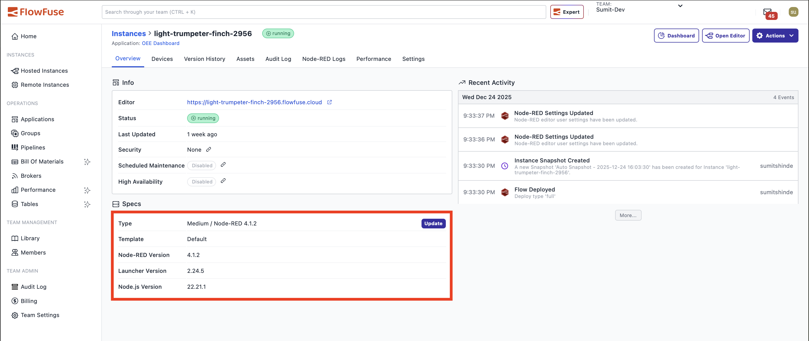
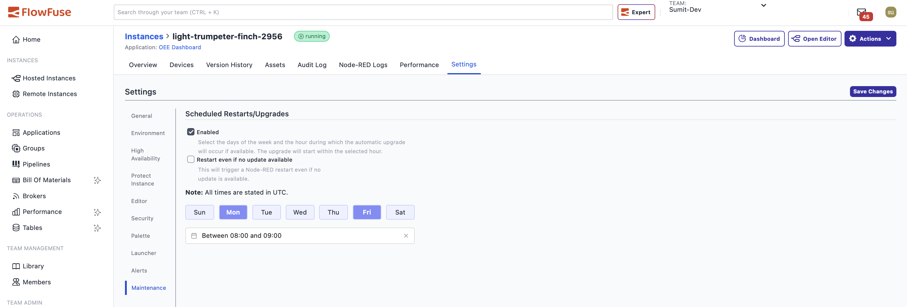

---
eleventyNavigation:
  key: Update Node-RED
  order: 2
  parent: Getting Started
meta:
  title: How to Update Node-RED
  description: Learn how to update Node-RED across different installation methods including npm, Raspberry Pi, Docker, and FlowFuse
  keywords: Node-RED update, upgrade Node-RED, Node-RED version, update npm Node-RED
---

# {{meta.title}}

Regular updates keep your Node-RED installation running smoothly with the latest features, improvements, and bug fixes. Each new release brings enhancements that expand what you can build and improve your development experience. Whether you installed Node-RED through npm, used the Raspberry Pi script, or are running it in Docker, this guide walks you through the update process step by step. We'll also cover how to check your version, update your installation, and handle updates in FlowFuse.

## Checking Your Current Version

Before updating, check which version you're currently running:

```bash
node-red --version
```

You can also check the version from the Node-RED editor by clicking the menu icon (three horizontal lines) in the top right corner and selecting "About."

## Updating Node-RED Installed with npm

If you installed Node-RED globally using npm, updating is straightforward.

### Standard Update

Stop Node-RED if it's running, then update using npm:

```bash
npm install -g --unsafe-perm node-red
```

The `--unsafe-perm` flag is required on some systems, particularly Linux and macOS, to ensure proper permissions during installation.

### Updating to a Specific Version

To install a specific version rather than the latest:

```bash
npm install -g --unsafe-perm node-red@2.2.0
```

Replace `2.2.0` with your desired version number.

## Updating on Raspberry Pi

If you used the recommended install script on Raspberry Pi, use the same script to update:

```bash
bash <(curl -sL https://raw.githubusercontent.com/node-red/linux-installers/master/deb/update-nodejs-and-nodered)
```

This script will:

- Check if updates are available
- Update Node-RED to the latest version
- Update Node.js if needed
- Preserve your existing flows and configuration

## Updating Docker Installations

For Docker installations, updating involves pulling the latest image and recreating your container.

**Step 1: Pull the Latest Image**

```bash
docker pull nodered/node-red:latest
```

**Step 2: Stop and Remove the Old Container**

```bash
docker stop mynodered
docker rm mynodered
```

Replace `mynodered` with your actual container name. If you're not sure what your container is named, run `docker ps -a` to see a list of all your containers.

**Step 3: Start a New Container**

```bash
docker run -d --name mynodered -p 1880:1880 -v node_red_data:/data nodered/node-red:latest
```

Make sure to use the same volume mapping (`-v`) to preserve your flows and settings.

## Updating FlowFuse Node-RED Instance

Updating a FlowFuse-managed Node-RED instance is quick and straightforward:

1. Navigate to your FlowFuse instance
2. Go to the **Overview** tab
3. In the **Specs** section, you'll see all details including your current Node-RED version
4. If an update is available, you'll see an **Update** button in the top right corner of the specs section
5. Click the **Update** button

{data-zoomable}

You'll be redirected to the instance settings where you have two options:

### Update to Latest Version

Click **Update Node-RED version** to install the latest available version.

### Change to Specific Version

1. Click **Change Node-RED version**
2. Select your desired Node-RED version from the dropdown
3. Click **Change Node-RED version** to apply

FlowFuse handles the update process automatically while preserving your flows and configuration.

## Scheduling Automatic Updates

Instead of updating instances manually, you can schedule automatic updates in flowfuse:

1. Go to **Settings**
2. Open the **Maintenance** section
3. Configure the update schedule by selecting:
   - Days of the week
   - Preferred time ranges

{data-zoomable}

FlowFuse will then automatically update your Node-RED instances within the defined maintenance window, ensuring they stay up to date without manual intervention.