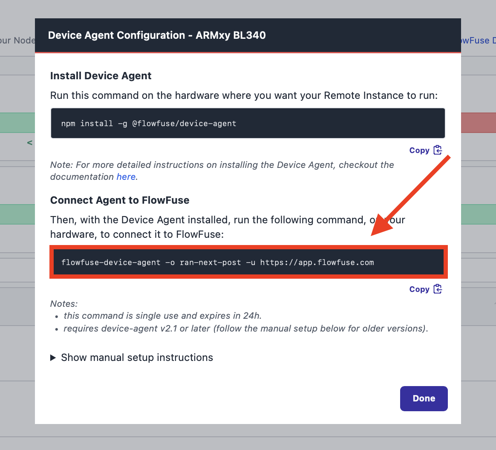
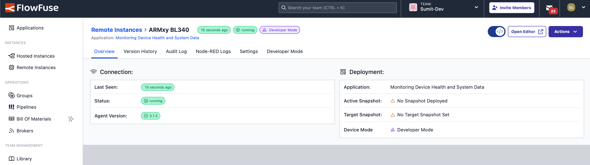
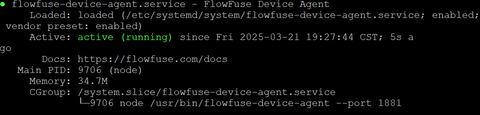

---
eleventyNavigation:
  key: ARMxy BL340
  parent: Hardware
meta:
  title: Setting Node-RED on ARMxy BL340
  description: Guide to setting up Node-RED on ARMxy BL340, including installation and configuration steps.
  keywords: node-red, flowfuse, ARMxy BL340
image: "/node-red/hardware/images/armxy-bl340.jpg"
specifications:
  Model: ARMxy BL340 Series
  RAM: 16GB LPDDR4X
  Processor: ARM Cortex-A76 + Cortex-A55, Octa-core
  GPU: Mali-G57
  GPIO: 40-pin expansion header
  Connectivity: Dual-band Wi-Fi 6, Bluetooth 5.2, Gigabit Ethernet, 4x USB 3.0, 1x USB-C
  Clock Speed: Up to 2.2 GHz
  Storage: NVMe SSD, microSD
  Display Output: HDMI 2.0, DisplayPort
  Power Supply: 12V DC, USB-C PD
layout: layouts/hardware.njk
---

The ARMxy BL340 is a high-performance single-board computer designed for demanding applications, including edge computing, automation, and embedded systems. Featuring an octa-core ARM processor, advanced connectivity options, and support for high-speed storage, it provides a powerful platform for developers and engineers.

## Prerequisites

Before proceeding with the installation, ensure you have the following:

- **ARMxy BL340** – A functioning device with internet access.
- **FlowFuse Account** -  Ensure you have a FlowFuse account. If not, you can create a free account that allows you to manage up to two edge devices for free. For more information, refer to [FlowFuse Free Tier](/blog/2024/12/flowfuse-release-2-12/)
- **Sudo Privileges** – Administrator access to install required packages.

## Getting Started

This guide explores how to install and run Node-RED through the FlowFuse Device Agent on the ARMxy BL340, enabling you to build, manage, and scale Node-RED flows efficiently from a remote location.

### Installing Node.js

To get started, you need to install Node.js. Follow the steps below to install it on your ARMxy BL340

```bash
sudo apt update && sudo apt upgrade -y 
sudo apt install -y nodejs
```

Once done, you can verify the installation with the following command:

```bash
node -v
```

This should return the installed Node.js version as follow:

```bash
v18.20.6
```

If Node.js 18 or a later version is installed, you can proceed further. If not, ensure that you install Node.js version 18 or later before continuing.

### Installing FlowFuse Device Agent

Next, you need to install the FlowFuse Device Agent. This will enable your ARMxy BL340 to connect to the FlowFuse platform, allowing you to manage and scale your Node-RED flows remotely.

To install the [FlowFuse Device Agent](/product/device-agent/), run the following command:

```bash
sudo npm install -g @flowfuse/device-agent
```

### Registering the Device to Connect to FlowFuse

Once you have installed the FlowFuse Device Agent, you need to register the hardware to connect it to your FlowFuse team.

For instructions on how to register the hardware with your FlowFuse team, follow the documentation: [Register your Remote Instance](https://flowfuse.com/docs/device-agent/register/).

When registering your hardware, you will be presented with a dialog containing a one-time passcode command that the Device Agent use to retrieve its configuration. **Make sure to copy it.**

{data-zoomable}

### Connecting Device

Execute the command you have copied:

```bash
sudo flowfuse-device-agent -o <insert-your-three-word-token> https://app.flowfuse.com
```

Once executed, you should see an output similar to the one below, indicating that the FlowFuse Device Agent has been successfully configured:

```bash
[AGENT] 3/21/2025 7:09:25 PM [info] Entering Device setup...
[AGENT] 3/21/2025 7:09:27 PM [info] Device setup was successful
[AGENT] 3/21/2025 7:09:27 PM [info] To start the Device Agent with the new configuration, run the following command:
[AGENT] 3/21/2025 7:09:27 PM [info] flowfuse-device-agent
```

To run the FlowFuse Device Agent, execute the following command:

```bash
flowfuse-device-agent
```

Now, you can check the remote instance in the FlowFuse platform, where its status should be displayed as **"running."** To start development, enable **Developer Mode** and click the **"Open Editor"** button.

{data-zoomable}

### Running FlowFuse Device Agent as a Service

To ensure that the FlowFuse Device Agent starts automatically on boot, configure it as a systemd service. Create a new service file for the FlowFuse Device Agent with the following command, which will create and write the necessary content to the systemd service file:

```bash
echo "[Unit]
Description=FlowFuse Device Agent
Wants=network.target
Documentation=https://flowfuse.com/docs

[Service]
Type=simple
User=$USER
WorkingDirectory=/opt/flowfuse-device

Environment=\"NODE_OPTIONS=--max_old_space_size=512\"
ExecStart=/usr/bin/env -S flowfuse-device-agent --port 1881
KillSignal=SIGINT
Restart=on-failure
RestartSec=20
SyslogIdentifier=FlowFuseDevice

[Install]
WantedBy=multi-user.target" | sudo tee /etc/systemd/system/flowfuse-device-agent.service >/dev/null
```

Then, enable and start the service by running:

```bash
sudo systemctl daemon-reload
sudo systemctl enable flowfuse-device-agent.service
sudo systemctl start flowfuse-device-agent.service
```

Finally, verify the service is running with:

```bash
sudo systemctl status flowfuse-device-agent.service
```

{data-zoomable}

Now, when your device reboots, the FlowFuse Device Agent will automatically start, ensuring that your ARMxy BL340 remains connected to the FlowFuse platform.
