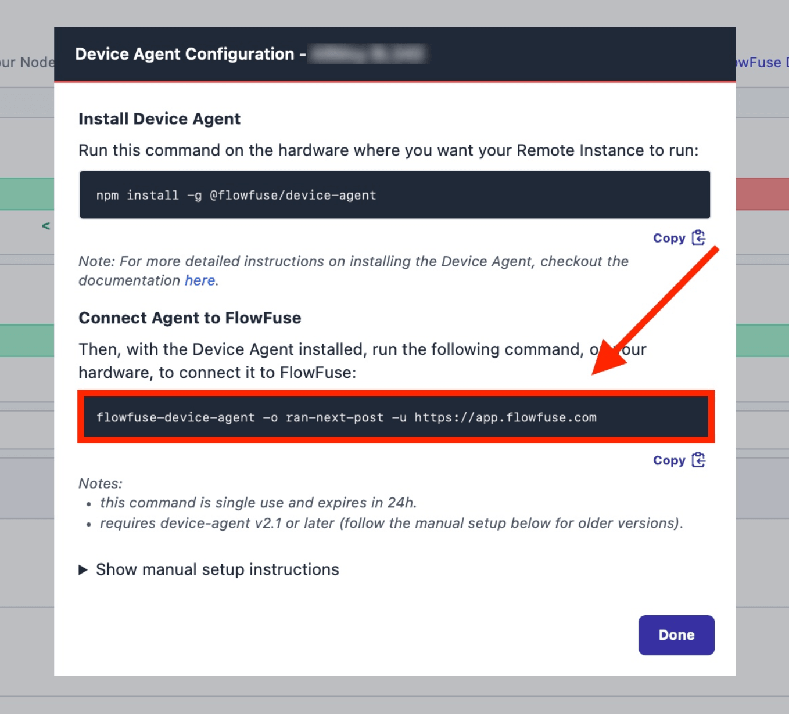

---
eleventyNavigation:
  key: Opto-22 Groov Epic
  parent: Hardware
meta:
  title: Setting up Node-RED on Opto-22 Groov Rio R7
  description: Learn how to install and configure Node-RED on the Opto-22 Groov Rio R7, a rugged edge I/O module for industrial applications.
  keywords: node-red, flowfuse, Opto-22 Groov Rio, groov RIO, industrial IoT, edge computing
image: "/node-red/hardware/images/GRV-R7-MM1001-10.jpeg"
specifications:
  Model: GRV-R7-MM2001-10
  RAM: 1024 MB
  Processor: ARM Cortex-A8, 1 GHz
  I/O Channels: 10 multi-signal, multifunction channels (analog I/O, temperature, discrete I/O, mechanical relays)
  Connectivity:
    - Dual switched Gigabit Ethernet
    - USB 2.0 (host)
    - Power over Ethernet (PoE)
    - 10–32 VDC power input
  Clock Speed: 1 GHz
  Storage:
    - 4 GB eMMC (internal)
    - USB memory stick support (up to 32 GB)
layout: layouts/hardware.njk
---

The Opto-22 Groov Rio R7 is a rugged edge I/O module designed for industrial applications. Equipped with a powerful ARM Cortex-A8 processor, versatile I/O channels, and various connectivity options, it’s an ideal solution for edge computing and industrial IoT.

## Prerequisites

Before proceeding with the installation, ensure you have the following:

- **Opto-22 Groov Rio R7** – A functioning device with internet access.
- **FlowFuse Account** - You need an active FlowFuse account to access the platform and configure your instance. If you do not have one, please visit the FlowFuse website and [sign up]({{ site.onboardingURL }}) for a new account before proceeding.
- **Sudo Privileges** – Administrator access to install required packages.

## Getting Started

This guide will walk you through setting up Node-RED on the Groov Rio R7 using the FlowFuse Device Agent, allowing you to manage, scale, and secure your remote instances effectively.



### Registering the Device to Connect to FlowFuse

Once you have installed the FlowFuse Device Agent, you need to register the hardware to connect it to your FlowFuse team.

For instructions on how to register the hardware with your FlowFuse team, follow the documentation: [Register your Remote Instance](https://flowfuse.com/docs/device-agent/register/).

When registering your hardware, you will be presented with a dialog containing a one-time passcode command that the Device Agent uses to retrieve its configuration. **Make sure to copy it.**

{data-zoomable}

### Connecting Device

Execute the command you have copied with sudo as shown below

```bash
sudo flowfuse-device-agent -o <insert-your-three-word-token> https://app.flowfuse.com --port 1881
```

> **Important:** Be sure to include the --port 1881 flag when running the command. By default, the Opto-22 firewall only allows access to port 1880 (default Node-RED port) by a very restricted list of users, so the Groov Rio R7 requires specifying port 1881 for the Device Agent to start correctly.

Once executed, you should see an output similar to the one below, indicating that the FlowFuse Device Agent has been successfully configured:

```bash
[AGENT] 3/21/2025 7:09:25 PM [info] Entering Device setup...
[AGENT] 3/21/2025 7:09:27 PM [info] Device setup was successful
[AGENT] 3/21/2025 7:09:27 PM [info] To start the Device Agent with the new configuration, run the following command:
[AGENT] 3/21/2025 7:09:27 PM [info] flowfuse-device-agent
```

Now, you can check the remote instance in the FlowFuse platform, where its status should be displayed as **"running."**.
