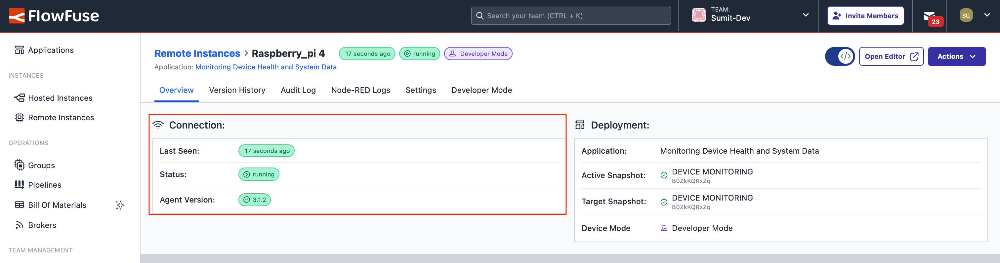

---
eleventyNavigation:
  key: Raspberry Pi 4
  parent: Hardware
meta:
  title: Setting Node-RED on Raspberry Pi 4
  description: Learn how to install the FlowFuse Edge Agent on the Raspberry Pi 4 effortlessly. Manage your device with Node-RED through FlowFuse with ease.
  keywords: node-red, flowfuse, raspberry pi, raspberry pi 4
image: "/node-red/hardware/images/raspberry-pi-4-b.png"
specifications:
  Model: Raspberry Pi 4 B 8GB
  RAM_MB: 8192
  Processor: Broadcom BCM2711, ARM Cortex-A72 (ARMv8-A), 4 (Quad-core)
  GPIO: (Fully backwar ds-compatible with previous boards), Standard 40-pin GPIO Header
  Connectivity: Dual-band Wi-Fi, Bluetooth 5.0, Gigabit Ethernet, 2x USB 3.0, 2x USB 2.0
  Clock Speed: 1.5 GHz
  Storage: microSD
layout: layouts/hardware.njk
---

## Raspberry Pi OS Installation

To set up your Raspberry Pi 4 for use with Node-RED and FlowFuse, follow these steps:

### Flashing Raspberry Pi OS

1. Use the [official Raspberry Pi Imager](https://www.raspberrypi.com/software/) to flash the 64-bit version of Raspberry Pi OS to an SD card.


2. Before writing to the SD card, configure the OS for headless mode, including Wi-Fi, SSH, and authentication settings.


3. Write the OS and configuration to the SD card. This process takes about 10 minutes.

4. Insert the SD card into the Raspberry Pi 4 and power it on. The device should appear on your network after a minute or so.

5. Connect to the Raspberry Pi using SSH:

    ```sh
    ssh pi@raspberrypi.local
    ```

## Getting Started

This guide explores how to install and run Node-RED through the FlowFuse Device Agent on the Raspberry Pi 4, enabling you to build, manage, and scale Node-RED flows efficiently from a remote location.





{data-zoomable}

