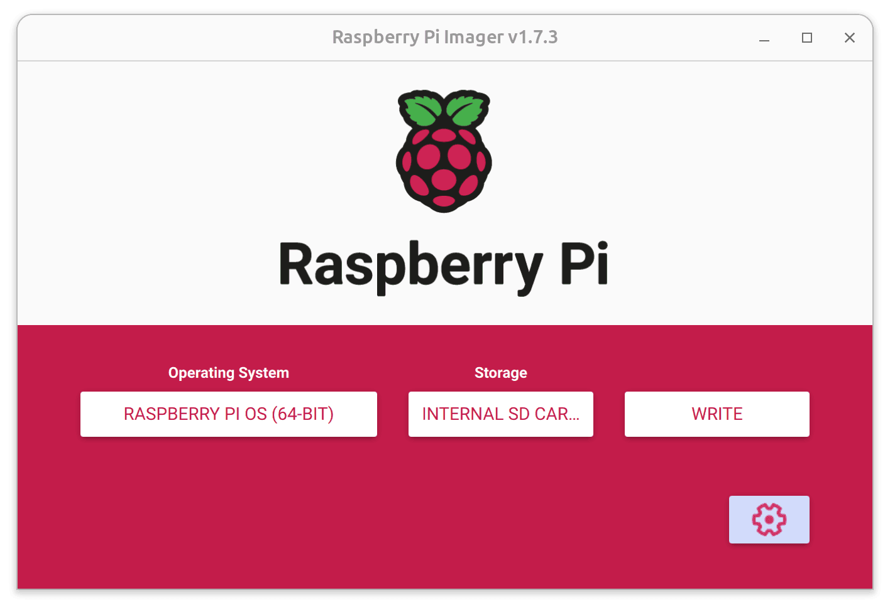

---
eleventyNavigation:
  key: Raspberry Pi 4
  parent: Hardware
meta:
  title: Setting Node-RED on Raspberry Pi 4
  description: Learn how to install the FlowFuse Edge Agent on the Raspberry Pi 4 effortlessly. Manage your device with Node-RED through FlowFuse with ease.
  keywords: node-red, flowfuse, raspberry pi, raspberry pi 4
image: "/node-red/hardware/images/raspberry-pi-4-b.png"
specifications:
  Model: Raspberry Pi 4 B 8GB
  RAM: 8GB
  Processor: Broadcom BCM2711, ARM Cortex-A72 (ARMv8-A), 4 (Quad-core)
  GPIO: (Fully backwar ds-compatible with previous boards), Standard 40-pin GPIO Header
  Connectivity: Dual-band Wi-Fi, Bluetooth 5.0, Gigabit Ethernet, 2x USB 3.0, 2x USB 2.0
  Clock Speed: 1.5 GHz
  Storage: microSD
layout: layouts/hardware.njk
---

## Raspberry Pi OS Installation

To set up your Raspberry Pi 4 for use with Node-RED and FlowFuse, follow these steps:

### Flashing Raspberry Pi OS

1. Use the [official Raspberry Pi Imager](https://www.raspberrypi.com/software/) to flash the 64-bit version of Raspberry Pi OS to an SD card.



2. Before writing to the SD card, configure the OS for headless mode, including Wi-Fi, SSH, and authentication settings.


3. Write the OS and configuration to the SD card. This process takes about 10 minutes.

4. Insert the SD card into the Raspberry Pi 4 and power it on. The device should appear on your network after a minute or so.

5. Connect to the Raspberry Pi using SSH:

    ```sh
    ssh pi@raspberrypi.local
    ```

6. Update and upgrade the system:

    ```sh
    sudo apt-get update
    sudo apt-get upgrade -y
    ```

## Installing FlowFuse Device Agent

The FlowFuse Device Agent manages Node-RED on the Raspberry Pi, handling Node-RED versions, upgrades, setup, management, and access controls.

FlowFuse provides a script to install the FlowFuse Device Agent onto a Raspberry Pi in an easy way. This script will check if Node.js is installed and ensure it's at least version 14; if not found, it installs latest Node.js version. Then, it installs the latest FlowFuse Device Agent using npm and sets it up to run as a service, which means it sets up the Pi to run the FlowFuse agent every time it boots up and restart it if it ever crashes.

```sh
bash <(curl -sL https://raw.githubusercontent.com/FlowFuse/device-agent/main/service/raspbian-install-device-agent.sh)
```

## Linking the Device Agent to Your FlowFuse Team

Now, before you begin developing applications with FlowFuse running on the device, you need the device to be configured with a token to identify itself on FlowFuse. To register and generate configuration details, visit `flowfuse.com`, log in with your ID and password, or if you don't have an account, create one, and then follow the steps below:

### Generating "Device Configuration"

1. Go to your team's **Devices** page.
2. Click the **Add Device** button.
3. You will be prompted to give the device a Name, an optional Type, and to choose which Application, if any, the device should be assigned to.
4. The Type field can be used to record additional meta information about the device.
5. If you do not wish to assign the device to an Application at this time, you can do so later.
6. Click **Add**.
7. Once the device has been registered, you will be shown the Device Configuration dialog which contains all the information needed to connect the device to the platform.

### Linking to FlowFuse Team

To link the FlowFuse Device Agent to your FlowFuse team, you have two different options. You can either utilize the command provided by FlowFuse, as explained in this section or opt for the Device Agent web UI interface. For more details on using the Device Agent web UI, refer to the [Device Agent Web UI documentation](/docs/device-agent/register/#device-agent-web-ui).

{data-zoomable}

1. Copy the command given in the dialog.
2. Paste that into your Raspberry Pi command line.

Now, your device has successfully connected to your FlowFuse team. When you restart the Raspberry Pi, the agent should start automatically with full configuration. The device will then ping back to FlowFuse, allowing you to commence application development on the FlowFuse Cloud.

### Accessing Node-RED Editor.

{data-zoomable}

1. Login into your FlowFuse account.
2. Click on the **Devices** option in the left sidebar.
3. Click on the device and enable the **developer mode** by clicking on the top right-corner switch.
4. Once Developer Mode is enabled, click on the **Device Editor** option located next to the that switch.
