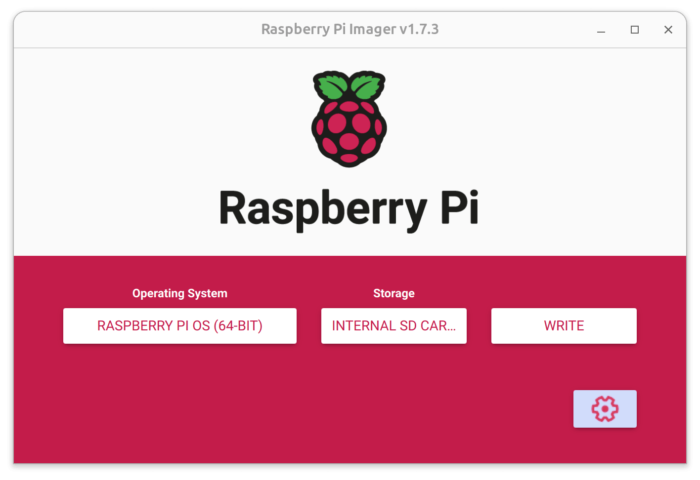
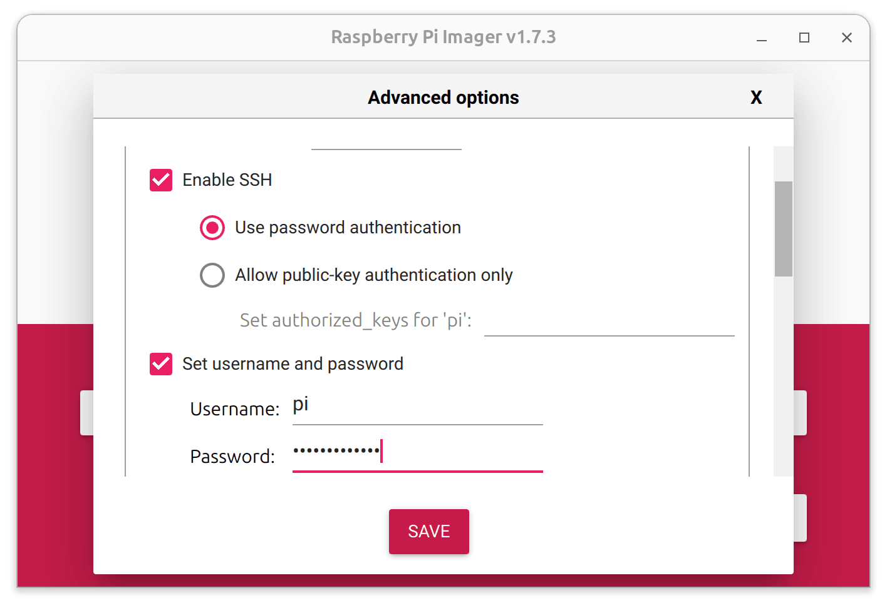
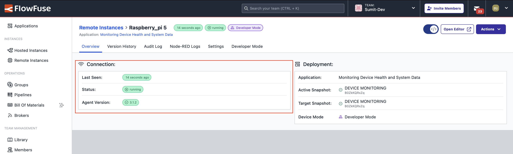

---
eleventyNavigation:
  key: Raspberry Pi 5
  parent: Hardware
meta:
  title: Setting Up Node-RED on Raspberry Pi 5
  description: Learn how to install the FlowFuse Edge Agent on the Raspberry Pi 5 effortlessly. Manage your device with Node-RED through FlowFuse with ease.
  keywords: node-red, flowfuse, raspberry pi, raspberry pi 5
image: "/node-red/hardware/images/raspberrypi-5.png"
specifications:
  Model: Raspberry Pi 5 Model 8GB   
  RAM_MB: 8192
  Processor: Broadcom BCM2712, ARM Cortex-A76 (ARMv8.2-A), 4 (Quad-core)
  GPIO: Standard 40-pin GPIO Header
  Connectivity: 2 × USB 2.0 Ports, 2 × USB 3.0 Ports, Bluetooth 5.0, USB-C, Wi-Fi + Bluetooth® Low Energy
  Clock Speed: 2.4 GHz
  Storage: microSD
layout: layouts/hardware.njk
---

## Raspberry Pi OS Installation

To set up your Raspberry Pi 5 for use with Node-RED and FlowFuse, follow these steps:

### Flashing Raspberry Pi OS

1. Use the [official Raspberry Pi Imager](https://www.raspberrypi.com/software/) to flash the 64-bit version of Raspberry Pi OS to an SD card.



2. Before writing to the SD card, configure the OS for headless mode, including Wi-Fi, SSH, and authentication settings.



3. Write the OS and configuration to the SD card. This process takes about 10 minutes.

4. Insert the SD card into the Raspberry Pi 5 and power it on. The device should appear on your network after a minute or so.

5. Connect to the Raspberry Pi using SSH:

    ```sh
    ssh pi@raspberrypi.local
    ```

## Getting Started

This guide explores how to install and run Node-RED through the FlowFuse Device Agent on the Raspberry Pi 5, enabling you to build, manage, and scale Node-RED flows efficiently from a remote location.





{data-zoomable}

