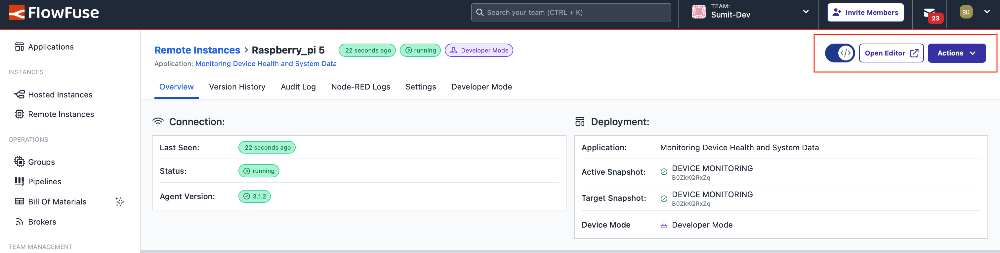

---
eleventyNavigation:
  key: Raspberry Pi 5
  parent: Hardware
meta:
  title: Setting Up Node-RED on Raspberry Pi 5
  description: Learn how to install the FlowFuse Edge Agent on the Raspberry Pi 5 effortlessly. Manage your device with Node-RED through FlowFuse with ease.
  keywords: node-red, flowfuse, raspberry pi, raspberry pi 5
image: "/node-red/hardware/images/raspberrypi-5.png"
specifications:
  Model: Raspberry Pi 5 Model 8GB   
  RAM: 8GB LPDDR4 SDRAM
  Processor: Broadcom BCM2712, ARM Cortex-A76 (ARMv8.2-A), 4 (Quad-core)
  GPIO: Standard 40-pin GPIO Header
  Connectivity: 2 × USB 2.0 Ports, 2 × USB 3.0 Ports, Bluetooth 5.0, USB-C, Wi-Fi + Bluetooth® Low Energy
  Clock Speed: 2.4 GHz
  Storage: microSD
layout: layouts/hardware.njk
---

## Raspberry Pi OS Installation

To set up your Raspberry Pi 5 for use with Node-RED and FlowFuse, follow these steps:

### Flashing Raspberry Pi OS

1. Use the [official Raspberry Pi Imager](https://www.raspberrypi.com/software/) to flash the 64-bit version of Raspberry Pi OS to an SD card.


2. Before writing to the SD card, configure the OS for headless mode, including Wi-Fi, SSH, and authentication settings.


3. Write the OS and configuration to the SD card. This process takes about 10 minutes.

4. Insert the SD card into the Raspberry Pi 5 and power it on. The device should appear on your network after a minute or so.

5. Connect to the Raspberry Pi using SSH:

    ```sh
    ssh pi@raspberrypi.local
    ```

6. Update and upgrade the system:

    ```sh
    sudo apt-get update
    sudo apt-get upgrade -y
    ```

## Installing the FlowFuse Device Agent

The FlowFuse Device Agent manages Node-RED on the Raspberry Pi, handling Node-RED versions, upgrades, setup, management, and access controls.

1. Install the agent using the following command:

    ```sh
    bash <(curl -sL https://raw.githubusercontent.com/FlowFuse/device-agent/main/service/raspbian-install-device-agent.sh)
    ```

   This script installs a Node.js runtime, the agent, and configures the Raspberry Pi to run the FlowFuse agent on boot and restart it if it crashes.

## Linking the Device Agent to Your FlowFuse Team

Now, before you begin developing applications with FlowFuse running on the device, you need the device to be configured with a token to identify itself on FlowFuse.

### Configuring the FlowFuse Agent

To configure the FlowFuse Cloud with your devices:

1. Log into the FlowFuse team and go to the devices option in the sidebar.
2. Add a new device by clicking on the top right "Add Device" button. In the popup that opens, enter the name for your device, select the type (optional), and assign the device to an application (optional). Then, click on the "Add" button.
3. After successfully creating and adding the device, you'll see a popup window with the command that allows you to quickly configure the device with FlowFuse Cloud.

{data-zoomable}

1. Copy that command and run it in your device's terminal. The device agent will start, and it will be configured with FlowFuse Cloud. To verify this, go to the FlowFuse team, click on the devices option in the sidebar, and then click on the device you have configured. You will see the status as running and last seen in green color.

### Accessing Node-RED Editor.

{data-zoomable}

1. Login into your FlowFuse account.
2. Click on the **Devices** option in the left sidebar.
3. Click on the device and enable the **developer mode** by clicking on the top right-corner switch.
4. Once Developer Mode is enabled, click on the **Device Editor** option located next to the that switch.

For more information refer to [FlowFuse documentation](/docs/user/introduction/#working-with-devices)