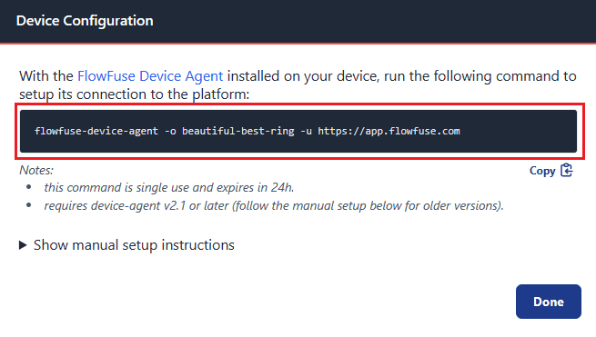

---
eleventyNavigation:
  key: Revolutionary Pi
  parent: Hardware
meta:
   title: Setting Node-RED on Revolutionary Pi
   description: Learn how to install and configure the FlowFuse Device Agent on a Revolutionary Pi, set up Node.js, and ensure seamless remote management with FlowFuse.
   keywords: node-red, raspberry pi, Revolutionary Pi
---

# {{meta.title}}

Revolution Pi is an industrial-grade computer based on the Raspberry Pi Compute Module, designed specifically for use in industrial automation environments. It offers robust hardware, a real-time operating system, and support for various industrial protocols, allowing it to be used as an IIoT gateway to collect and send data from factory machines to the cloud.

## Goal

This documentation guides users through installing the FlowFuse Device Agent on a Revolutionary Pi. The agent enables running Node-RED on the edge device, managing it remotely via FlowFuse, and accessing [enterprise features](/product/features/) that are useful for organizations. Since the device does not come with Node.js preinstalled, this guide covers installing both Node.js and the FlowFuse Device Agent.

## Prerequisites

Before proceeding with the installation, ensure you have the following:

- **Revolutionary Pi** – A functioning device with internet access.
- **Sudo Privileges** – Administrator access to install required packages.
- **Network Access** – Ensure outbound traffic is allowed on port 443 for connections to:

  - `app.flowfuse.com:443`
  - `mqtt.flowfuse.cloud:443`

- **Firewall Rules** – The Device Agent does not install Node-RED at startup. When receiving a snapshot, it downloads the required Node-RED version. Allow access to:

  - `https://registry.npmjs.com`

Verify that your device can access the necessary services. If telnet is not installed, install it using:

```bash
sudo apt install -y telnet
```

Then, run the following commands:

  ```bash
  telnet app.flowfuse.com 443
  telnet mqtt.flowfuse.cloud 443
  telnet registry.npmjs.com 443
```

The expected output should indicate that the servers are reachable. For example, a successful response would look like this:

```bash
Trying <IP Address>...
Connected to <hostname>.
Escape character is '^]'.
```

If the connection fails, it will show:

```bash
Trying <IP Address>...
Unable to connect to remote host: Connection refused
```

## Getting Started

This guide provides step-by-step instructions for setting up the FlowFuse Device Agent on a Revolutionary Pi. It begins with installing Node.js, a prerequisite for running the agent, followed by the installation and configuration of the FlowFuse Device Agent.

### Installing Node.js

Since Node.js is not preinstalled on the Revolutionary Pi, follow these steps to install it:

#### Step 1: Update System Packages

```bash
sudo apt update && sudo apt upgrade -y
```

#### Step 2: Install Node.js

You can install Node.js from the default APT repositories:

```bash
sudo apt install -y nodejs
```

#### Step 3: Verify Installation

```bash
node -v
```

After running the verification command, the installed Node.js version should be displayed in the terminal.

> **Note:** Ensure that the installed version is **Node.js 18 or later**, as this is the recommended version for optimal compatibility with the device agent.

### Installing the FlowFuse Device Agent

#### Step 1: Install Required Package (curl)

If `curl` is not already installed on your system, you will need to install it first:

```bash
sudo apt install -y curl
```

#### Step 2: Execute the Installation Script

To install the FlowFuse Device Agent and set it up as a service, download and execute the installation script from GitHub:

```bash
bash <(curl -sL https://raw.githubusercontent.com/FlowFuse/device-agent/main/service/raspbian-install-device-agent.sh)
```

This script installs the agent, and configures the Revolutionary Pi to run the FlowFuse agent on boot and restart it if it crashes.

### Registering the Device Agent to FlowFuse and Running It

After installing the FlowFuse Device Agent, the next step is to link the Revolutionary Pi to your [FlowFuse team](/docs/user/team/). This allows the device to be managed remotely and receive Node-RED deployments.

#### Step 1: Add a New Device to Your FlowFuse Team

Follow the instructions in the official documentation to add your device to your FlowFuse team: [Add a Remote Instance](/docs/device-agent/register/#add-remote-instance).

Once you register the device, you will receive the configuration details required to connect device to your team. Copy the provided command.

{data-zoomable}

#### Step 2: Configuring the Device

Execute the command you copied to complete the device configuration.

#### Step 3: Restart the Device Agent

Once the device is configured, restart it. The FlowFuse Device Agent will start automatically upon reboot.

#### Step 4: Verifying the Device Agent is Running

After the device restarts, you can check if the FlowFuse Device Agent is running by using the following command:

```bash
sudo systemctl status flowfuse-device-agent
```

This should display the status of the FlowFuse Device Agent, showing whether it's active and running.

> **Note:** If you encounter any issues with the agent not starting automatically, you can manually start it with the following command:

```bash
sudo systemctl start flowfuse-agent
```

#### Step 5: Monitor and Manage Device from FlowFuse

Once the device is successfully registered and running, you can monitor and manage it from the FlowFuse platform remotly. Any changes you make to the device’s configuration or Node-RED flows will be reflected on the device immediately.

To access the device editor, go to your FlowFuse team, where you will see the Revolutionary Pi listed under remote instances. Click on it to enable the device editor, then open the editor. For more information, refer to [Deploy Flows to Remote Instances](https://flowfuse.com/docs/device-agent/quickstart/#deploy-flows-to-remote-instances).
