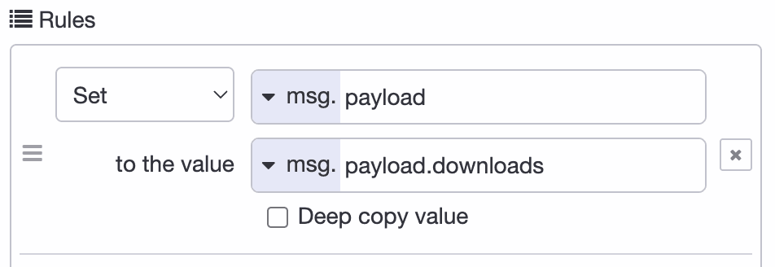
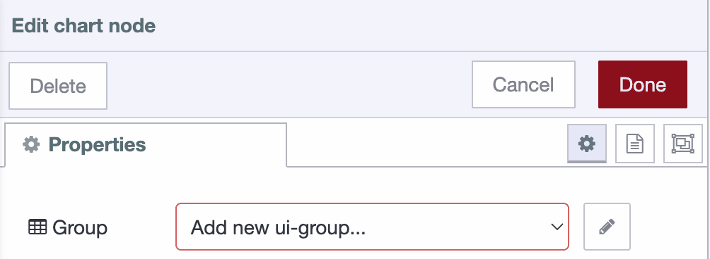
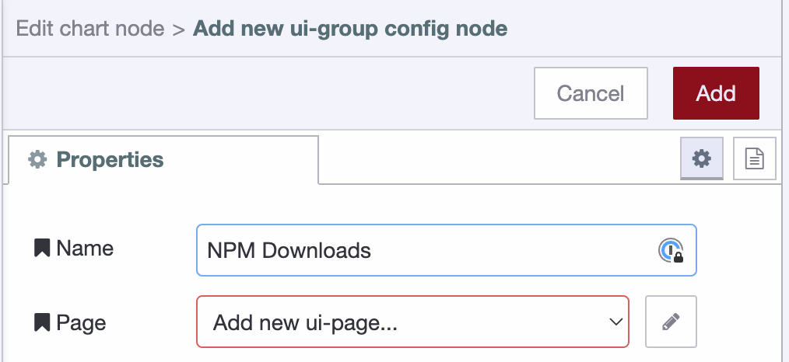
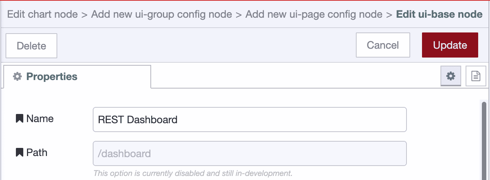
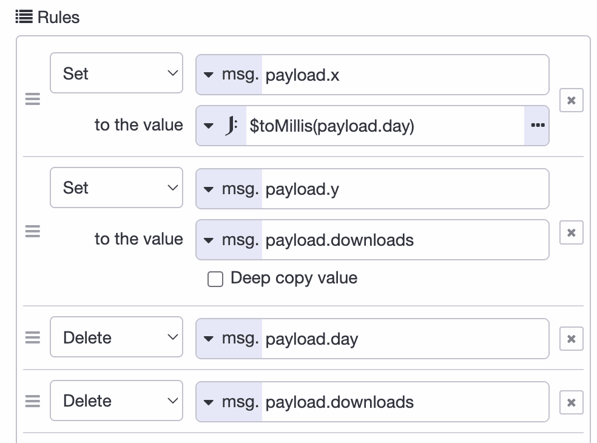
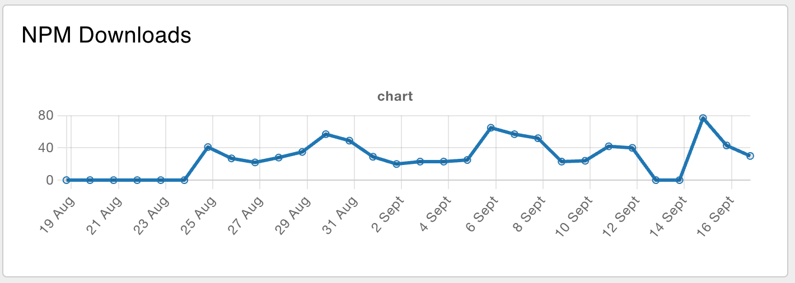

---
eleventyNavigation:
  key: REST API
  parent: "Integration Technologies"
meta:
   title: Creating REST API's with Node-RED
   description: Learn how to create REST APIs in Node-RED and fetch data from an API.
   keywords: node-red, flowfuse, rest api
---

# {{meta.title}}

REST APIs are how applications talk to each other over the web. They use standard HTTP methods (GET, POST, PUT, DELETE) to send and receive data, usually in JSON format. This guide shows you how to build your own REST APIs in Node-RED and how to pull data from existing APIs.

## Creating a GET API

1. Drag an "http-in" onto the workspace, double click on it and select the Method to for which operation you need, set URL endpoint.
2. Drag an chagne node onto the workspace and set the `msg.payload` to data you want to send as response.
3. Then Drag an http response node, in it and set the status code if want.
4. Connect the "http-in" node's output to the input of the function node and the function node's output to the input of the http response node.


[{"id":"27333f67794bdc72","type":"http in","z":"977143edb097b685","name":"","url":"/test","method":"get","upload":false,"swaggerDoc":"","x":320,"y":220,"wires":[["f351033226953150"]]},{"id":"a7ee48616541a36a","type":"http response","z":"977143edb097b685","name":"","statusCode":"200","headers":{},"x":760,"y":220,"wires":[]},{"id":"dcfc8d1126f139d5","type":"comment","z":"977143edb097b685","name":"Http-in node created API sending todo list as response","info":"","x":540,"y":140,"wires":[]},{"id":"f351033226953150","type":"change","z":"977143edb097b685","name":"","rules":[{"t":"set","p":"payload","pt":"msg","to":"todos","tot":"global"}],"action":"","property":"","from":"","to":"","reg":false,"x":540,"y":220,"wires":[["a7ee48616541a36a"]]}]


## Creating a POST, PUT, and DELETE API

1. Drag an "HTTP In" node onto the workspace. Double-click on it and select the desired method (POST, PUT, DELETE).
2. Add a node to the canvas based on your application's needs. For example, if you've selected DELETE, you may use a Change node to perform operations to delete data stored in Node-RED context. Set `msg.payload` to the response data you want to send, make sure the msg.payload is originated from "http-in" node.
3. Drag an "HTTP Response" node onto the workspace. Configure it and set the status code if needed.
4. Connect the output of the "HTTP In" node to the input of the node handling your application logic (e.g., Change node for DELETE operation). Then, connect the output of this node to the input of the HTTP Response node.


[{"id":"8893fc84b3391b34","type":"http in","z":"977143edb097b685","name":"","url":"/todo/delete","method":"delete","upload":true,"swaggerDoc":"","x":250,"y":720,"wires":[["088808484586fdc1"]]},{"id":"04a60e7af4d6d522","type":"http response","z":"977143edb097b685","name":"","statusCode":"204","headers":{},"x":740,"y":720,"wires":[]},{"id":"088808484586fdc1","type":"function","z":"977143edb097b685","name":"Delete the todo item","func":"let todoList = global.get('todos') || [];\nlet id = msg.payload.id;\n\n// Find the index of the item to delete\nlet index = todoList.findIndex(item => item.id === id);\n\nif (index !== -1) {\n    // Remove the item from the todoList array\n    todoList.splice(index, 1);\n    global.set('todos', todoList);\n    msg.payload = \"Item deleted successfully.\";\n    msg.statusCode = 204; // No Content\n} else {\n    msg.payload = \"Item not found.\";\n    msg.statusCode = 404; // Not Found\n}\n\nreturn msg;\n","outputs":1,"timeout":0,"noerr":0,"initialize":"","finalize":"","libs":[],"x":520,"y":720,"wires":[["04a60e7af4d6d522"]]}]



[{"id":"825a6296456b7c27","type":"http in","z":"977143edb097b685","name":"","url":"/todo","method":"post","upload":true,"swaggerDoc":"","x":260,"y":1460,"wires":[["0133494821cf99ca","9fe48410514631f8"]]},{"id":"0133494821cf99ca","type":"debug","z":"977143edb097b685","name":"debug 1","active":true,"tosidebar":true,"console":false,"tostatus":false,"complete":"true","targetType":"full","statusVal":"","statusType":"auto","x":540,"y":1420,"wires":[]},{"id":"5284a06365a7f8f7","type":"http response","z":"977143edb097b685","name":"","statusCode":"201","headers":{},"x":860,"y":1500,"wires":[]},{"id":"9fe48410514631f8","type":"function","z":"977143edb097b685","name":"store todo in todolist ","func":"let todoList = global.get('todos') || [];\nlet newTodo = msg.payload;\n\ntodoList.push(newTodo);\nglobal.set('todos',todoList)\nreturn msg;","outputs":1,"timeout":0,"noerr":0,"initialize":"","finalize":"","libs":[],"x":560,"y":1500,"wires":[["5284a06365a7f8f7"]]}]



[{"id":"8893fc84b3391b34","type":"http in","z":"977143edb097b685","name":"","url":"/todo/update","method":"put","upload":true,"swaggerDoc":"","x":400,"y":280,"wires":[["088808484586fdc1"]]},{"id":"04a60e7af4d6d522","type":"http response","z":"977143edb097b685","name":"","statusCode":"200","headers":{},"x":900,"y":280,"wires":[]},{"id":"088808484586fdc1","type":"function","z":"977143edb097b685","name":"update the todo item","func":"let todoList = global.get('todos') || [];\nlet id = msg.payload.id;\nlet newTodo = msg.payload.newtodo;\n\n// Find the index of the item to update\nlet index = todoList.findIndex(item => item.id === id);\n\nif (index !== -1) {\n    // Update the todo item\n    todoList[index].task = newTodo;\n    global.set('todos', todoList);\n    msg.payload = \"Item updated successfully.\";\n    msg.statusCode = 200; // OK\n} else {\n    msg.payload = \"Item not found.\";\n    msg.statusCode = 404; // Not Found\n}\n\nreturn msg;\n","outputs":1,"timeout":0,"noerr":0,"initialize":"","finalize":"","libs":[],"x":660,"y":280,"wires":[["04a60e7af4d6d522"]]},{"id":"ea3e7e96bbccf530","type":"comment","z":"977143edb097b685","name":"Http in node created api for updating the todo item","info":"","x":650,"y":200,"wires":[]}]


For more details, refer to the [CRUD API Blueprint](https://flowfuse.com/blueprints/getting-started/crud/), where we have created CRUD APIs to store, retrieve, delete, and update the data from MongoDB database.

## Securing Your APIs

APIs without security are open doors to your application. Here are essential practices for protecting your endpoints:

### Authentication

The simplest approach is HTTP Basic Authentication. Add authentication to your http-in nodes:

1. Open your **http-in** node
2. Enable "Use authentication"
3. Set a username and password

Node-RED will reject requests without valid credentials. For production systems, consider more robust options like:

- **API Keys**: Send a secret key in headers that your flow validates
- **OAuth 2.0**: Industry-standard authorization for third-party access
- **JWT Tokens**: Stateless authentication tokens that carry user information

### Rate Limiting

Prevent abuse by limiting how often someone can hit your endpoints. Use the `node-red-contrib-rate-limit` node to throttle requests:

```
npm install node-red-contrib-rate-limit
```

Place it after your http-in node to block excessive requests from the same source.

### HTTPS Only

Never expose APIs over plain HTTP in production. Always use HTTPS to encrypt data in transit. If you're using FlowFuse, HTTPS is handled automatically. For self-hosted instances, configure Node-RED behind a reverse proxy (nginx, Apache) with SSL certificates.

### Input Validation

Always validate incoming data. Don't trust anything users send:

```javascript
// In a function node
if (!msg.payload.id || typeof msg.payload.id !== 'string') {
    msg.statusCode = 400;
    msg.payload = { error: "Invalid ID" };
    return msg;
}
```

Check data types, required fields, and acceptable values before processing.

### CORS Configuration

If your API is called from web browsers, configure CORS properly. Add an **http response** node and set headers:

```
Access-Control-Allow-Origin: https://yourdomain.com
Access-Control-Allow-Methods: GET, POST, PUT, DELETE
Access-Control-Allow-Headers: Content-Type, Authorization
```

Never use `*` for `Allow-Origin` in production—specify exact domains.

## Example: Reading Data

Now that you've learned how to create REST APIs in Node-RED, let's explore an example of reading data using a HTTP GET request. This example will demonstrate how to fetch data from an external API and process it and display on dashboard chart.

For the example we will fetch the data of Node-RED Dashboard 2.0 Downloads from npm registry api.
`https://api.npmjs.org/downloads/range/last-month/@flowforge/node-red-dashboard`.

A simple flow to fetch data from npm registry  would be:


[{"id":"32b083d0ca67265f","type":"inject","z":"977143edb097b685","name":"","props":[{"p":"payload"},{"p":"topic","vt":"str"}],"repeat":"","crontab":"","once":false,"onceDelay":0.1,"topic":"","payload":"","payloadType":"date","x":240,"y":1100,"wires":[["53db14b9a848d5ce"]]},{"id":"53db14b9a848d5ce","type":"http request","z":"977143edb097b685","name":"","method":"GET","ret":"obj","paytoqs":"ignore","url":"https://api.npmjs.org/downloads/range/last-month/@flowforge/node-red-dashboard","tls":"","persist":false,"proxy":"","insecureHTTPParser":false,"authType":"","senderr":false,"headers":[],"x":410,"y":1100,"wires":[["9e08fa8d25a19f24"]]},{"id":"9e08fa8d25a19f24","type":"debug","z":"977143edb097b685","name":"debug 1","active":true,"tosidebar":true,"console":false,"tostatus":false,"complete":"false","statusVal":"","statusType":"auto","x":580,"y":1100,"wires":[]}]


Where we paste the API URL into the settings panel:


When running this flow you'll see a blob of text in the `Debug` pane. This is a
great first start, but a blob isn't useful for the rest of the flow.

We need to parse the data as JSON. While the [JSON node](/node-red/core-nodes/json)
would work, the HTTP request node can do this natively. Let `a parsed JSON object`
the `Return` settings of the HTTP request node.

So now we got the data, and a little more than we need, so let's change the
message output to keep only what we're interested in; `payload.downloads`. To
do this, we'll use the [change node](/node-red/core-nodes/change).



### Building the Dashboard

Follow the [Dashboard getting started guide](/blog/2024/03/dashboard-getting-started/) to get up and running.

Now we drag in the `chart` node that's available after installing the dashboard
package and make sure it' input comes from the configured `change` node. Before
hitting the deploy button the dashboard itself needs configuring:

First add configuration for the `ui-group`: 

To setup the `ui-group` correctly you'll need to add configuration for the `ui-page`: .

To create the UI page it requires another 2 config settings, `ui-base`, and the theming through `ui-theme`.



The default theme is great, so just accept that, and save all dialogs to continue the chart creation.

#### Normalizing the data

The data for the chart needs to be changed before we can show it. The messages should have a `x` and `y` key. So let's prepare the data with
a combination of the [Split](/node-red/core-nodes/split) and change node.

The Split node with the default configuration allows to 30 elements of the array
to be mapped individually. The change node will set the `payload.x` and `payload.y`
on the message:



Connect the change node output to a new chart node, and voila:



### Keeping the data up-to-date

While we created a chart and it has some data, there's one more thing to explain.
How can the data be kept up-to-date? It's straight forward to have the `Inject`
node [run every night](/node-red/core-nodes/inject/),
but the chart would now have multiple data points
for the same day. This paints multiple lines on top of each other. While that works,
the hover of the chart will display the duplication and it's wastefull.

So before we update the chart we need to send a message to the chart where the
[payload is `[]`](https://dashboard.flowfuse.com/nodes/widgets/ui-chart.html#removing-data).
That way the chart is emptied first, and right afterwards it will
receive the new data to write.


[{"id":"da9a67e8c3ea7742","type":"inject","z":"977143edb097b685","name":"","props":[{"p":"payload"}],"repeat":"","crontab":"00 12 * * *","once":false,"onceDelay":0.1,"topic":"","payload":"[]","payloadType":"json","x":250,"y":960,"wires":[["efd22a89abc3c06f","a6851a41dba2c39b"]]},{"id":"a6851a41dba2c39b","type":"http request","z":"977143edb097b685","name":"","method":"GET","ret":"obj","paytoqs":"ignore","url":"https://api.npmjs.org/downloads/range/last-month/@flowforge/node-red-dashboard","tls":"","persist":false,"proxy":"","insecureHTTPParser":false,"authType":"","senderr":false,"headers":[],"x":430,"y":960,"wires":[["7931f7457880f7c3"]]},{"id":"7931f7457880f7c3","type":"change","z":"977143edb097b685","name":"Only get the Downloads","rules":[{"t":"set","p":"payload","pt":"msg","to":"payload.downloads","tot":"msg"}],"action":"","property":"","from":"","to":"","reg":false,"x":650,"y":960,"wires":[["74e3b15c7b09726a"]]},{"id":"74e3b15c7b09726a","type":"link out","z":"977143edb097b685","name":"link out 1","mode":"link","links":["43e4aff34b989e83"],"x":815,"y":960,"wires":[]},{"id":"43e4aff34b989e83","type":"link in","z":"977143edb097b685","name":"Normalize daily data","links":["74e3b15c7b09726a"],"x":195,"y":1040,"wires":[["ca8c62bfbdf75715"]]},{"id":"ca8c62bfbdf75715","type":"split","z":"977143edb097b685","name":"","splt":"\\n","spltType":"str","arraySplt":1,"arraySpltType":"len","stream":false,"addname":"","x":310,"y":1040,"wires":[["3f462d2c7e3bca50"]]},{"id":"3f462d2c7e3bca50","type":"change","z":"977143edb097b685","name":"Prepare data for the chart","rules":[{"t":"set","p":"payload.x","pt":"msg","to":"$toMillis(payload.day)","tot":"jsonata"},{"t":"set","p":"payload.y","pt":"msg","to":"payload.downloads","tot":"msg"},{"t":"delete","p":"payload.day","pt":"msg"},{"t":"delete","p":"payload.downloads","pt":"msg"}],"action":"","property":"","from":"","to":"","reg":false,"x":510,"y":1040,"wires":[["f4e6a85b8cb8dac0"]]},{"id":"4b71fc28c2da66e7","type":"ui-chart","z":"977143edb097b685","group":"bac8effac57694e1","name":"","label":"Daily Downloads","order":9007199254740991,"chartType":"line","xAxisType":"time","removeOlder":1,"removeOlderUnit":"3600","removeOlderPoints":"","colors":["#1f77b4","#aec7e8","#ff7f0e","#2ca02c","#98df8a","#d62728","#ff9896","#9467bd","#c5b0d5"],"width":0,"height":0,"className":"","x":330,"y":1120,"wires":[[]]},{"id":"f4e6a85b8cb8dac0","type":"link out","z":"977143edb097b685","name":"link out 2","mode":"link","links":["6f7068445bfe4311"],"x":675,"y":1040,"wires":[]},{"id":"6f7068445bfe4311","type":"link in","z":"977143edb097b685","name":"Update the chart","links":["f4e6a85b8cb8dac0","79067215ee592ec9","efd22a89abc3c06f"],"x":195,"y":1120,"wires":[["4b71fc28c2da66e7"]]},{"id":"efd22a89abc3c06f","type":"link out","z":"977143edb097b685","name":"link out 3","mode":"link","links":["6f7068445bfe4311"],"x":415,"y":920,"wires":[]},{"id":"bac8effac57694e1","type":"ui-group","name":"NPM Downloads","page":"f10b4d0259e43aeb","width":"6","height":"1","order":-1},{"id":"f10b4d0259e43aeb","type":"ui-page","name":"Main","ui":"cb79bc4520925e32","path":"/","layout":"grid","theme":"2c5d702b11de7dd1","order":-1},{"id":"cb79bc4520925e32","type":"ui-base","name":"My UI","path":"/dashboard","includeClientData":true,"acceptsClientConfig":["ui-notification","ui-control"],"showPathInSidebar":false},{"id":"2c5d702b11de7dd1","type":"ui-theme","name":"Theme Name","colors":{"surface":"#ffffff","primary":"#0094ce","bgPage":"#eeeeee","groupBg":"#ffffff","groupOutline":"#cccccc"}}]
