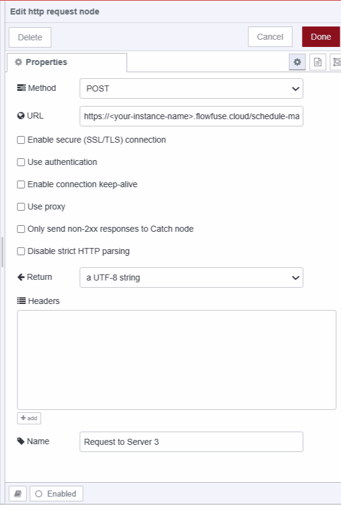

---
eleventyNavigation:
  key: Webhook
  parent: "Integration Technologies"
meta:
   title: Using Webhook with Node-RED
   description: Learn how to seamlessly integrate webhooks into your Node-RED applications for automating tasks and enhancing communication.
   keywords: node-red, flowfuse, webhooks, automation, event-driven
image: /node-red/hardware/images/webhooks-node-red.png
---

# {{meta.title}}

Webhooks let different systems talk to each other automatically when something happens. Instead of constantly asking "anything new?", one system just tells the other "hey, this just happened." This guide shows you how to set up webhooks in Node-RED, using a real manufacturing example where temperature sensors trigger maintenance alerts.

## What are Webhooks?

A webhook is basically an automated HTTP request that fires when a specific event occurs. Think of it like setting up a notification system between two apps—when something happens in App A, it immediately sends a message to App B with all the relevant details.

The technical term is "user-defined HTTP callbacks," but here's what that means in practice: you tell a system "when X happens, send this data to this URL." From then on, it handles everything automatically.

## How Webhook works 

{data-zoomable}

- Event Initiator: This refers to the event specified to trigger the WebHook. Whenever this event occurs, the WebHook will be triggered.
- Webhook Server: The webhook server is responsible for managing webhook configurations and endpoints. It listens for the specified event. When the event is detected, the webhook server automatically sends an HTTP POST request containing relevant data to the designated third-party application or service.
- Data Reception by Third-Party Application: The third-party application will receive the data sent via the WebHook to the designated URL or listener provided during registration.
- Custom Action Execution: Upon receiving the POST request, specific actions can be performed.

## API Vs Webhook

It's common and understandable to get confused between APIs and webhooks, especially when you are learning about webhooks for the first time. However, comparing the two can help dispel these confusions.

| Aspect            | API                                                    | Webhook                                              |
|-------------------|--------------------------------------------------------|------------------------------------------------------|
| Direction         | Typically involves client-to-server communication.     | Typically involves server-to-server communication.   |
| Initiation        | The client initiates requests.                  | The server initiates requests.                |
| Request Method    | Usually employs HTTP methods like GET, POST, etc.      | Typically uses the HTTP POST method.                 |
| Response          | Provides an immediate response upon request.           | Does not provide an immediate response; asynchronous.|
| Data Transfer     | Utilizes a pull model where the client fetches data.  | Operates on a push model where the server pushes data to the client.|
| Polling           | Requires periodic polling for updates.                 | No need for polling; receives updates directly.      |
| Payload           | The client specifies the payload in the request.       | The server defines the payload in the outgoing request. |
| Error Handling    | Typically includes error codes and messages.           | Errors are handled by retry mechanisms or manual intervention. |

### Example Scenario:

Consider a manufacturing facility that utilizes temperature sensors to monitor temperature levels in critical areas. When the temperature falls or exceeds predefined thresholds, it triggers a series of actions for maintenance and monitoring.

{data-zoomable}

- Raspberry Pi with connected temperature sensor (Server 1): Physical sensors are installed in the manufacturing facility and connected to a Raspberry Pi running Node-RED for reading and monitoring temperature data. The application running on Node-RED triggers webhook requests to Server 2 whenever abnormal temperature patterns are detected.
- Webhook Server (Server 2): This server creates and hosts the webhook endpoint. It receives HTTP requests from (Server 1) when abnormal temperatures are detected. The request contains temperature data. Server 2 then processes this data and sends a POST request with relevant information to Server 3.
- Maintenance System (Server 3): This system receives POST requests from Server 2 containing event-related data on a specific endpoint provided to Server 2. It then automatically schedules maintenance tasks based on the received information.

## Practical implementation

In this section, we will construct the practical implementation of the scenario described above. all three components or servers will be hosted on the seprate Node-RED instance in our example.

### Setting Up a Webhook (Server 2) 

Having a separate server for webhooks is crucial as it will receive data from multiple sensors. You might wonder why we need a separate Server 2 instead of using one server running on the Raspberry Pi (Server 1) to send data directly to Server 3. The answer is simple: the Raspberry Pi is hardware with limited memory and power, which can slow down communication if the server running on it receives a lot of traffic. Therefore, running a separate Node-RED instance on each Raspberry Pi and having one centralized separate webhook server is necessary. This central server, running on the cloud, will have significantly more power and resources to handle the incoming traffic efficiently.                              

1. Drag an **http-in** node onto the canvas. Configure the method as POST and set the path as **/test-webhook**.

{data-zoomable}

2. Drag an **http request** node onto the canvas. Configure the method as POST and set the URL to `https://<your-instance-name-in-which-server-3-running>.flowfuse.cloud/schedule-maintenance`, replace <your-instance-name> with your actual name of the instance. **/schedule-maintenance** will be the endpoint for posting requests to the maintenance monitoring system provided by Server 3. 

{data-zoomable}

3. Drag an **http response** node onto the canvas and connect its input to the output of the http-in node. Also, connect an http request node's input to the same http in the node's output.

## Setting Up a Temperature sensors

For this practicle, the DHT11 sensor is connected to a Raspberry Pi 4, which is running the FlowFuse device agent. Node-RED on the Raspberry Pi allows direct reading and monitoring of sensor data, while the FlowFuse device agent enables remote editing and management of Node-RED applications from anywhere in the world. For more details, refer to the [Running the FlowFuse Device Agent as a service on a Raspberry Pi](https://flowfuse.com/blog/2023/05/device-agent-as-a-service/).

### Installing custom node for reading sensor data

1. Click the Node-RED Settings (top-right).
2. Click "Manage Palette."
3. Switch to the "Install" tab.
4. Search for `node-red-contrib-dht-sensor`.
5. Click "Install"

### Reading and formatting sensor data

Before proceeding with this step, it is necessary to run Node-RED on your Raspberry Pi as a superuser and ensure that the DHT11 sensor is correctly connected with wires. Also, make sure to install the [BCM2835](https://www.airspayce.com/mikem/bcm2835/).

1. Drag an **inject** node onto the canvas and set the interval to your preference so that it triggers readings after a specific interval of time.

{data-zoomable}

2. Drag an **rpi-dht22** sensor node onto the canvas. This node will return an object containing humidity, temperature (as the payload), etc.
3. Select the sensor model. Since I am using the DHT11 sensor, I have selected "DHT11."
4. Choose the pin numbering as **BCM GPIO**.
5. Select the GPIO pin to which your sensor's data output is connected.
6. Drag the **change** node onto canvas.
7. Set `msg.payload` to `{"Temperature":$number(payload),"name":topic}` as JSON expression.

{data-zoomable}

8. Connect the **inject** node's output to the **rpi-dht22** node's input and **rpi-dht22** node's output to **change** node's input.

## Monitoring Temperature ( Server 1 )

1. Drag a **switch** node onto the canvas, click on it, and set up three conditions: one to check if the temperature is less than 20, the second to check if the temperature is greater than 30, and the last one for other cases.

{data-zoomable}

2. Drag an **http request** node onto the canvas, click on it, set the method as POST, and set the URL as `https://<your-instance-name-in-which-webhook-server>.flowfuse.cloud/test-webhook`

{data-zoomable}

3. Connect the **change** node's output to the switch node's input and the **http request** node’s output to the first and second output of the switch node. then connect the third output of the switch node to the debug node.

## Setting Up a Server 3

Before moving further install Dashboard 2.0 as we will display the scheduled maintenance on the table, For more information for more information refer to [Getting started with Dashboard 2.0](https://flowfuse.com/blog/2024/03/dashboard-getting-started/).

1. Drag the **http in** node onto canvas, select the method as POST, and set the method as **/schedule-maintenance**.

{data-zoomable}

2. Drag a **change** node onto the canvas, and set `msg.payload` to `msg.req.body`. Name this node "Set payload as request body."

{data-zoomable}

3. Drag another **change** node onto the canvas, and set `msg.payload` as `{ "ocured_at":$moment(), "temperature": payload.temperature, "name": payload.name }` as JSON expression. Name this node "Format the payload."

{data-zoomable}

4. Drag the **function** node onto Canvas and copy the below code in it.

```js

// Retrieve or initialize scheduled maintenance data
let scheduledMaintenanceData = global.get('scheduledMaintenance') || [];

// Randomly assign maintenance task
let assignedTo = Math.random() < 0.5 ? "Bob Smith": "Alice Walker";
msg.payload.assignedTo = assignedTo

// Add recent maintenance data to records
scheduledMaintenanceData.push(maintenanceScheduleRecentData);

// Update scheduled maintenance data to global context
global.set('scheduledMaintenance', scheduledMaintenanceData);

return msg;
```

{data-zoomable}

5. Drag the **http response** node onto the canvas.
6. Drag another **change** node onto the canvas and set `msg.payload` to `global.scheduledMaintenance`. Name this node "Retrieve data from global context."

{data-zoomable}

7. Drag the **ui-table** widget onto Canvas, and create a new **ui-group** for it in which it will render.
8. Connect the output of the **http in** node to the input of the "Set payload as request body" **change** node.
9. Connect the output of the "Set payload as request body" **change** node to the input of the "Format the payload" **change** node, and subsequently, connect the output of the "Format the payload" **change** node to the input of the **function** node.
10. Connect the output of the **function** node to the input of the **http response** node, and connect the output of the "Retrieve data from global context" **change** node to the input of the **ui-table** widget.

### Deploying the flow

{data-zoomable}

{data-zoomable}

{data-zoomable}

1. With your flow updated to include the above, click the "Deploy" button in the top-right corner of the Node-RED Editor in each Node-RED instance.
2. In server 3 Node-RED instance (Maintenance scheduling system), Locate the 'Open Dashboard' button at the top-right corner of the Dashboard 2.0 sidebar and click on it to navigate to the dashboard.

{data-zoomable}