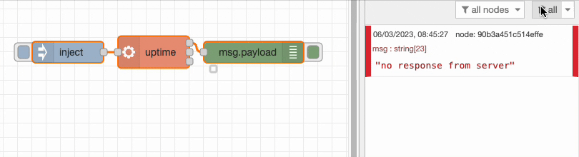
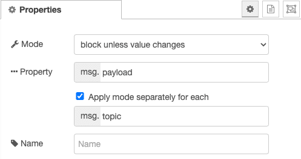
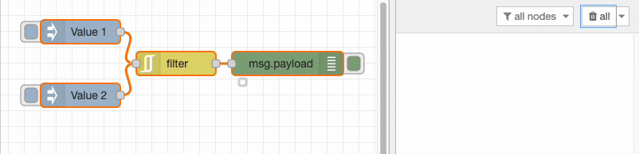
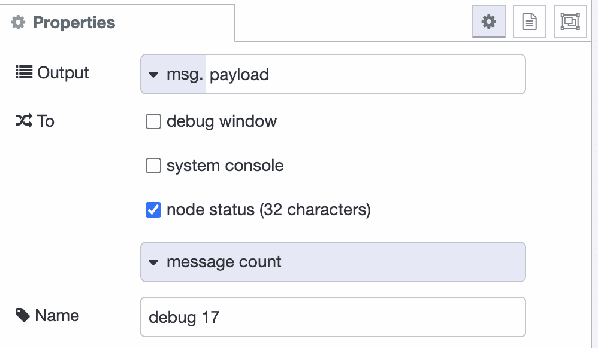
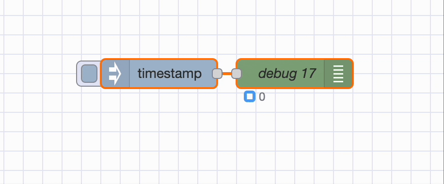

# {{ meta.title }}

There is usually more than one way to complete a given task in software, and Node-RED is no exception. In each of this series of blog posts, we are going to share three useful tips to save yourself time when working on your flows.

### 1. The Exec node allows you to interact with BASH from Node-RED

Exec allows you to run Shell commands and receive the value back into your flow. This opens up almost any command which can be run on the host devices CLI to your Node-RED flows.

### 2. The Filter node helps you discard duplicate messages

It can be useful to only allow messages to proceed through a flow where their value is unique. Filter makes that task simple, no need to store the past values and check each new message against a list.

Once your filter is configured as shown above, try sending different payloads through to see the outcome.

### 3. Counting the amount of messages sent to a Debug node

The Debug node has a lot of great features that we don't see used that often. One example is the ability to show a count of how many messages have been sent to that Debug node since the last deploy.

Once you've setup the node as shown above, you will see a counter under the debug.

We hope you found these tips useful, if you'd like to suggest some of your own tips which you think we should share in our future blog posts please [get in touch](mailto:contact@flowfuse.com).