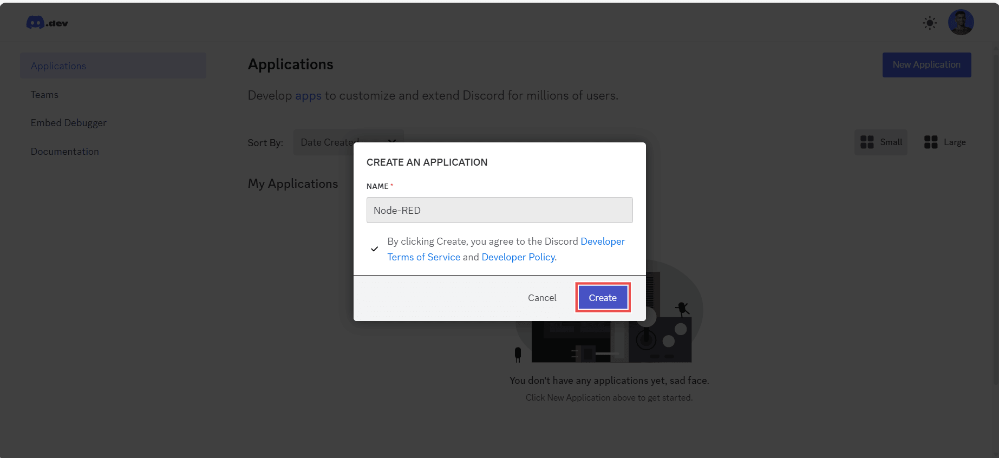
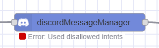
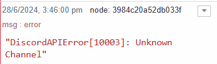

---
eleventyNavigation:
  key: Discord
  parent: "Notification Services"
meta:
   title: Sending and receiving Discord messages with Node-RED
   description: Learn how to send and receive Discord messages with Node-RED.
   keywords: nodered discord, node red discord
image: /node-red/notification/images/sending-and-receiving-discord-message-with-node-red.png
---

# {{meta.title}}

This guide explains how to integrate Discord with Node-RED to send and receive messages. You'll learn how to configure a Discord bot, send messages to users and channels, and handle incoming messages.

Discord is commonly used for notifications in IoT applications. This document covers the setup process and includes troubleshooting steps for common integration issues.

For information on integrating other notification services, see the guides on [Email](/node-red/notification/email/) and [Telegram](/node-red/notification/telegram/).

<!--more-->

## Prerequsite

Before proceeding further, make sure you have installed the following node:

- [node-red-contrib-discord-advance](https://flows.nodered.org/node/node-red-contrib-discord-advanced)

## Creating Bot in Discord

1. Navigate to the [Discord developer portal](https://discord.com/developers/applications).
2. Login with your Discord account credentials.
3. To create an application, click on the top-right "Create Application" button.

4. Enter the name for your application and click on the "Create" button.

5. After the successful creation of the application, you'll be redirected to that application's setting. Click on the "Bot" option from the left sidebar.

6. Click on the "Reset Token" and copy the regenerated bot secret token.
7. Next, you'll need to enable [Privileged Gateway Intents](https://discord.com/developers/docs/topics/gateway#gateway-intents) for your bot.  To do so, navigate to the bot page and enable three intents as seen below.

*Note:- If your application is verified or if your bot is in more than 100 servers, you'll need to apply for Privileged Gateway Intents to use them.* 

## Adding configuration for the discord nodes

Before proceeding further, make sure you have added the environment variable for your bot's secret token. Using environment variables prevents the configuration token from being exposed in the application flow. For more information refer to the guide on [Using environment variable](/blog/2023/01/environment-variables-in-node-red/).

1. Drag the DiscordMessageManager Node onto the canvas.
2. Double-click on it and then click on the pencil icon next to "Token" input field, and add the environment variable added for the bot token into the Token input field.

## Sending a message to User

To send a message to a user, you will need the ID of that user. Before copying the ID, ensure that you have enabled "Developer Mode" in Discord, which starts displaying IDs for users, channels, and messages. Navigate to the Discord app, go to "Settings" -> "Advanced," and enable the "Developer Mode" option.

1. In the Discord app, click on the user profile you want to send a message to, and click on "Copy User ID" to copy the ID.

2. Drag an Inject node onto the canvas.
3. Set the `msg.payload` to the message you want to send and the `msg.user` to the user ID of the user you want to send the message to.
4. Connect the Inject node's output to the input of the DiscordMessageManager node.

## Sending messages to the Discord server

To send a message to the Discord server, you have to make sure that your bot is a member of that server with appropriate permissions.

### Adding the bot to the Discord server

1. Navigate to the Discord Developer Portal and click on your application, then click on the OAuth2 option from the sidebar.
2. Select "bot" from the OAuth2 URL Generator's scope section and select the permissions you want to give to the bot in the server.
3. At the bottom, you'll find the "Copy" button. Click on it to copy the OAuth2 URL.
4. Paste that URL into the browser field and press Enter.
5. Now, you'll see a Discord popup. Select the server to which you want to add the bot and click on the "Continue" button.

6. Next, confirm that you want to give the permissions you selected while generating the OAuth2 URL to the bot on the server and click "Authorize" to add it to the server along with those permissions.

### Sending messages to Discord server

1. Drag the Inject node onto the canvas.
2. Set the `msg.payload` to the message you want to send, and set `msg.channel` (you can also set it in the node) to the Channel ID to which you want to send the message. To grab the Channel ID, go to the Discord app, right-click on the server in the sidebar where the channel is located that you want to send the message to, click on the channel, and then click on "Copy Channel ID.

3. Connect the Inject node's output to the input of the DiscordMessageManager node.

## Receiving messages from Discord

1. Drag the DiscordMessage node onto the canvas.
2. Double-click on it to ensure you have configured your bot correctly.
3. Drag the Debug node onto the canvas, double-click on it, and select the output to "Complete message object".

After deploying the flow, you will start receiving messages sent to your bot. In the debug panel in the sidebar, you will see the message object printed for each message, which contains different objects. Each object shows different details; for example, the author object contains details about the sender, and the channel object includes information of the channel if the message was sent in a channel.

Below, I have provided the complete flow we built throughout the guide. Make sure to replace the environment variable 'BOT_TOKEN' with your actual bot token.


[{"id":"7a8dd49f9614608e","type":"inject","z":"4674ed668685adf6","name":"Sending mesasge to Discord server 's channel","props":[{"p":"payload"}],"repeat":"","crontab":"","once":false,"onceDelay":0.1,"topic":"","payload":"Hello,  This is from Node-RED","payloadType":"str","x":570,"y":420,"wires":[["3984c20a52db033f"]]},{"id":"3984c20a52db033f","type":"discordMessageManager","z":"4674ed668685adf6","name":"","channel":"56454645657765656","token":"","x":930,"y":420,"wires":[["b99ae75425047b6b"]]},{"id":"b99ae75425047b6b","type":"debug","z":"4674ed668685adf6","name":"debug 3","active":true,"tosidebar":true,"console":false,"tostatus":false,"complete":"false","statusVal":"","statusType":"auto","x":1200,"y":420,"wires":[]},{"id":"6af740e11aba6ca2","type":"inject","z":"4674ed668685adf6","name":"Sending message to Discord user","props":[{"p":"payload"},{"p":"user","v":"65454534534345365","vt":"str"}],"repeat":"","crontab":"","once":false,"onceDelay":0.1,"topic":"","payload":"Hello, Sumit","payloadType":"str","x":550,"y":320,"wires":[["f69363f341b62333"]]},{"id":"f69363f341b62333","type":"discordMessageManager","z":"4674ed668685adf6","name":"","channel":"","token":"","x":930,"y":320,"wires":[["c5001a783992ae01"]]},{"id":"c5001a783992ae01","type":"debug","z":"4674ed668685adf6","name":"debug 4","active":true,"tosidebar":true,"console":false,"tostatus":false,"complete":"false","statusVal":"","statusType":"auto","x":1220,"y":320,"wires":[]},{"id":"820b70826545a401","type":"debug","z":"4674ed668685adf6","name":"debug 2","active":true,"tosidebar":true,"console":false,"tostatus":false,"complete":"true","targetType":"full","statusVal":"","statusType":"auto","x":1020,"y":540,"wires":[]},{"id":"f044d3784ef8c74a","type":"discordMessage","z":"4674ed668685adf6","name":"","channelIdFilter":"","token":"","x":720,"y":540,"wires":[["820b70826545a401"]]}]


## Debugging and Troubleshooting

Below are common errors that can occur while integrating Discord with Node-RED, along with troubleshooting tips.

If your Discord nodes show a status similar to the image above, you might still need to enable the [Privileged Gateway Intents](https://discord.com/developers/docs/topics/gateway#gateway-intents) option. If you have already enabled it but are still encountering this issue, it could be due to your app bot is verified. A verified app bot is required to apply for the privileged gateway intents. For more information, refer to [Discord support article](https://support-dev.discord.com/hc/en-us/articles/6205754771351-How-do-I-get-Privileged-Intents-for-my-bot).

If you are getting errors similar to the images above, it's likely because the `channelId` or `userId` is invalid. Double-check and correct these identifiers to resolve the errors.
