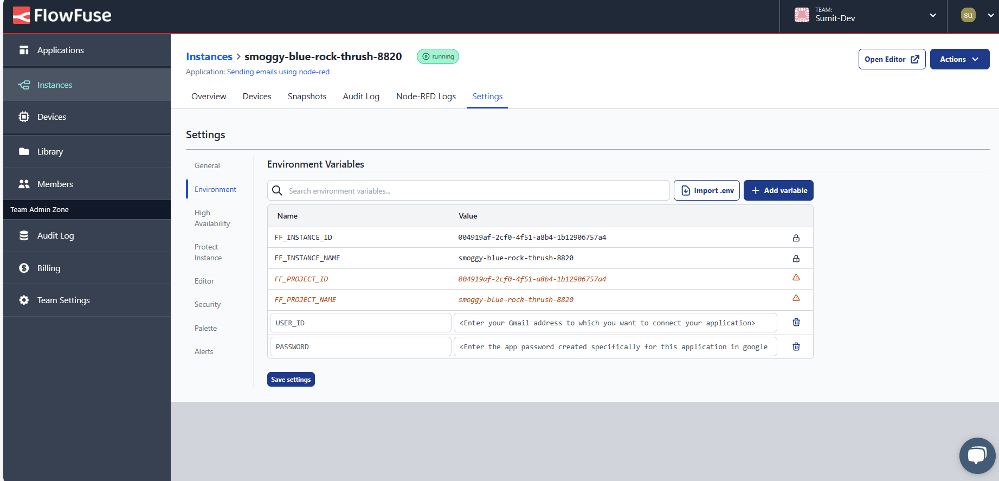
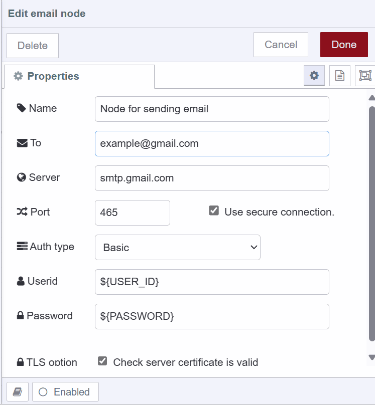
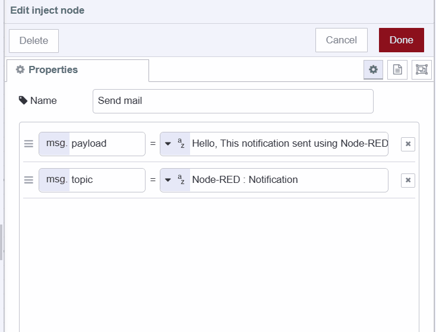
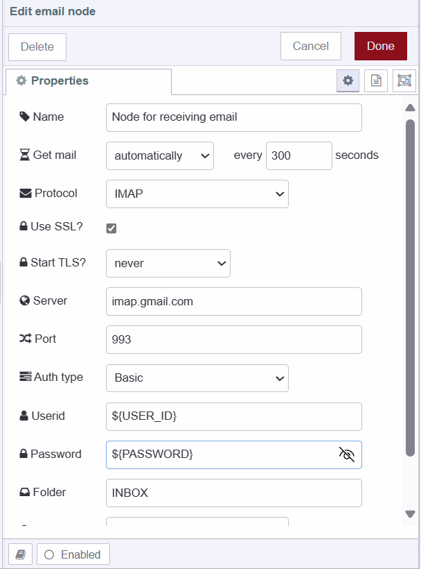
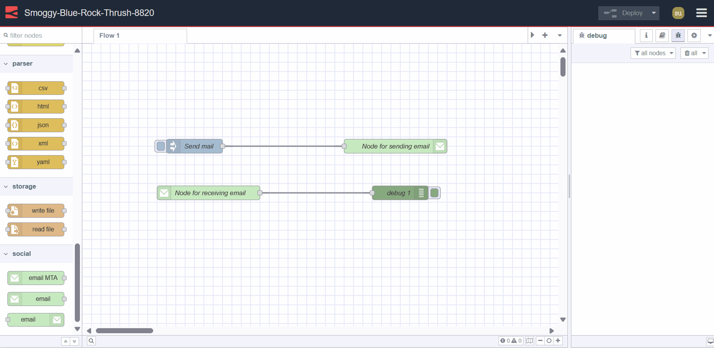
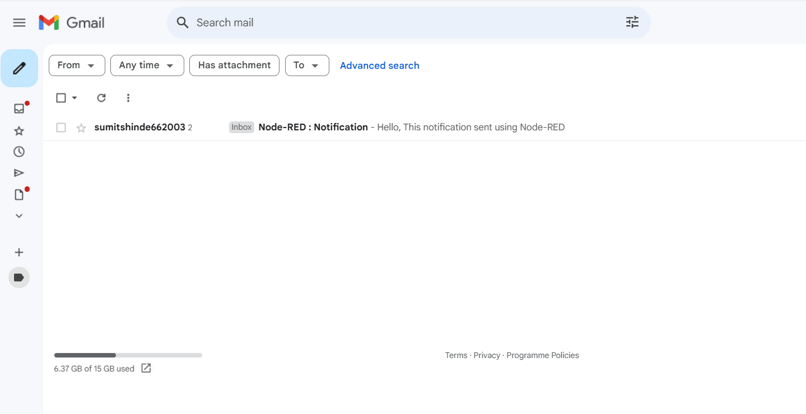

---
eleventyNavigation:
  key: Email
  parent: "Notification Services"
meta:
   title: Sending and receiving emails with Node-RED
   description: Learn how to send and receive emails using Node-RED, along with best practices for sending email notifications.
   keywords: node-red, gmail, flowfuse device agent, anti-spam measures, email]
image: /node-red/notification/images/email_node-red.png
---

# {{meta.title}}

This guide shows you how to integrate email with Node-RED for sending and receiving messages. You'll learn how to configure email nodes, set up Gmail integration, and follow best practices to ensure your notifications reach their destination.

## When to Use Email for IoT Notifications

Email offers unique advantages that make it suitable for specific notification scenarios:

- **Non-urgent notifications** - Email works well for updates that don't require immediate action, allowing users to review them at their convenience.
- **Compliance and audit trails** - Email provides documented communication records that are essential for regulatory compliance and audit requirements.
- **Detailed information** - Email supports attachments and longer content, making it useful for sharing reports, logs, and comprehensive documentation.
- **Multiple recipients** - Email can deliver notifications to several users simultaneously, ensuring information reaches everyone who needs it.

## Installing the Email Node

1. Open Node-RED Settings (top-right menu)
2. Select "Manage Palette"
3. Go to the "Install" tab
4. Search for `node-red-node-email`
5. Click "Install"

## Understanding Email Node Configuration

### Server

The server address determines where your emails are sent or retrieved from. Outgoing mail uses SMTP servers (like `smtp.example.com`), while incoming mail uses IMAP or POP3 servers (like `imap.example.com` or `pop.example.com`).

**Email Protocols:**
- **SMTP** (Simple Mail Transfer Protocol) - Handles sending outgoing messages from your application to the recipient's mail server
- **POP3** (Post Office Protocol v3) - Downloads messages to your client and typically removes them from the server
- **IMAP** (Internet Message Access Protocol) - Manages email directly on the server, keeping messages synchronized across all your devices

### Port

Different ports serve different purposes for email communication:

**Outgoing (SMTP):**
- **465** - Uses SSL encryption from the start of the connection
- **587** - Uses TLS encryption with STARTTLS (recommended)
- **25** - The original SMTP port, though many ISPs block it for security reasons

**Incoming:**
- **993** - IMAP with SSL encryption
- **143** - IMAP without encryption
- **995** - POP3 with SSL encryption
- **110** - POP3 without encryption

### Use Secure Connection

Enable this option to encrypt your connection using TLS, which protects your email credentials and content during transmission. 

**Note:** If you're using port 587 or 25 with a server that supports STARTTLS, you should leave this option disabled since the connection will upgrade to encrypted automatically.

### Auth Type

Choose the authentication method your email provider requires:
- **Basic** - Standard username and password authentication
- **XOAuth** - OAuth authentication using a username and access token
- **None** - No authentication required (rare and not recommended for outgoing mail)

### TLS Option

When enabled, this option verifies that your mail server's SSL/TLS certificate is valid, adding an extra layer of security to your connection.

### Format to SASL

This option handles SASL (Simple Authentication and Security Layer) XOAuth2 token formatting:
- **Enabled** - The node automatically formats your OAuth2 token by combining the username and token, encoding it in base64
- **Disabled** - You'll need to manually format the token before passing it to the email node

## Gmail Configuration

This guide uses Gmail as the email provider. Here's what you need to configure:

- **Server (outgoing):** `smtp.gmail.com`
- **Server (incoming):** `imap.gmail.com`
- **User ID:** Your Gmail address (example@gmail.com)
- **Port:** 465 (SSL) or 587 (TLS)
- **Password:** You'll need to generate an app password for your Google account. Visit [Sign in with app passwords](https://support.google.com/mail/answer/185833?hl=en) to create one. Generate a separate app password for each Node-RED application you create.

## Setting Up Environment Variables

Storing your email credentials directly in Node-RED flows exposes sensitive information. Environment variables keep your credentials secure by storing them separately from your flow configuration. For a detailed explanation, see [Using Environment Variables with Node-RED](/blog/2023/01/environment-variables-in-node-red/).

{data-zoomable}

1. Navigate to your instance Settings and select the Environment tab
2. Click "Add variable" and create variables for both `userid` and `password`
3. Click "Save" to store your variables
4. Restart your instance using the Actions menu (top-right) and selecting Restart

## Configuring the Email Output Node

1. Drag an **e-mail** node onto the canvas and double-click to open it
2. Enter the recipient's email address in the "to" field. You can also set this dynamically using `msg.to`, and include CC or BCC recipients with `msg.cc` and `msg.bcc`. See the [Node README](https://flows.nodered.org/node/node-red-node-email) for more details.
3. Enter `smtp.gmail.com` as your server address
4. Choose port 465 for SSL or 587 for TLS (either works)
5. Set auth type to "Basic"
6. Enter your environment variables for user ID and password in the corresponding fields
7. Enable the "Use secure connection" option

 {data-zoomable}

## Sending Emails

1. Drag an **inject** node onto the canvas
2. Set `msg.payload` to your email body content. For more control, use `msg.plaintext` for plain text emails, `msg.html` for HTML-formatted emails, or `msg.attachment` (as an array) for attachments in [Nodemailer](https://nodemailer.com/message/attachments/) format.
3. Set `msg.topic` to your email subject line
4. Connect the inject node's output to the e-mail node's input

 {data-zoomable}

## Receiving Emails

1. Drag an **e-mail in** node onto the canvas
2. Select your preferred "Get mail" option
3. Set the Protocol to "IMAP" (recommended for third-party applications)
4. Enter your environment variables for userid and password
5. Add a **debug** node to the canvas
6. Connect the debug node's input to the e-mail in node's output

{data-zoomable}

## Deploying the Flow

{data-zoomable}

{data-zoomable}

Click the "Deploy" button in the top-right of the Node-RED Editor. Once deployed, you can send emails by clicking the inject button, or configure triggers to send notifications based on specific events in your IoT application.

## Ensuring Your Emails Reach Their Destination

### Understanding Anti-Spam Measures

Email servers use sophisticated filtering systems to protect users from unwanted messages. These systems analyze various aspects of incoming emails:

**Content filtering** scans your email text for keywords and patterns commonly found in spam. **Sender authentication** verifies that your email address and domain are legitimate, often using protocols like SPF to confirm your server is authorized to send emails on behalf of your domain. **IP filtering** blocks messages from IP addresses with known spam activity. **Reputation scoring** tracks your sending history and behavior, assigning a score that affects whether your emails land in inboxes or spam folders.

### Best Practices for Email Delivery

Even legitimate emails can sometimes trigger spam filters. Follow these practices to keep your notifications flowing smoothly:

- **Write clear, purposeful messages** - Keep your content focused and action-oriented, clearly stating why you're sending the notification and what action recipients should take.
- **Avoid spam trigger words** - Stay away from phrases like "free," "limited time offer," or "urgent" that commonly appear in spam messages.
- **Authenticate your emails** - Implement SPF, DKIM, and DMARC protocols to verify your email's legitimacy and improve deliverability.
- **Manage your sending frequency** - Avoid sending too many emails in a short period. Maintain a consistent schedule and ensure each message provides value.
- **Keep your email list clean** - Regularly remove invalid or inactive addresses. High bounce rates and spam complaints damage your sender reputation.
- **Monitor your reputation** - Use tools like SenderScore or Google Postmaster Tools to track your sender reputation and identify potential issues before they affect delivery.