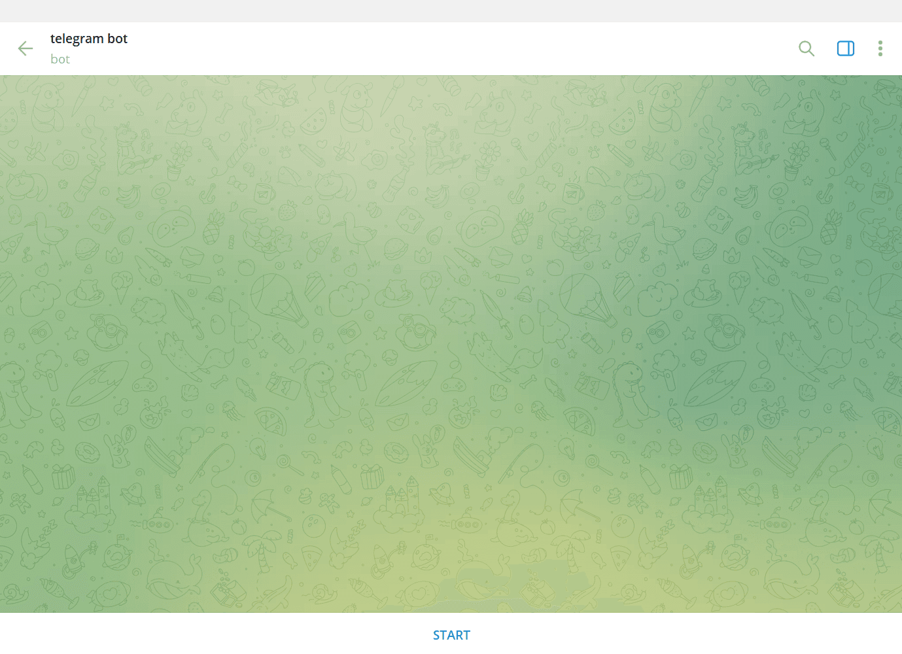

---
eleventyNavigation:
  key: Telegram
  parent: "Notification Services"
meta:
   title: Sending and receiving Telegram messages with Node-RED
   description: Learn to seamlessly integrate Telegram with Node-RED for messaging. Create bots, obtain chat IDs, and send/receive messages, including group messaging.
   keywords: node-red, telegram, bot
image: /node-red/notification/images/telegram_node-red.png
---

# {{meta.title}}

Telegram has become a popular choice for messaging in home automation applications. This guide shows you how to integrate Telegram with Node-RED, covering bot creation, chat ID retrieval, and both sending and receiving messages.

## Creating a Bot in Telegram

1. Open your Telegram application and click the search icon in the top-right corner.
2. Search for "BotFather" and select the account with the blue verified checkmark.

{data-zoomable}

3. In the chat interface, type `/newbot` and press Enter to send the command.
4. The bot will ask for a name, which will be the display name of your bot. You can choose any name you like.
5. Next, it will ask for a unique username for your bot. The username cannot include spaces and must end with 'bot' (for example: `telegram_bot` or `telegrambot`).
6. Once you've entered a valid and unique username, you'll receive a confirmation message with your bot's secret access token and a link to start your bot.
7. Click the provided link to open the chat interface with your bot, then click the Start button at the bottom to activate it.

{data-zoomable}

## Obtaining Your Telegram Chat ID

The Telegram chat ID is a unique identifier for a chat or group in Telegram, which is required for sending and receiving messages. This section covers how to obtain both your personal chat ID and group chat IDs.

### Obtaining Your Personal Chat ID

1. Open your Telegram app, click the search icon in the top-right corner, and search for "Get My ID".

{data-zoomable}

2. Select the first result to open the chat interface, type `/start`, and press Enter. You'll receive a message containing your Chat ID and User ID.

### Obtaining Your Telegram Group Chat ID

1. Add `@getmyid_bot` to the group where you want to send or receive messages using Node-RED.
2. Once the bot joins the group, it will automatically send the group's chat ID.

## Installing the Custom Node

1. Click Node-RED Settings (top-right menu).
2. Select "Manage Palette".
3. Switch to the "Install" tab.
4. Search for `node-red-contrib-telegrambot`.
5. Click "Install".

## Adding Environment Variables

Environment variables keep your sensitive information secure by preventing it from being exposed in your flow.json file. This is especially important when configuring nodes with credentials like access tokens. For more details, see [Using Environment Variables with Node-RED](/blog/2023/01/environment-variables-in-node-red/).

{data-zoomable}

1. Navigate to Instance Settings and switch to the "Environment" tab.
2. Click the "Add variable" button (top-right).
3. Add variables for your bot's secret access token and chat ID.
4. Click "Save settings" and restart the instance by clicking Actions (top-right) and selecting "Restart".

## Configuring the Custom Node

1. Drag a **Sender** node onto the canvas and double-click it.
2. Enable the "Send error to second output" option. This separates error messages from successful send confirmations, making it easier to handle different outcomes.

{data-zoomable}

3. Click the edit icon next to the Bot field.
4. Enter your bot name and add the environment variable for your access token in the Token field, then add the environment variable for your chat ID in the chatIds field as shown below.

{data-zoomable}

## Sending a Message to Telegram

1. Drag an **Inject** node onto the canvas.
2. Drag a **Change** node onto the canvas and configure it to set `msg.payload.type` as "message". To explore other message types, refer to the [node readme](https://flows.nodered.org/node/node-red-contrib-telegrambot). Set `msg.payload.chatId` to the environment variable you added for the chat ID, and set `msg.payload.content` to the message you want to send.

{data-zoomable}

3. Drag two **Debug** nodes onto the canvas.
4. Connect the Inject node's output to the Change node's input, then connect the Change node's output to the Sender node's input.
5. Connect one Debug node's input to the first output of the Sender node, and the second Debug node's input to the Sender node's second output.

## Receiving a Message from Telegram

1. Drag a **Receiver** node onto the canvas.
2. Double-click the node and make sure you've selected the correct bot configuration.
3. The Receiver node has two outputs: one for messages from authorized users, and another for messages from unauthorized users.
4. To add users to your authorized list, click the Receiver node, click the edit icon next to the Bot field, and add usernames separated by commas in the users field.
5. Drag two **Debug** nodes onto the canvas.
6. Connect the first Debug node's input to the first output of the Receiver node, and the second Debug node's input to the second output of the Receiver node.

## Deploying the Flow

{data-zoomable}

1. Deploy the flow by clicking the Deploy button in the top-right corner.

Your Telegram bot is now ready to use. Click the Inject button to send a message, and you'll receive a notification in Telegram. You can also check your bot's chat to see messages sent via Node-RED. To test receiving messages, send a message to your bot and watch the Debug panel display the message object containing the message content and additional information.