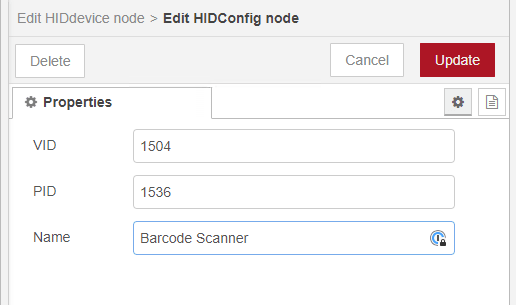
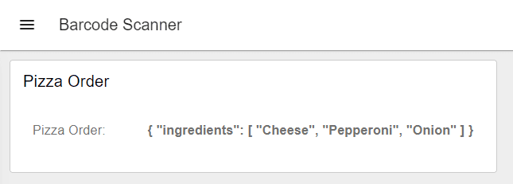

---
eleventyNavigation:
  key: "Barcode Scanner"
  parent: "Peripheral Devices"
meta:
   title: How to connect a barcode scanner to your Node-RED application
   description: Learn to seamlessly connect a barcode scanner to Node-RED for efficient data capture and automation.
   keywords: node-red, flowfuse, barcodescanner
image: /node-red/peripheral/images/barcode-scanner.png
---

# {{meta.title}}

Barcode scanners, functioning as Human Interface Devices (HID) similar to keyboards, offer versatile programming options.  Variations of barcode scanners can be seen used from anything from checkout counters, logistics, and to manufacturing erp systems. In our case, we kept it basic and we used one to trigger a Node-RED flow, keeping the process straightforward and efficient.  Don't let that limit your imagination though, with QR codes, you can store just about anything including recipes in a JSON structure.

## Configuring the scanner and scanning barcodes

We revitalized an older project for this purpose, ensuring it's up-to-date. For Windows users, the setup is straightforward. Start by importing the project, [@gdziuba/node-red-usbhid](https://flows.nodered.org/node/@gdziuba/node-red-usbhid), via the palette manager.  Import these [flows](https://flows.nodered.org/flow/3e08565bc0e024e81325dc028c5da792) to get started.  This initial flow identified as **getHIDdevices** will detect all devices connected to your Node-RED environment. Locate your barcode scanner  in the debug output.  You will see everything from your mouse and keyboard.  If you have just recently added the barcode scanner to your computer, it will probably be found at the end.  Once you find it note its **Product ID** and **Vendor ID**.  For us, they would be identified as 1536 and 1504 respectively.

Next, configure the **HIDdevice** node: replace the default **PID** with your scanner’s Product ID, and the **VID** with its Vendor ID. 

Test your barcode scanner against any barcode your scanner works with and you should observe an event being triggered in Node-RED and output to debug should be the contents of the barcode.

You could even take it a step further and create a [QR code](https://smalldev.tools/qr-code-generator-online) for your favorite pizza ingredients as seen here on the new [Dashboard 2.0](https://dashboard.flowfuse.com/). 

## Linux Setup

Linux users might face a slightly more complicated setup, as access to communication ports isn't always granted by default, and specific drivers are needed for optimal node functionality. This is due to the security around applications having access to specific devices connected to the system. For this, we recommend following the detailed instructions available in the project's [GitHub](https://github.com/gdziuba/node-red-contrib-usbhid) repository.