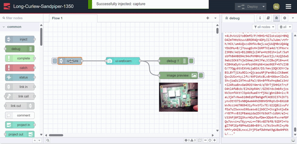

---
eleventyNavigation:
  key: Webcam
  parent: "Peripheral Devices"
meta:
   title: Using webcam with Node-RED
   description: Learn how to seamlessly connect webcam with Node-RED
   keywords: node-red, flowfuse,  webcam, capturing image
image: /node-red/peripheral/images/using_webcam_with_node-red.png
---

# {{meta.title}}

Dashboard 2.0 has introduced its first third-party webcam widget, simplifying the integration of webcam features with Node-RED applications. In this documentation, you will learn how to utilize the ui-webcam widget in your Node-RED applications.

Additionally, if you are willing to develop your own third-party widget, we have our [example widget](https://github.com/FlowFuse/node-red-dashboard-2-ui-example) which helps you develop your widget. Additionally for a detailed step-by-step guide refer to [Building Third Party Widgets](https://dashboard.flowfuse.com/contributing/widgets/third-party.html).

Install Node-RED Dashboard 2.0. Follow these [instructions](/blog/2024/03/dashboard-getting-started/) to get started.

## Using a webcam custom widget

Once Dashboard 2.0 is installed, proceed to install the ui-webcam widget:

1. Install `@sumit_shinde_84/node-red-dashboard-2-ui-webcam` by the palette manager.
2. Select a created group for the ui-webcam widget in which it will render.
3. Deploy the flow by clicking on the top-right red deploy button.

## Inner Workings of the Webcam Widget

In this section, we will take a closer look at the inner workings of the webcam widget. The widget is built using Vue.js and provides a highly engaging and interactive user interface that follows Node-RED and Dashboard 2.0 standards. To enable webcam functionality, the widget makes use of the [MediaDevices API](https://developer.mozilla.org/en-US/docs/Web/API/MediaDevices/getUserMedia), which facilitates access to connected media input devices like cameras and microphones. 

## Capturing images using controls

This webcam widget offers nice interactive controls that will allow you to interact with the webcam easily.

1. Navigate to the dashboard by accessing `https://<your-instance-name>.flowfuse.cloud/dashboard`.
2. Initially, you'll see a black interface with a power button on the dashboard. Clicking this button will activate the webcam. Ensure that you grant permission to the dashboard to access your webcam.
3. Once the webcam is active, you can capture images by clicking the button with the camera icon located at the bottom center of the webcam interface.
4. The widget returns a Base64 string containing the captured image in PNG format.

## Capturing images by passing payload

1. Drag an inject node onto the canvas.
2. Set `msg.payload` to `capture` as string. You can also set an interval time to automatically send the message after a specific interval, or you can keep it unchanged to manually send the payload by clicking the inject button.
3. Connect the output of the inject node to the input of the webcam widget.
4. Deploy the flow.

By passing the "capture" string as payload, the webcam widget will activate (if it's off) and capture images automatically, without requiring user interaction. This method is commonly used in industrial applications which depend on automated actions.

## Selecting different camera devices

The webcam widget also allows you to select different camera devices connected to your system:

1. Click on the ellipsis icon located at the top-right corner of the webcam interface.
2. A dropdown menu will display the connected cameras. Select your preferred camera to use. Additionally, you can turn off the camera by selecting the "Turn camera off" option.

## Browser support and privacy

- Browser Compatibility: The webcam widget is compatible with all modern browsers, except Internet Explorer. Whether you're using Chrome, Firefox, Safari, or Edge, you can seamlessly integrate webcam features into your Node-RED applications.
- Control Limitation: It's important to note that this widget is designed to interact with webcams directly accessible to the system running Node-RED. For example, if the webcam is connected to a different device or network and not directly accessible to the Node-RED running system, the video stream from that webcam won't be displayed on a dashboard using this widget.
- HTTPS Requirement: When accessing Dashboard 2.0 remotely (not via `localhost`), it's crucial to use HTTPS. Failure to do so may result in the browser blocking access to the webcam. 
- User Permission: Before the webcam can be activated, the browser will prompt the user for permission to access the webcam device. This ensures user privacy and consent before any image capture occurs. The widget cannot capture images until the user has given their permission.