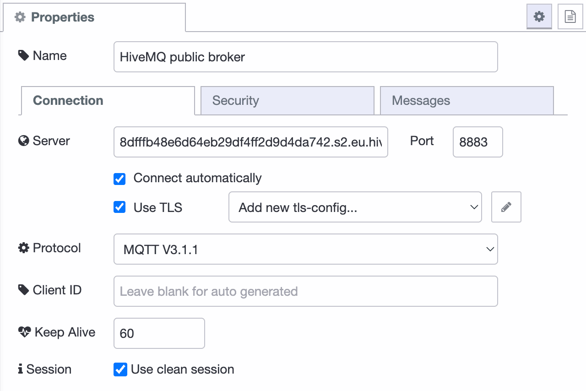
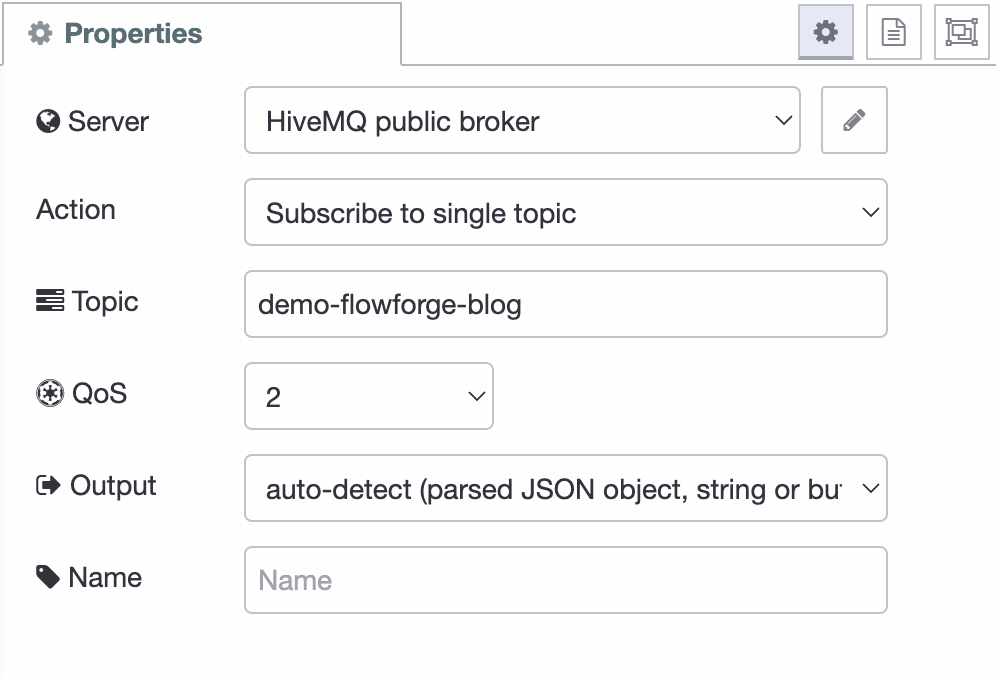

---
eleventyNavigation:
  key: MQTT
  parent: "Communication Protocols"
  title: MQTT
meta:
  title: Using MQTT with Node-RED
  description: Learn how to use MQTT with Node-RED.
  keywords: node red mqtt in, nodered mqtt, mqtt node red, node-red mqtt, node-red mqtt broker, node red mqtt dynamic subscription, mqtt broker node red, nodered mqtt broker, node red mqtt out, mqtt in node red
image: /node-red/protocol/images/flowforge-nodered-mqtt-hivemq.png
---

# {{meta.title}}

In the realm of IIoT (Industrial Internet of Things), effective communication between devices is crucial. One protocol that has gained significant popularity for its lightweight and scalable nature is MQTT (Message Queuing Telemetry Transport). This guide explains MQTT, its relevance in IIoT, and walks you through connecting a broker HiveMQ with Node-RED in FlowFuse.

## Understanding MQTT

[MQTT](https://en.wikipedia.org/wiki/MQTT), with development starting in 1999, is a publish-subscribe-based messaging protocol designed for efficient communication between IoT devices. It operates on top of TCP/IP, like HTTP, providing a lightweight approach to messaging. MQTT follows a client-server model, where devices (clients) publish messages to a central server called the broker. Other clients interested in receiving those messages subscribe to specific topics on the broker.

## Advantages of MQTT in IIoT

MQTT has become a preferred choice for IoT and industrial IoT applications due to several reasons:
1. **Low Overhead**: MQTT uses small packet sizes, minimizing bandwidth consumption and reducing network traffic, suitable for low-power devices and networks.
2. **Reliability**: MQTT incorporates Quality of Service (QoS) mechanisms for message delivery, ideal for applications requiring reliable data transmission.
3. **Asynchronous Communication**: MQTT enables asynchronous communication, allowing devices to operate independently, reducing latency and increasing system responsiveness.

## Sending Messages to an MQTT Broker with Node-RED

Using a [Cloud MQTT broker](https://www.hivemq.com/mqtt-cloud-broker/) provided by HiveMQ, we'll host and manage the Node-RED instance in FlowFuse. The MQTT nodes are pre-installed as "Core Nodes" in Node-RED.

1. Drag in the "Inject" node and the "MQTT out" node, connecting the Inject node's output to the MQTT out node.
2. Configure the MQTT node to connect to the broker, using the username, password, and server details from HiveMQ.
3. Save the config, deploy the changes, and ensure the MQTT node status is green, indicating successful connection and configuration.

After saving the config, and deploying the changes, the flow should tell display a green
status bubble under the MQTT node which tells you it's connected and configured properly.

## Receiving Messages from an MQTT Broker with Node-RED

1. Drag in the "mqtt in" node and connect it to the "Debug" node.
2. Open the MQTT in node, select the configured server, and ensure the topic matches the previous selection.
3. Deploy the flow, and the Debug node should display received messages.

When deployed you should again see the status bubble turn green, and have a
timestamp appear in the sidebar every second!
