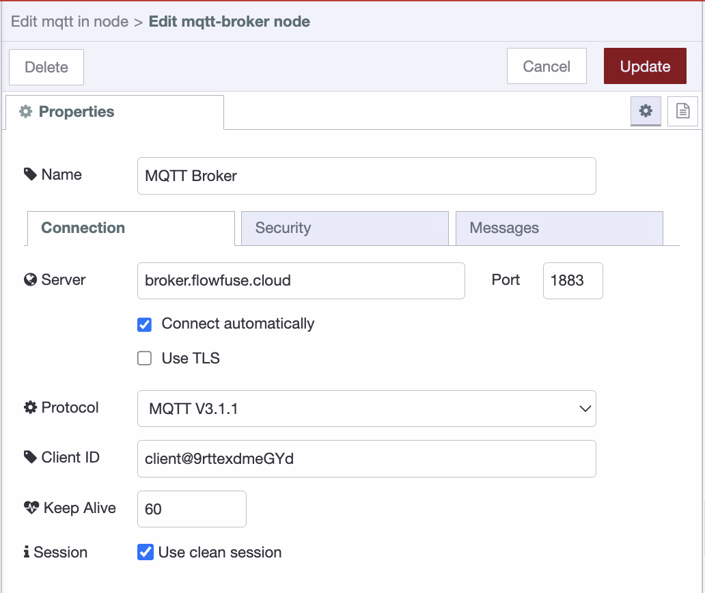
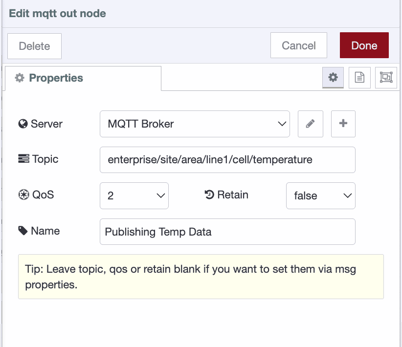
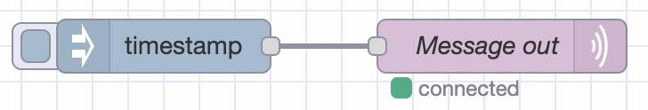
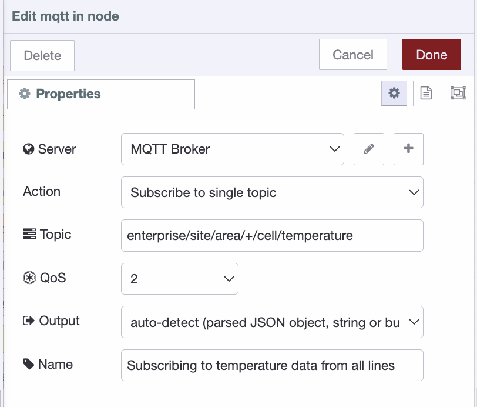

-
eleventyNavigation:
  key: MQTT
  parent: "Communication Protocols"
  title: MQTT
meta:
  title: Using MQTT with Node-RED
  description: Learn how to use MQTT with Node-RED.
  keywords: node red mqtt in, nodered mqtt, mqtt node red, node-red mqtt, node-red mqtt broker, node red mqtt dynamic subscription, mqtt broker node red, nodered mqtt broker, node red mqtt out, mqtt in node red
---

# {{meta.title}}

Getting devices to talk to each other in industrial environments isn't trivial. You're dealing with spotty networks, power constraints, and devices that need to share data without constant back-and-forth polling. MQTT solves these problems by keeping communication lightweight and flexible. This guide walks you through what MQTT is, why it works well for IIoT, and how to get it running with Node-RED.

## Understanding MQTT

[MQTT](https://en.wikipedia.org/wiki/MQTT) is a messaging protocol that's been around since 1999. It uses a publish-subscribe model, which is different from the request-response pattern you see with HTTP.

Here's the basic setup: devices/systems (clients) connect to a central server called a broker. When a device has data to share, it publishes a message to a specific topic. Other devices/systems subscribe to topics they care about and automatically receive messages when they're published. The broker handles all the routing.

This architecture means devices/systems don't need to know about each other or maintain direct connections. A temperature sensor can publish readings to `enterprise/site/area/line/cell/temperature` without caring who's listening.

## Setting Up MQTT in Node-RED

Node-RED comes with MQTT nodes built in, so you don't need to install anything extra. You'll need access to an MQTT broker - you can use a cloud service, run your own with Mosquitto, use a public test broker for experimenting, or if you're using FlowFuse, it provides a [built-in MQTT broker service](/blog/2024/10/announcement-mqtt-broker/).

## Configuring the MQTT Broker Connection

Before you can publish or subscribe to messages, you need to configure the broker connection. You only need to do this once - the same broker configuration can be reused across multiple MQTT nodes.

1. Add either an **MQTT out** or **MQTT in** node to your canvas
2. Double-click the node to open its configuration
3. Click the pencil icon next to "Server" to add a new broker connection
4. Enter your broker's address (e.g., `broker.flowfuse.cloud`)
5. Add the port (usually 1883 for unencrypted, 8883 for TLS)
6. If your broker requires authentication, switch to the Security tab in the same configuration dialog by clicking on it "Security", then enter your username and password
7. Give the connection a name and click Add

Once configured, this broker connection will appear in the Server dropdown for all MQTT nodes in your flow.

_Setting up the broker connection_

## Publishing Messages to a Broker

Let's start by sending data to an MQTT broker.

1. Add an **MQTT Out** node.
2. Connect your data source node’s output (use an Inject node to simulate data if you don’t have one) to the **MQTT Out** node.
3. Double-click the **MQTT Out** node.
4. Select your configured broker from the **Server** dropdown (or create a new one by following the steps above).
5. Enter a topic such as `enterprise/site/area/line1/cell/temperature` (topics use forward slashes as separators, similar to file paths).
6. Set the **QoS** level if needed for message reliability, and enable **Retain** if you want the broker to store the last published message for new subscribers.
7. Click **Done**.

_MQTT Out node — publishing data to a topic_

9.  Click Deploy

The MQTT out node should show "connected" with a green dot.

_Green status means you're connected_

## Subscribing to Messages from a Broker

Now let's receive messages from the MQTT broker.

1. Add an **MQTT In** node to the canvas.
2. Add a **Debug** node.
3. Connect the **MQTT In** node to the **Debug** node.
4. Double-click the **MQTT In** node.
5. Select your configured broker from the **Server** dropdown (or create a new one if needed).
6. Set the **Action** to **Subscribe to a single topic**.
7. Enter the topic you want to subscribe to, for example: `enterprise/site/area/+/cell/temperature` (the `+` symbol acts as a wildcard for one level).
8. Set the **QoS** level based on your reliability requirements.
9. Click **Done**, then **Deploy** your flow.

Once deployed, you should see the messages appear in the **Debug** sidebar.

*MQTT In node — subscribing to a topic*

## Using Wildcards in Topics

MQTT supports wildcards for subscribing to multiple topics at once:

- **Single-level wildcard (+)**: Matches one level. `enterprise/site/area/+/cell/temperature` matches `enterprise/site/area/line1/cell/temperature` and `enterprise/site/area/line2/cell/temperature` but not `enterprise/site/area/line1/cell/station1/temperature`

- **Multi-level wildcard (#)**: Matches multiple levels. `enterprise/site/area/#` matches everything under that area, including `enterprise/site/area/line1/cell/temperature` and `enterprise/site/area/line1/cell/station1/pressure`

When deployed you should again see the status bubble turn green, and have a
timestamp appear in the sidebar every second!
