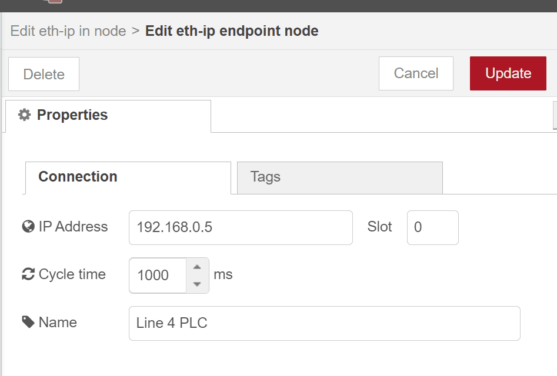
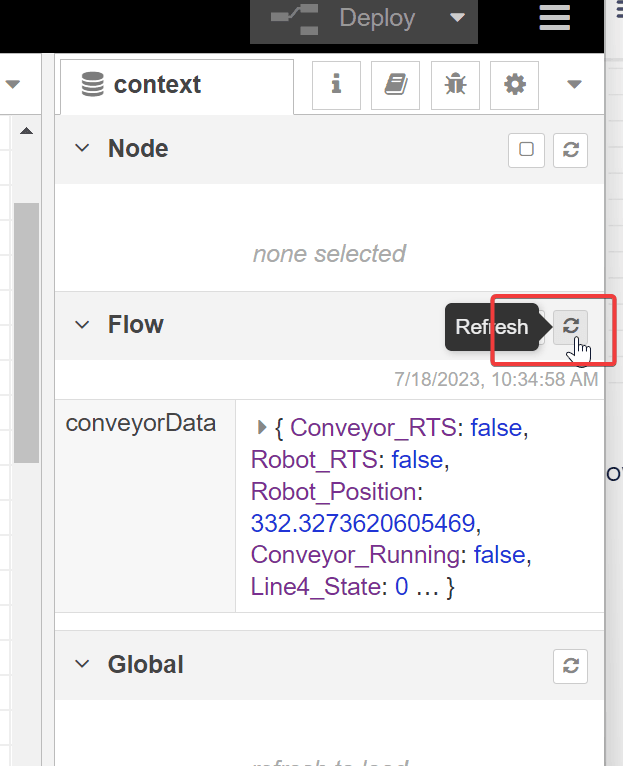
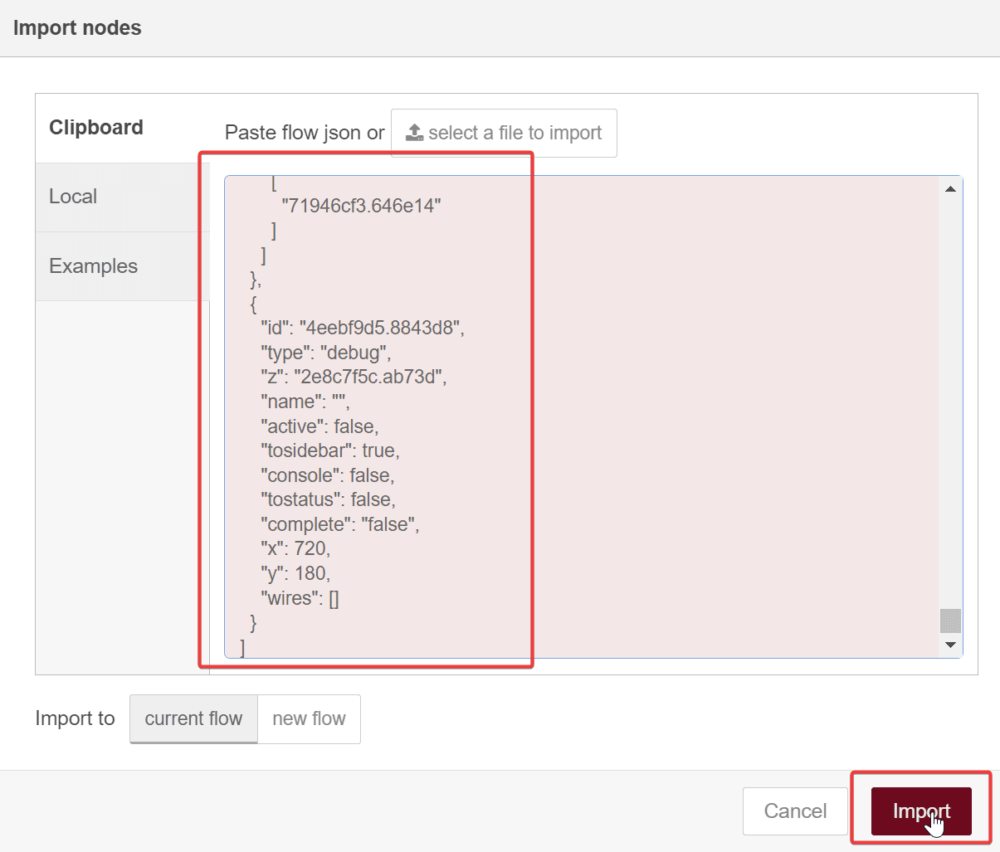
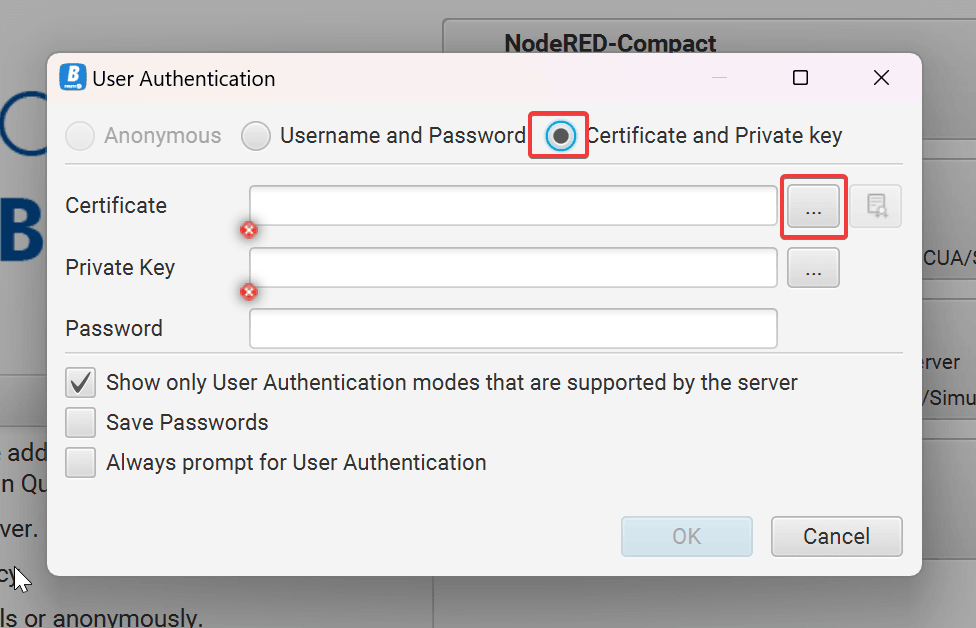
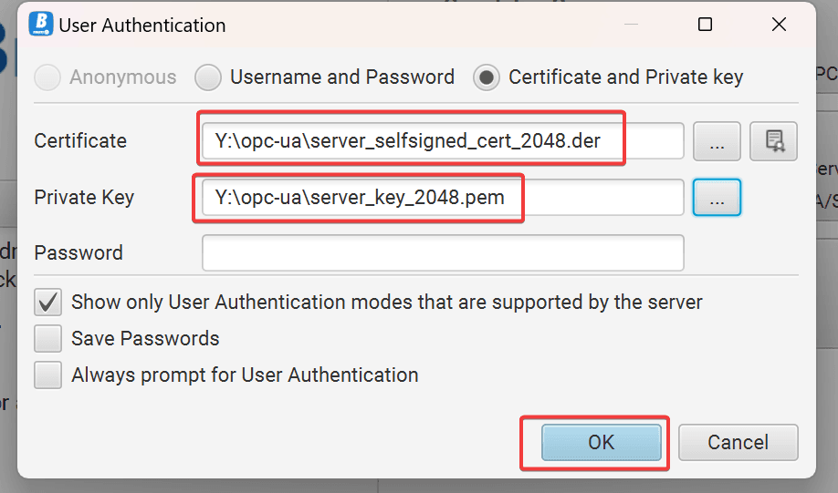
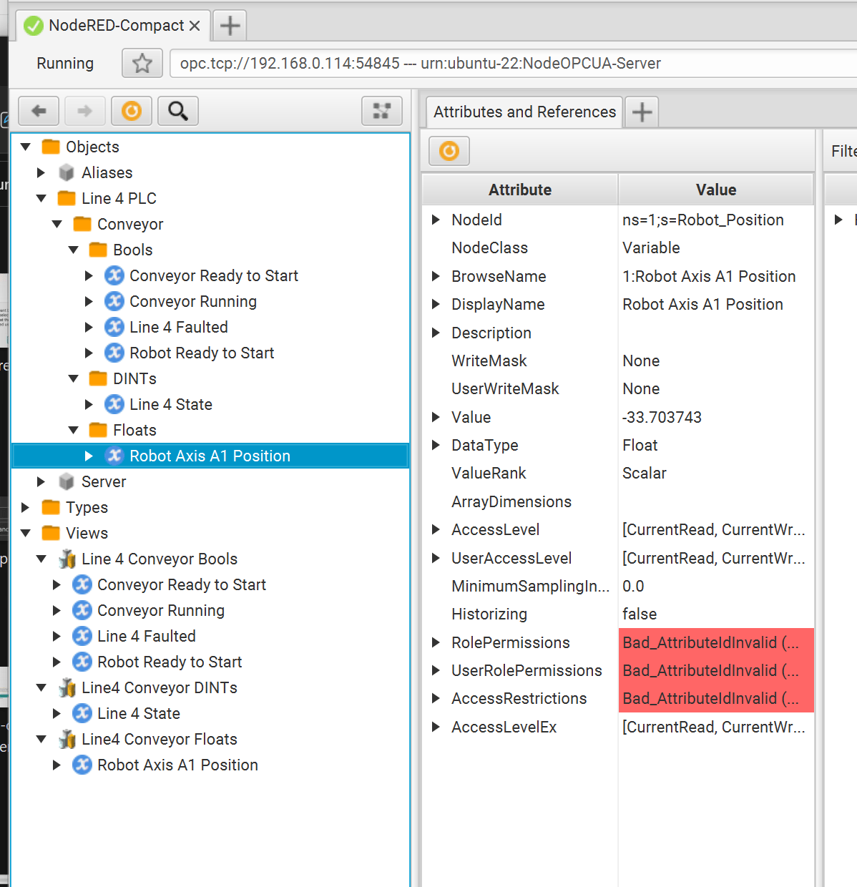

---
eleventyNavigation:
  key: OPC-UA
  parent: "Communication Protocols"
meta:
   title: Building Secure OPC-UA Server in Node-RED.
   description: Learn how to build Build and Deploy a custom OPC UA Server in Node-RED
   keywords: node-red,flowfuse, opc-ua,
image: /node-red/protocol/images/opc-ua-2-title-image.png
---

# {{meta.title}}

OPC-UA (OPC Unified Architecture) is a communication protocol designed for industrial automation. It enables seamless data exchange and interoperability between various devices, systems, and software applications in the industrial domain. OPC-UA offers secure and reliable communication, making it a preferred choice for building robust industrial solutions. In this document, we will delve into the creation of a fully custom secure OPC-UA Server for PLCs in Node-RED.

If you're not familiar with OPC-UA, you can learn more about it [here](/blog/2023/07/how-to-deploy-a-basic-opc-ua-server-in-node-red/).

## Introduction

While it's typical to find PLCs that have built-in OPC-UA server capabilities, such as Omron and Siemens, this is not an industry-wide practice. One notable exception is Allen Bradley PLCs. For Allen Bradley, you have to buy FactoryTalk Linx Gateway (formally RSLinx Enterprise) for OPC-UA Server capability, or you need to employ a 3rd party OPC-UA Server. This documentation will guide you through the process of using Node-RED as a 3rd party OPC-UA Server for Allen Bradley, by creating a custom Information Model for the PLC data, publishing it, then securing the server with SSL to make it production-ready.

## PLC to OPC-UA Server Architecture Overview

A visual representation of our PLC to OPC-UA Server architecture is shown in the drawing below, consisting of 6 major parts.


1. Set up the PLC tags to be sent to the OPC Server
2. Read the PLC tags into Node-RED
3. Copy the PLC tags into Node-RED context memory
4. Program the OPC Server address space
5. Encrypt the OPC Server with SSL
6. Set up the OPC Client  

The PLC is an Allen Bradley, and an instance of Node-RED running on the same OT network as the PLC will act as the OPC UA Server. In our Allen Bradley PLC, we will re-use an example from a [Node-RED as a No-Code EtherNet/IP to S7 Protocol Converter](/blog/2023/06/node-red-as-a-no-code-ethernet_ip-to-s7-protocol-converter/) where the PLC is simulating a conveyor line, called *Line 4 PLC,* depicted as number 1 architecture drawing above. The tags below represent the data to be transferred from the Line 4 PLC to the Node-RED OPC UA server, depicted as number 2 in the architecture drawing.

| **Tag**          | **Data Type** | **Description**               |
| ---------------- | ------------- | ----------------------------- |
| Conveyor_RTS     | BOOL          | Conveyor Ready to Start       |
| Robot_RTS        | BOOL          | Conveyor Robot Ready to Start |
| Robot_Position   | REAL          | Robot Arm position (degrees)  |
| Conveyor_Running | BOOL          | Conveyor is running           |
| Line4_State      | DINT          | Line 4 Machine State          |
| Line4_Fault      | BOOL          | Line 4 is faulted             |

A simple ladder application has been built in the PLC to simulate our conveyor values.


The Line 4 PLC tags will be read by Node-RED using an Ethernet/IP driver, with each PLC tag copied to flow context memory as part of an object named `conveyorData`, depicted in number 3 of the architecture drawing. Using the `node-red-contrib-opcua-server` node, the `conveyorData` object will become part of a hierarchical OPA UA Information Model representing the Line 4 PLC conveyor data, and stored into the *OPC UA Server Address Space,* depicted as number 4 in the architecture drawing. The OPC Server will publish the Line 4 PLC conveyor data, implementing a self-signed SSL certificate to encrypt the OPC traffic and establish a secure connection with an OPC Client application, depicted as number 5 in the architecture drawing.

- note - if you prefer not to secure the server, you can skip this step and still connect to the server anonymously for testing purposes.

The OPC client will be a windows-based [Prosys OPC UA Browser](https://www.prosysopc.com/products/opc-ua-browser/), depicted on the far right as number 6 in our architecture drawing.

Now that we have laid out a concept for our application, let’s build it.

## Install Custom Nodes

First, we need to add three custom nodes that will allow Node-RED to read Ethernet/IP data and add OPC UA Server functionality.

Click the hamburger icon → manage palette


 

On the `install` tab, search for `ethernet` and install the `node-red-contrib-cip-ethernet-ip` node, which will be used to read the Ethernet/IP fieldbus data from our Allen Bradley PLC.


Next, search for `opc` and install `node-red-contrib-opcua` and `node-red-contrib-opc-ua-server`. These nodes take a particularly long time to install, as they require a lot of dependencies. Expect anywhere from 2 to 10 minutes to complete installation, depending on the speed of your system. You will not be able to track the progress of the installation unless you are monitoring the logs on the back-end, so just be patient.


Go to the `Nodes` tab and confirm the 3 custom nodes have been properly installed.


## Set Up Ethernet/IP Data 

Note: this process is largely a recap from the first part of a article where [Node-RED is used as an Ethernet/IP to S7 protocol converter](/blog/2023/06/node-red-as-a-no-code-ethernet_ip-to-s7-protocol-converter/).

Let’s start by dragging a `eth-ip in` node onto the palette. Then add a new endpoint, which will point to our Line4 PLC.


In the endpoint `Connection` properties, the connection information must match the PLC, so set the IP address and CPU slot number appropriately. Also, the default cycle time is 500ms. Depending on your application, polling the CPU at 500ms may be appropriate. But for our OPC UA application, we will change it to 1000ms, which is a more appropriate polling rate for this type of application.


On the `Tags` tab, populate the tag information to match our Allen Bradley PLC. Then select `Update` to complete configuration of the `eth-ip endpoint`.


Now that we have our endpoint, let’s finish configuring the `eth-ip in` node.

1. select the endpoint we just created
2. Change `Mode` To `All tags`
3. Give the node a descriptive name.


As configured, the node is going to read all PLC tags any time a value is changed. Press done to complete the configuration.

Before we deploy this flow, let’s wire a `debug` node to our `eth-ip in` node to confirm Node-RED can read the tags from our PLC.


Deploy the flow.


Click the `debug` tab and confirm data is flowing in from our PLC.


We can see that all tags are being read from the PLC in one message as a key/value hash table, or dict.

After confirming the PLC data acquisition is working, we can remove the `debug` node and continue building the rest of our flow. Referring back to our architecture drawing, we’ve now taken care of the first 2 objectives of our application.


<input type="checkbox" checked> Set up the PLC tags to be sent to the OPC Server<br>
<input type="checkbox" checked> Read the PLC tags into Node-RED<br>

Let’s move on to objective 3.

## Store the PLC Data In Flow Context Memory

Drag a `change` node onto the palette and wire it to the `eth-ip in` node.


We’re going move the data from the PLC into flow context memory, by setting each element of the outgoing `msg.payload` to `flow.conveyorData`. To do this, refer back to the structure of the `msg.payload` from the `debug` node we connected to the `eth-ip in` node earlier - 


Now open up the change node, and press the `+add` button to add a rule for each PLC tag in our `msg.payload` object (6), and `set` each rule so that you're setting a `flow` value to a `msg` value.  Then populate each rule as shown - 


We've now configured the `change` node to move the data from our PLC into a dict called `conveyorData`, stored in flow context memory.

Give the node an appripriate name, hit done and deploy the flow. 

Our flow should now look like below - 


Let’s look at the flow context memory to confirm the data from our PLC is being written to the `conveyorData` object we created.



Every time we hit refresh, the values in `conveyorData` change as the value in the PLC changes, confirming things are working as expected.

Looking back at the application architecture we laid out, we’ve achieved 3 out of the 6 objectives.


<input type="checkbox" checked> Set up the PLC tags to be sent to the OPC Server<br>
<input type="checkbox" checked> Read the PLC tags into Node-RED<br>
<input type="checkbox" checked> Copy the PLC tags into Node-RED context memory<br>

Let’s now tackle the OPC Server address space.

## Program the OPC UA Server Address Space

To make our lives significantly easier, we’re going to start from a template, the same template used in [part 1 of our OPC UA Series](/blog/2023/07/how-to-deploy-a-basic-opc-ua-server-in-node-red/).

Copy the content of the [example template](https://github.com/BiancoRoyal/node-red-contrib-opcua-server/blob/master/examples/server-with-context.json), then paste it into Node-RED to import it.



You end up with a new flow that looks like the one below.


All we care about here is the `Compact-Server` node.  In fact, we’ll just copy that node and paste it into the current flow we’ve been building.  Once we’ve copied the server node into our custom flow, we can discard the example flow.  The whole purpose of this was to simply populate the `address space` of the `Compact-Server` node with template code that will trivialize the programming for our custom application.

Our custom flow should now look something like this.


- note - I’ve added some comments to make the flow even easier to follow.  Similar to commenting code, commenting flows is good practice.

Open up the `Compact-Server` node and jump straight to the address space.  


- note - we won’t go into detail on what the address space actually is in this documentation, or the details of the `Compact-Server` node, as it was covered in [part 1 of this OPC UA series](/blog/2023/07/how-to-deploy-a-basic-opc-ua-server-in-node-red/).  Please read that documentation if you are unfamiliar with it.

There are 4 key things we’ll modify in the address space template code - 

1. Bring in our `conveyorData` context variables 
2. create our custom folder structure
3. define our context variables as OPC UA nodes
4. create custom browser views for our nodes

### Bring in Context Variables

Starting from the section of code where it’s bringing in the context variables defined in the example, delete that code

```javascript 
  this.sandboxFlowContext.set("isoInput1", 0);
  this.setInterval(() => {
    flexServerInternals.sandboxFlowContext.set(
      "isoInput1",
      Math.random() + 50.0
    );
  }, 500);
  this.sandboxFlowContext.set("isoInput2", 0);
 ...
 this.sandboxFlowContext.set("isoOutput8", 0);
```

and replace it with our `conveyorData` context variables.

```javascript 
  this.sandboxFlowContext.set("conveyorData.Conveyor_RTS", false);
  this.sandboxFlowContext.set("conveyorData.Robot_RTS", false);
  this.sandboxFlowContext.set("conveyorData.Robot_Position", 0);
  this.sandboxFlowContext.set("conveyorData.Conveyor_Running", false);
  this.sandboxFlowContext.set("conveyorData.Line4_State", 0);
  this.sandboxFlowContext.set("conveyorData.Line4_Fault", false);
```

### Create Custom Folder Structure

Starting from the section of code where the example folder structure is defined, delete it and replace it with our custom folder structure defined in our architecture - 


Delete the section of code starting from here - 

```javascript 
  const myDevice = namespace.addFolder(rootFolder.objects, {
    "browseName": "RaspberryPI-Zero-WLAN"
  });
  const gpioFolder = namespace.addFolder(myDevice, { "browseName": "GPIO" });
  const isoInputs = namespace.addFolder(gpioFolder, {
    "browseName": "Inputs"
  });
  const isoOutputs = namespace.addFolder(gpioFolder, {
    "browseName": "Outputs"
  });
```

and replace it with the folder structure shown above - 

```javascript 
  const myDevice = namespace.addFolder(rootFolder.objects, {
    "browseName": "Line 4 PLC"
  });
  const conveyorFolder = namespace.addFolder(myDevice, { 
  "browseName": "Conveyor" 
  });
  const conveyorBools = namespace.addFolder(conveyorFolder, {
    "browseName": "Bools"
  });
  const conveyorDINTs = namespace.addFolder(conveyorFolder, {
    "browseName": "DINTs"
  });
  const conveyorFloats = namespace.addFolder(conveyorFolder, {
    "browseName": "Floats"
  });
```

### Define OPC UA Nodes

Now we can construct the nodes for each context variable.


Delete the section of code defining the nodes for `isoInput1` through `isoOutput8`  - 

```javascript 
  const gpioDI1 = namespace.addVariable({
    "organizedBy": isoInputs,
    "browseName": "I1",
    "nodeId": "ns=1;s=Isolated_Input1",
    "dataType": "Double",
    "value": {
    ...
      "set": function(variant) {
        flexServerInternals.sandboxFlowContext.set(
          "isoOutput8",
          parseFloat(variant.value)
        );
        return opcua.StatusCodes.Good;
      }
    }
  });   
```

And replace it with our custom nodes, paying respect to the folder structure we defined in our architecture - 

```javascript 
  // Construct Nodes
  const Conveyor_RTS = namespace.addVariable({
    "organizedBy": conveyorBools,
    "browseName": "Conveyor Ready to Start",
    "nodeId": "ns=1;s=Conveyor_RTS",
    "dataType": "Boolean",
    "value": {
      "get": function () {
        return new Variant({
          "dataType": DataType.Boolean,
          "value": flexServerInternals.sandboxFlowContext.get("conveyorData.Conveyor_RTS")
        });
      },
      "set": function (variant) {
        flexServerInternals.sandboxFlowContext.set(
          "conveyorData.Conveyor_RTS",
          variant.value
        );
        return opcua.StatusCodes.Good;
      }
    }
  });

  const Robot_RTS = namespace.addVariable({
    "organizedBy": conveyorBools,
    "browseName": "Robot Ready to Start",
    "nodeId": "ns=1;s=Robot_RTS",
    "dataType": "Boolean",
    "value": {
      "get": function () {
        return new Variant({
          "dataType": DataType.Boolean,
          "value": flexServerInternals.sandboxFlowContext.get("conveyorData.Robot_RTS")
        });
      },
      "set": function (variant) {
        flexServerInternals.sandboxFlowContext.set(
          "conveyorData.Robot_RTS",
          variant.value
        );
        return opcua.StatusCodes.Good;
      }
    }
  });

  const Conveyor_Running = namespace.addVariable({
    "organizedBy": conveyorBools,
    "browseName": "Conveyor Running",
    "nodeId": "ns=1;s=Conveyor_Running",
    "dataType": "Boolean",
    "value": {
      "get": function () {
        return new Variant({
          "dataType": DataType.Boolean,
          "value": flexServerInternals.sandboxFlowContext.get("conveyorData.Conveyor_Running")
        });
      },
      "set": function (variant) {
        flexServerInternals.sandboxFlowContext.set(
          "conveyorData.Conveyor_Running",
          variant.value
        );
        return opcua.StatusCodes.Good;
      }
    }
  });

  const Line4_Fault = namespace.addVariable({
    "organizedBy": conveyorBools,
    "browseName": "Line 4 Faulted",
    "nodeId": "ns=1;s=Line4_Fault",
    "dataType": "Boolean",
    "value": {
      "get": function () {
        return new Variant({
          "dataType": DataType.Boolean,
          "value": flexServerInternals.sandboxFlowContext.get("conveyorData.Line4_Fault")
        });
      },
      "set": function (variant) {
        flexServerInternals.sandboxFlowContext.set(
          "conveyorData.Line4_Fault",
          variant.value
        );
        return opcua.StatusCodes.Good;
      }
    }
  });

  const Line4_State = namespace.addVariable({
    "organizedBy": conveyorDINTs,
    "browseName": "Line 4 State",
    "nodeId": "ns=1;s=Line4_State",
    "dataType": "Int32",
    "value": {
      "get": function () {
        return new Variant({
          "dataType": DataType.Int32,
          "value": flexServerInternals.sandboxFlowContext.get("conveyorData.Line4_State")
        });
      },
      "set": function (variant) {
        flexServerInternals.sandboxFlowContext.set(
          "conveyorData.Line4_State",
          variant.value
        );
        return opcua.StatusCodes.Good;
      }
    }
  });

  const Robot_Position = namespace.addVariable({
    "organizedBy": conveyorFloats,
    "browseName": "Robot Axis A1 Position",
    "nodeId": "ns=1;s=Robot_Position",
    "dataType": "Float",
    "value": {
      "get": function () {
        return new Variant({
          "dataType": DataType.Float,
          "value": flexServerInternals.sandboxFlowContext.get("conveyorData.Robot_Position")
        });
      },
      "set": function (variant) {
        flexServerInternals.sandboxFlowContext.set(
          "conveyorData.Robot_Position",
          parseFloat(variant.value)
        );
        return opcua.StatusCodes.Good;
      }
    }
  });
```

### Define Browser Views

Last, let’s create some custom views. Delete the code starting from - 

```javascript 
  //------------------------------------------------------------------------------
  // Add a view
  //------------------------------------------------------------------------------
  const viewDI = namespace.addView({
    "organizedBy": rootFolder.views,
    "browseName": "RPIW0-Digital-Ins"
  });
  ...
    viewDO.addReference({
    "referenceType": "Organizes",
    "nodeId": gpioDO8.nodeId
  });
```

And replace with a custom view of your choice.  I’ve defined a view that splits the bools, DINTs, and Reals.

```javascript 
  const viewBools = namespace.addView({
    "organizedBy": rootFolder.views,
    "browseName": "Line 4 Conveyor Bools"
  });

  const viewDINTs = namespace.addView({
    "organizedBy": rootFolder.views,
    "browseName": "Line4 Conveyor DINTs"
  });

  const viewFloats = namespace.addView({
    "organizedBy": rootFolder.views,
    "browseName": "Line4 Conveyor Floats"
  });

  viewBools.addReference({
    "referenceType": "Organizes",
    "nodeId": Conveyor_RTS.nodeId
  });

  viewBools.addReference({
    "referenceType": "Organizes",
    "nodeId": Robot_RTS.nodeId
  });

  viewBools.addReference({
    "referenceType": "Organizes",
    "nodeId": Conveyor_Running.nodeId
  });

  viewBools.addReference({
    "referenceType": "Organizes",
    "nodeId": Line4_Fault.nodeId
  });


  viewDINTs.addReference({
    "referenceType": "Organizes",
    "nodeId": Line4_State.nodeId
  });

  viewFloats.addReference({
    "referenceType": "Organizes",
    "nodeId": Robot_Position.nodeId
  });
```

We’ve now completed the address space, so all that’s left is to define the OPC UA endpoint.

## Wrap Up Server Configuration

Go to the discovery tab and define an endpoint following the convention below, with the ip address matching the ip address of your Node-RED instance.


Now, our OPC UA Server is set up and ready to be browsable by an OPC UA Client.

Deploy the changes and make sure the `Compact-Server` is reporting `active`.  


If not, go back and check your code for errors.  The Node-RED logfiles will come in handy to track down issues if your server isn’t activating.

This wraps up the 4th objective of our application.


<input type="checkbox" checked> Set up the PLC tags to be sent to the OPC Server<br>
<input type="checkbox" checked> Read the PLC tags into Node-RED<br>
<input type="checkbox" checked> Copy the PLC tags into Node-RED context memory<br>
<input type="checkbox" checked> Program the OPC Server address space<br>

## Security (Optional)

At this point, our OPC UA Server will accept a client connection, but it won’t be secure, so we should take the extra step and encrypt our OPC UA traffic.

To do this, go to the `Security` tab of the `Compact-Server` properties.


By default, the server is using no security, and allowing anonymous connections.  Let’s fix that by unchecking `Allow Anonymous` , and checking `Use invididual Certificate Files`. 


The node gives us some clues on how we can populate this section.  When `node-red-contrib-opcua-server` was installed, it created self-signed ssl certificates that are bound to our host system.  Let’s make use of them. 

navigate to `./node-red-contrib-opcua-server/certificates` directory, where the node-red instance has installed the Node-RED module. 

- I have Node-RED installed in the root path of my server, so my full path to the certs folder is `/root/.node-red/node_modules/node-red-contrib-opcua-server/certificates`
- If you’re having trouble finding the directory, do a search for the file `server_selfsigned_cert_2048.pem`.  

Once you’ve navigated to the correct directory, it should be full of various cert files.


The two cert files we care about, which were already pre-defined in the node, are `server_selfsigned_cert_2048.pem`, which is the public cert file, and `server_key_2048.pem`, which is the private cert file.

Go back to the node configuration and populate the `Security` tab with the *full absolute path* to the files.


Hit done and redeploy the node.  Make sure the server reports `active`.  If not, check the cert paths and try again.  

You may also run into file permission issues, depending on how you set up your Node-RED instance, so make sure Node-RED also has read access to the files.

We’re not done yet.  The server is happy, but the OPC Client will need access to these cert files as well.  So copy the files to a location that will make the two cert files accessible to the OPC Client.  In my case, the OPC Client is being ran on a personal Windows machine on the same network.  So I copied the cert files to a nas, which both my Node-RED instance and my Windows machine have access to.


Now we can move on to OPC Client Configuration.  We’ve achieved 5 out of 6 objectives.


<input type="checkbox" checked> Set up the PLC tags to be sent to the OPC Server<br>
<input type="checkbox" checked> Read the PLC tags into Node-RED<br>
<input type="checkbox" checked> Copy the PLC tags into Node-RED context memory<br>
<input type="checkbox" checked> Program the OPC Server address space<br>
<input type="checkbox" checked> Encrypt the OPC Server with SSL<br>

## OPC UA Client Configuration and Testing


To connect to our Node-RED OPC server, enter the endpoint url and press “connect to server”.


Security settings are displayed.

We’re going to select `Sign & Encrypt` and change the security policy to `Aes128Sha256RsaOaep`


When we try to connect, our connection to the server is rejected, because we haven’t pointed the client to our ssl cert files.  Press Okay to acknowledge the error and we can fix that problem.


When you acknowledge the connection error, you are taken to the `User Authentication` properties.  Select `Certificate and Private key`.  We need to point to our certificate and private key files.


When we browse for our certificate file, the client software tells us it’s expecting a `*.der` file, which we don’t have yet.  


However, we can create one from our existing cert file using `openssl`.  

If you don’t already have openssl installed, [install it](https://www.openssl.org/).  

Then from a command prompt, run the following command in the directory where your client-side cert files are stored - 

``` 
openssl x509 -in server_selfsigned_cert_2048.pem -out server_selfsigned_cert_2048.der -outform DER
```


This command will generate the .der file the opc client is expecting to see.  


Now we can go back and point to the public key file, which is the `server_selfsigned_cert_2048.der` file, and the private key file, which is the `server_key_2048.pem` file.


The first time you do this, you will be asked to accept the server certificate. 


If you choose accept permanently, you won’t see this prompt again.  You should now have access to browse the OPC Server.

As can be seen, our OPC Client sees the data from our PLC matching our OPC Information Model we defined in our Node-RED server address space.


We’ve now achieved all of our design objectives.


<input type="checkbox" checked> Set up the PLC tags to be sent to the OPC Server<br>
<input type="checkbox" checked> Read the PLC tags into Node-RED<br>
<input type="checkbox" checked> Copy the PLC tags into Node-RED context memory<br>
<input type="checkbox" checked> Program the OPC Server address space<br>
<input type="checkbox" checked> Encrypt the OPC Server with SSL<br>
<input type="checkbox" checked> Set up the OPC Client<br>

Our custom OPC UA application is complete and production-ready.

Test the application by confirming values changed in the PLC are reflected in the OPC UA Client.

In my PLC code, I created a sine wave generator that changes the `Robot Axis A1 Position` value continuously, so the value is always changing, making it easy to confirm that the server is passing OPC traffic correctly.


In this documentation, we covered in detail how to create an OPC UA application that pulls data from an Allen Bradley PLC over Ethernet/IP, store the PLC data in Node-RED context memory, then publish the PLC data from context memory onto a ssl secured OPC UA Server.  An OPC Client can subscribe to the OPC UA Server over an encrypted connection, making the application deployable in a production environment, including in the cloud if desired.  

With the foundation laid in this documentation, you can customize the application to fit your individual needs, with an understanding of what is going on “under the hood” of an OPC UA Server.  This application only scratches the surface of what features OPC UA has available.  Refer to the [NodeOPCUA sdk](https://node-opcua.github.io/) and experiment by building on top of this example if you desire to learn more or want to add features this application is lacking.

In the next documentation of the OPC UA series, we will establish how to create an OPC UA Client application in Node-RED.

Source code for flow used in this documentation - 


[{"id":"2e8c7f5c.ab73d","type":"tab","label":"OPC-UA Custom Context Server","disabled":false,"info":""},{"id":"38ce10de.7d8c","type":"opcua-compact-server","z":"2e8c7f5c.ab73d","port":"54845","endpoint":"","productUri":"","acceptExternalCommands":true,"maxAllowedSessionNumber":"10","maxConnectionsPerEndpoint":"10","maxAllowedSubscriptionNumber":"100","alternateHostname":"","name":"","showStatusActivities":false,"showErrors":true,"allowAnonymous":false,"individualCerts":true,"isAuditing":false,"serverDiscovery":true,"users":[],"xmlsetsOPCUA":[],"publicCertificateFile":"/root/.node-red/node_modules/node-red-contrib-opcua-server/certificates/server_selfsigned_cert_2048.pem","privateCertificateFile":"/root/.node-red/node_modules/node-red-contrib-opcua-server/certificates/server_key_2048.pem","registerServerMethod":"1","discoveryServerEndpointUrl":"opc.tcp://192.168.0.114:54845","capabilitiesForMDNS":"","maxNodesPerRead":1000,"maxNodesPerWrite":1000,"maxNodesPerHistoryReadData":100,"maxNodesPerBrowse":3000,"maxBrowseContinuationPoints":"10","maxHistoryContinuationPoints":"10","delayToInit":"1000","delayToClose":"200","serverShutdownTimeout":"100","addressSpaceScript":"function constructAlarmAddressSpace(server, addressSpace, eventObjects, done) {\n  // server = the created node-opcua server\n  // addressSpace = address space of the node-opcua server\n  // eventObjects = add event variables here to hold them in memory from this script\n\n  // internal sandbox objects are:\n  // node = the compact server node,\n  // coreServer = core compact server object for debug and access to NodeOPCUA\n  // this.sandboxNodeContext = node context node-red\n  // this.sandboxFlowContext = flow context node-red\n  // this.sandboxGlobalContext = global context node-red\n  // this.sandboxEnv = env variables\n  // timeout and interval functions as expected from nodejs\n\n  const opcua = coreServer.choreCompact.opcua;\n  const LocalizedText = opcua.LocalizedText;\n  const namespace = addressSpace.getOwnNamespace();\n\n  const Variant = opcua.Variant;\n  const DataType = opcua.DataType;\n  const DataValue = opcua.DataValue;\n\n  var flexServerInternals = this;\n\n  this.sandboxFlowContext.set(\"conveyorData.Conveyor_RTS\", false);\n  this.sandboxFlowContext.set(\"conveyorData.Robot_RTS\", false);\n  this.sandboxFlowContext.set(\"conveyorData.Robot_Position\", 0);\n  this.sandboxFlowContext.set(\"conveyorData.Conveyor_Running\", false);\n  this.sandboxFlowContext.set(\"conveyorData.Line4_State\", 0);\n  this.sandboxFlowContext.set(\"conveyorData.Line4_Fault\", false);\n\n  // this.sandboxFlowContext.set(\"isoInput1\", 0);\n  // this.setInterval(() => {\n  //   flexServerInternals.sandboxFlowContext.set(\n  //     \"isoInput1\",\n  //     Math.random() + 50.0\n  //   );\n  // }, 500);\n  // this.sandboxFlowContext.set(\"isoInput2\", 0);\n  // this.sandboxFlowContext.set(\"isoInput3\", 0);\n  // this.sandboxFlowContext.set(\"isoInput4\", 0);\n  // this.sandboxFlowContext.set(\"isoInput5\", 0);\n  // this.sandboxFlowContext.set(\"isoInput6\", 0);\n  // this.sandboxFlowContext.set(\"isoInput7\", 0);\n  // this.sandboxFlowContext.set(\"isoInput8\", 0);\n  // this.sandboxFlowContext.set(\"isoOutput1\", 0);\n  // this.setInterval(() => {\n  //   flexServerInternals.sandboxFlowContext.set(\n  //     \"isoOutput1\",\n  //     Math.random() + 10.0\n  //   );\n  // }, 500);\n\n  // this.sandboxFlowContext.set(\"isoOutput2\", 0);\n  // this.sandboxFlowContext.set(\"isoOutput3\", 0);\n  // this.sandboxFlowContext.set(\"isoOutput4\", 0);\n  // this.sandboxFlowContext.set(\"isoOutput5\", 0);\n  // this.sandboxFlowContext.set(\"isoOutput6\", 0);\n  // this.sandboxFlowContext.set(\"isoOutput7\", 0);\n  // this.sandboxFlowContext.set(\"isoOutput8\", 0);\n\n  coreServer.debugLog(\"init dynamic address space\");\n  const rootFolder = addressSpace.findNode(\"RootFolder\");\n\n  node.warn(\"construct new address space for OPC UA\");\n\n  const myDevice = namespace.addFolder(rootFolder.objects, {\n    \"browseName\": \"Line 4 PLC\"\n  });\n  const conveyorFolder = namespace.addFolder(myDevice, { \"browseName\": \"Conveyor\" });\n  const conveyorBools = namespace.addFolder(conveyorFolder, {\n    \"browseName\": \"Bools\"\n  });\n  const conveyorDINTs = namespace.addFolder(conveyorFolder, {\n    \"browseName\": \"DINTs\"\n  });\n  const conveyorFloats = namespace.addFolder(conveyorFolder, {\n    \"browseName\": \"Floats\"\n  });\n\n  // Construct Nodes\n  const Conveyor_RTS = namespace.addVariable({\n    \"organizedBy\": conveyorBools,\n    \"browseName\": \"Conveyor Ready to Start\",\n    \"nodeId\": \"ns=1;s=Conveyor_RTS\",\n    \"dataType\": \"Boolean\",\n    \"value\": {\n      \"get\": function () {\n        return new Variant({\n          \"dataType\": DataType.Boolean,\n          \"value\": flexServerInternals.sandboxFlowContext.get(\"conveyorData.Conveyor_RTS\")\n        });\n      },\n      \"set\": function (variant) {\n        flexServerInternals.sandboxFlowContext.set(\n          \"conveyorData.Conveyor_RTS\",\n          variant.value\n        );\n        return opcua.StatusCodes.Good;\n      }\n    }\n  });\n\n  const Robot_RTS = namespace.addVariable({\n    \"organizedBy\": conveyorBools,\n    \"browseName\": \"Robot Ready to Start\",\n    \"nodeId\": \"ns=1;s=Robot_RTS\",\n    \"dataType\": \"Boolean\",\n    \"value\": {\n      \"get\": function () {\n        return new Variant({\n          \"dataType\": DataType.Boolean,\n          \"value\": flexServerInternals.sandboxFlowContext.get(\"conveyorData.Robot_RTS\")\n        });\n      },\n      \"set\": function (variant) {\n        flexServerInternals.sandboxFlowContext.set(\n          \"conveyorData.Robot_RTS\",\n          variant.value\n        );\n        return opcua.StatusCodes.Good;\n      }\n    }\n  });\n\n  const Conveyor_Running = namespace.addVariable({\n    \"organizedBy\": conveyorBools,\n    \"browseName\": \"Conveyor Running\",\n    \"nodeId\": \"ns=1;s=Conveyor_Running\",\n    \"dataType\": \"Boolean\",\n    \"value\": {\n      \"get\": function () {\n        return new Variant({\n          \"dataType\": DataType.Boolean,\n          \"value\": flexServerInternals.sandboxFlowContext.get(\"conveyorData.Conveyor_Running\")\n        });\n      },\n      \"set\": function (variant) {\n        flexServerInternals.sandboxFlowContext.set(\n          \"conveyorData.Conveyor_Running\",\n          variant.value\n        );\n        return opcua.StatusCodes.Good;\n      }\n    }\n  });\n\n  const Line4_Fault = namespace.addVariable({\n    \"organizedBy\": conveyorBools,\n    \"browseName\": \"Line 4 Faulted\",\n    \"nodeId\": \"ns=1;s=Line4_Fault\",\n    \"dataType\": \"Boolean\",\n    \"value\": {\n      \"get\": function () {\n        return new Variant({\n          \"dataType\": DataType.Boolean,\n          \"value\": flexServerInternals.sandboxFlowContext.get(\"conveyorData.Line4_Fault\")\n        });\n      },\n      \"set\": function (variant) {\n        flexServerInternals.sandboxFlowContext.set(\n          \"conveyorData.Line4_Fault\",\n          variant.value\n        );\n        return opcua.StatusCodes.Good;\n      }\n    }\n  });\n\n  const Line4_State = namespace.addVariable({\n    \"organizedBy\": conveyorDINTs,\n    \"browseName\": \"Line 4 State\",\n    \"nodeId\": \"ns=1;s=Line4_State\",\n    \"dataType\": \"Int32\",\n    \"value\": {\n      \"get\": function () {\n        return new Variant({\n          \"dataType\": DataType.Int32,\n          \"value\": flexServerInternals.sandboxFlowContext.get(\"conveyorData.Line4_State\")\n        });\n      },\n      \"set\": function (variant) {\n        flexServerInternals.sandboxFlowContext.set(\n          \"conveyorData.Line4_State\",\n          variant.value\n        );\n        return opcua.StatusCodes.Good;\n      }\n    }\n  });\n\n  const Robot_Position = namespace.addVariable({\n    \"organizedBy\": conveyorFloats,\n    \"browseName\": \"Robot Axis A1 Position\",\n    \"nodeId\": \"ns=1;s=Robot_Position\",\n    \"dataType\": \"Float\",\n    \"value\": {\n      \"get\": function () {\n        return new Variant({\n          \"dataType\": DataType.Float,\n          \"value\": flexServerInternals.sandboxFlowContext.get(\"conveyorData.Robot_Position\")\n        });\n      },\n      \"set\": function (variant) {\n        flexServerInternals.sandboxFlowContext.set(\n          \"conveyorData.Robot_Position\",\n          parseFloat(variant.value)\n        );\n        return opcua.StatusCodes.Good;\n      }\n    }\n  });\n\n  //------------------------------------------------------------------------------\n  // Add a view\n  //------------------------------------------------------------------------------\n  const viewBools = namespace.addView({\n    \"organizedBy\": rootFolder.views,\n    \"browseName\": \"Line 4 Conveyor Bools\"\n  });\n\n  const viewDINTs = namespace.addView({\n    \"organizedBy\": rootFolder.views,\n    \"browseName\": \"Line4 Conveyor DINTs\"\n  });\n\n  const viewFloats = namespace.addView({\n    \"organizedBy\": rootFolder.views,\n    \"browseName\": \"Line4 Conveyor Floats\"\n  });\n\n  viewBools.addReference({\n    \"referenceType\": \"Organizes\",\n    \"nodeId\": Conveyor_RTS.nodeId\n  });\n\n  viewBools.addReference({\n    \"referenceType\": \"Organizes\",\n    \"nodeId\": Robot_RTS.nodeId\n  });\n\n  viewBools.addReference({\n    \"referenceType\": \"Organizes\",\n    \"nodeId\": Conveyor_Running.nodeId\n  });\n\n  viewBools.addReference({\n    \"referenceType\": \"Organizes\",\n    \"nodeId\": Line4_Fault.nodeId\n  });\n\n\n  viewDINTs.addReference({\n    \"referenceType\": \"Organizes\",\n    \"nodeId\": Line4_State.nodeId\n  });\n\n  viewFloats.addReference({\n    \"referenceType\": \"Organizes\",\n    \"nodeId\": Robot_Position.nodeId\n  });\n  coreServer.debugLog(\"create dynamic address space done\");\n  node.warn(\"construction of new address space for OPC UA done\");\n\n  done();\n}\n","x":960,"y":600,"wires":[]},{"id":"7ae89f134415c51e","type":"eth-ip in","z":"2e8c7f5c.ab73d","endpoint":"f012042b75173b77","mode":"all","variable":"","program":"","name":"Read Line4 Conveyor tags","x":150,"y":600,"wires":[["0c51f44baa08a3b2"]]},{"id":"a0592280baea975b","type":"comment","z":"2e8c7f5c.ab73d","name":"read data from PLC & store in conveyorData context flow memory","info":"","x":350,"y":540,"wires":[]},{"id":"b411a5ce4749fa61","type":"comment","z":"2e8c7f5c.ab73d","name":"Secure OPC UA Server Publishing PLC conveyorData","info":"","x":980,"y":540,"wires":[]},{"id":"0c51f44baa08a3b2","type":"change","z":"2e8c7f5c.ab73d","name":"store PLC Data in flow context memory","rules":[{"t":"set","p":"conveyorData.Conveyor_RTS","pt":"flow","to":"payload.Conveyor_RTS","tot":"msg"},{"t":"set","p":"conveyorData.Conveyor_Running","pt":"flow","to":"payload.Conveyor_Running","tot":"msg"},{"t":"set","p":"conveyorData.Line4_Fault","pt":"flow","to":"payload.Line4_Fault","tot":"msg"},{"t":"set","p":"conveyorData.Line4_State","pt":"flow","to":"payload.Line4_State","tot":"msg"},{"t":"set","p":"conveyorData.Robot_Position","pt":"flow","to":"payload.Robot_Position","tot":"msg"},{"t":"set","p":"conveyorData.Robot_RTS","pt":"flow","to":"payload.Robot_RTS","tot":"msg"}],"action":"","property":"","from":"","to":"","reg":false,"x":530,"y":600,"wires":[[]]},{"id":"f012042b75173b77","type":"eth-ip endpoint","address":"192.168.0.5","slot":"0","cycletime":"1000","name":"Line 4 PLC","vartable":{"":{"Conveyor_RTS":{"type":"BOOL"},"Conveyor_Running":{"type":"BOOL"},"Line4_Fault":{"type":"BOOL"},"Line4_State":{"type":"DINT"},"Robot_Position":{"type":"REAL"},"Robot_RTS":{"type":"BOOL"}}}}]

