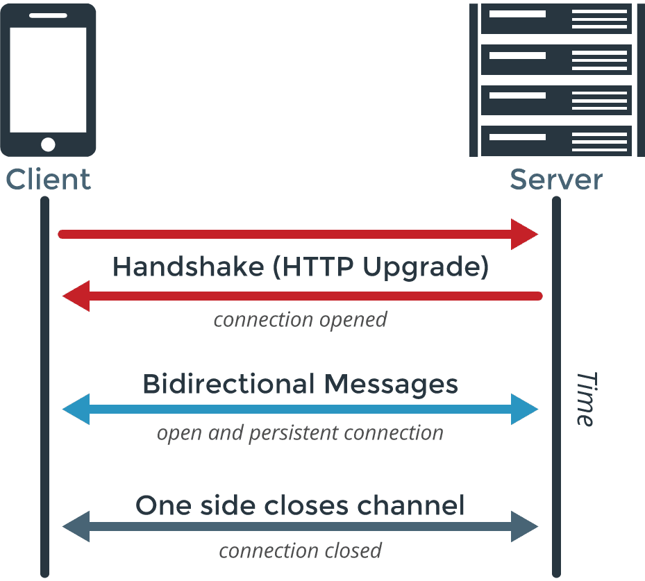

---
eleventyNavigation:
  key: Websocket
  parent: "Communication Protocols"
meta:
   title: Using Websocket with Node-RED
   description: 
   keywords: node-red websocket, websocket in node-red, websocket node-red
image: 
---

# {{meta.title}}

This guide covers WebSocket communication in Node-RED. You'll learn how to connect as a client and set up your own WebSocket server.

## What is Websocket?

WebSocket enables real-time, bidirectional communication between clients (web browsers, IoT devices, etc.) and servers. Think of it as keeping a phone line open instead of hanging up and calling back for every message.

Traditional HTTP works like sending letters back and forth - each request needs its own connection. WebSocket keeps a single connection alive, letting both sides send messages whenever they need to. This makes it ideal for applications that need instant data exchange.

## How Does WebSocket Work?

{data-zoomable}
_WebSocket connection establishment process_

WebSocket establishes a persistent connection between a client (such as a web browser or IoT device) and a server. The process begins when the client sends an initial HTTP request to the server, indicating a desire to upgrade to a WebSocket connection. If the server supports WebSocket, it responds with a confirmation, and the connection is established.

Once the connection is open, both the client and server can send messages to each other at any time. This two-way communication allows for real-time data exchange without the need to re-establish connections for each message. When the communication is no longer needed, either party can close the connection.

## Using Websocket with Node-RED 

This document will explain how to communicate as both a server and a client using WebSocket in Node-RED. Practical examples will be provided to help you follow along, ensuring a comprehensive understanding of the concepts.

## Understanding Servers and Clients in WebSocket Context

In the context of WebSocket communication:

- **WebSocket Server:** The WebSocket server is a application (such as a web browser or IoT device) that listens for incoming WebSocket connection requests from clients. It manages these connections and facilitates the exchange of messages in real time. The server can handle multiple clients simultaneously, allowing for concurrent communication.

- **WebSocket Client:** The WebSocket client is the application (such as a web browser or IoT device) that initiates the connection to the WebSocket server. It sends requests to establish a WebSocket connection and can send and receive messages at any time once the connection is active.

## Building a WebSocket Server in Node-RED and Communicating with Clients

Before creating the server, it's important to understand that we will need to listen for incoming messages as well as send messages. Let’s first create the server to listen for connections.

### Building the WebSocket Server to Listen

1. Drag the **WebSocket In** node onto the canvas.
2. Double-click the node and select the type as "Listen On."
3. Click on the "+" icon to add the WebSocket configuration.
4. Enter the path you want to listen on as the server (e.g., `/ws/listen`).
5. Choose whether you want to send and receive the entire message or only `msg.payload`.
6. Drag a **Debug** node onto the canvas and connect it to the WebSocket In node. This will allow you to see incoming messages in the debug window.

**Note**: By default, the payload will contain the data sent over or received from the WebSocket. If configured to send the entire message, the object will be in JSON string format.

### Making the Server Able to Send Data to Clients

1. Drag the **Inject** node onto the canvas. This node will be used to send example data, but you can use any other data source node that you wish.
2. Drag the **WebSocket Out** node onto the canvas. Double-click it and set the type to "Listen On."
3. In the URL field, select the configuration you added while building the server in the previous section.
4. Click the **Deploy** button to activate your flow.

### Testing the WebSocket Server

{data-zoomable}
_Testing the WebSocket server with a Websocket client_

Now that you have deployed the Node-RED flow, it is acting as a server that can both send and receive data. To test the server, you can use the [Simple WebSocket Client](https://chromewebstore.google.com/detail/simple-websocket-client/pfdhoblngboilpfeibdedpjgfnlcodoo?hl=en) extension in your browser. Make sure to install this extension if you want to test the server.

1. In the extension interface, enter the URL to connect to your server:
   - For a deployed server: `wss://<instance-name>/ws/listen`
   - For a local server: `ws://localhost:1880/ws/listen` (Note: Use `ws` for unencrypted connections and `wss` for encrypted connections.)
2. Click the **Open** button to connect to the server. Once connected, you should see the status change to "opened."
3. In the request field, enter the message you want to send to the server and click **Send**. You will see the message printed in the debug window of Node-RED.
4. To send a message from websocket server created in Node-RED to the client, click the **Inject** button with `msg.payload` set to the data you want to send. In the extension interface, you will see the sent data in the message log.

With these steps, you will have successfully set up a WebSocket server in Node-RED and tested its functionality as both a server and client. This setup allows for real-time communication, which is essential for many applications.

### Sending Data from Node-RED

To send a message from Node-RED to the client, click the **Inject** button with `msg.payload` set to the data you want to send. In the extension interface, you will see the sent data in the message log.

## Connecting to a WebSocket Server as a client in Node-RED and communicating

Now, as the section states, we are going to see how you can connect to the WebSocket server as the client. To move further, ensure that you have a server to connect to, which you can create as shown in the above section in Node-RED.

### Connecting to the WebSocket Server for Incoming Messages

1. Drag the **WebSocket In** node onto the canvas.
2. Double-click on it and select the type as "Connect To."
3. Click on the "+" icon to add the WebSocket configuration.
4. Enter the WebSocket server URL you want to connect to.
5. Select 'payload' in the Send/Receive.
6. Drag the **Debug** node onto the canvas and connect it to the WebSocket In node.

### Making the Client Able to Send Messages

1. Drag the **Inject** node onto the canvas. This node will be used to send example data.
2. Drag the **WebSocket Out** node onto the canvas. Double-click it and set the type to "Connect To."
3. In the URL field, select the configuration you added while connecting to the server for listening to incoming messages.
4. Click the **Deploy** button.

### Testing the WebSocket Client

{data-zoomable}
_Testing Websocket Client with Websocket Server_

Now, to test the client, you can send messages from the server and see the debug window for that message in the client instance. Similarly, you can send messages from the client Instance to the server and observe the responses in the debug window of server instance.

For more information on the advaced websocket node configuration refer to the [Websocket Node Documentation](/node-red/core-nodes/websocket/)