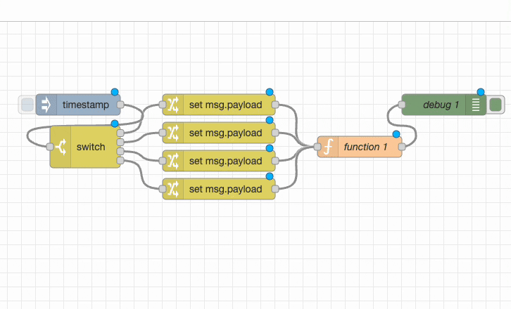
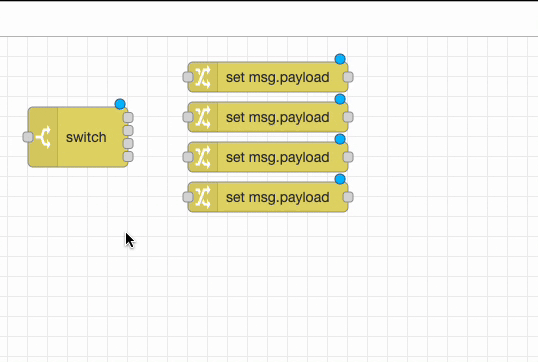

# {{ meta.title }}

There is usually more than one way to complete a given task in software and Node-RED is no exception. In this blog post we are going to share three useful tips to save yourself time when working on your flows.

### 1. Use control+left-click to search your nodes

Sometimes it's quicker to search for a node using its name rather than scrolling through the palette. Simply hold control then left-click to bring up a searchable list.

### 2. Split sections of your code using the link nodes

If you want to separate your flow into two distinct sections, link nodes are a great way to format your work. As we covered in our blog on [Node-RED best practices](/blog/2022/12/node-red-flow-best-practice), the combination of link nodes and grouped flows is very powerful.

To split your flow select the input and output nodes then right click, select 'Show Action List' and then type 'split'. Select 'Split wire with link nodes'.

### 3. Link multiple inputs and outputs in one command

Once a switch node has several outputs it can be slow to manually wire each to the new node. Using the action menu (right click), select 'Show Action List' then 'Wire Node to Multiple' this option will join everything up in one step.

We hope you found these tips useful, if you'd like to suggest some of your own tips which you think we should share in our future blog posts please [get in touch](mailto:contact@flowfuse.com).
