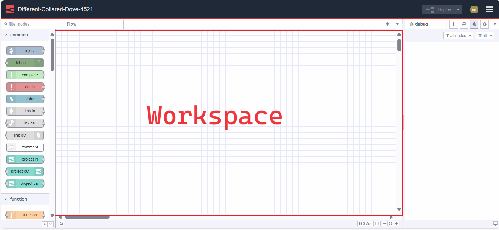
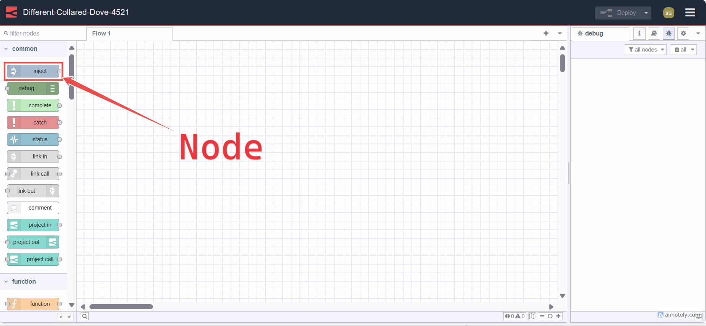
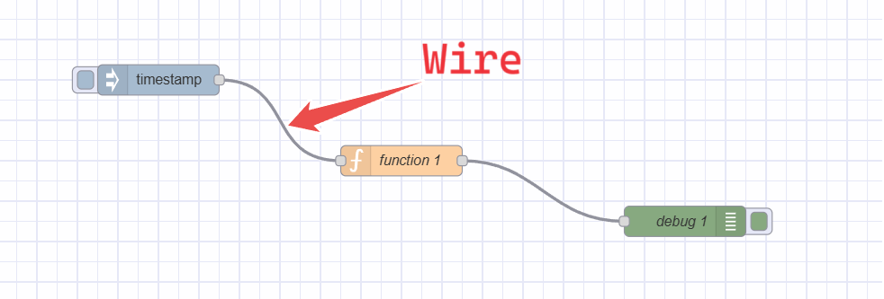
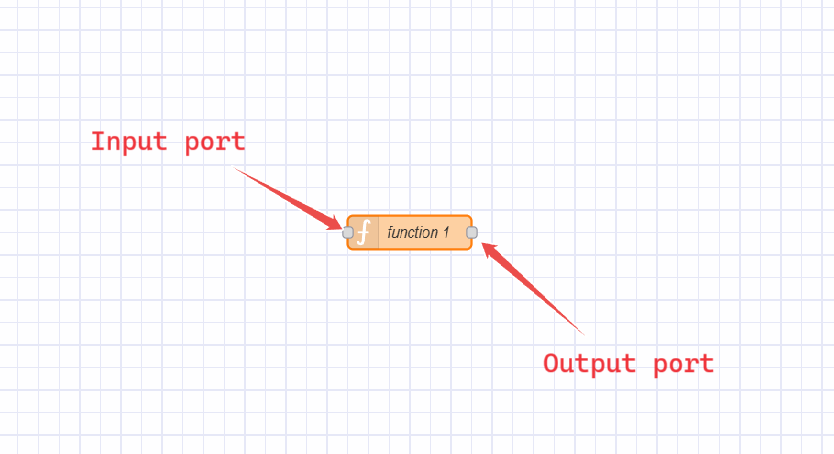
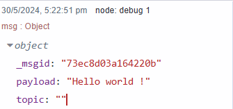
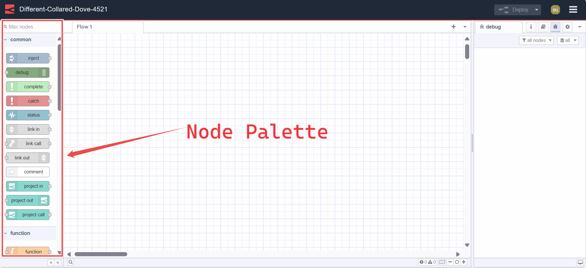
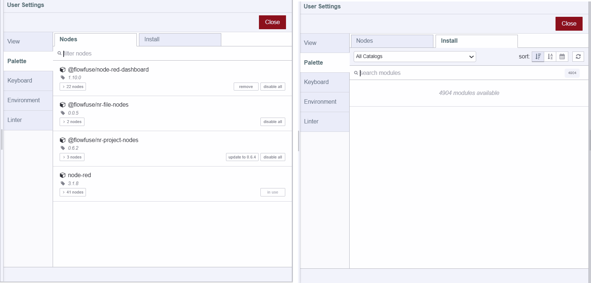
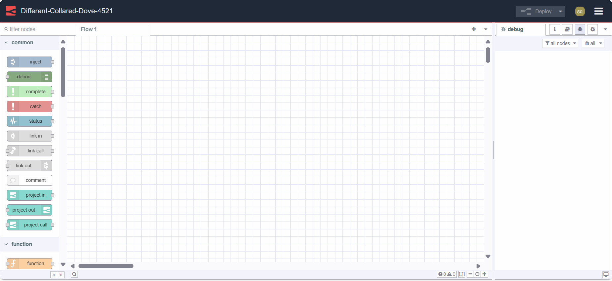

## Node-RED Terminology

This documentation is designed to help you understand the key terms and concepts used within the Node-RED community. Having a standardized vocabulary ensures clarity and consistency in our communications.

1. **Flow:**
   A flow is represented as a tab within the editor workspace which provides a new workspace for building applications by connecting nodes. The term "flow" is also used to informally describe a single set of connected nodes. So a flow (tab) can contain multiple flows (sets of connected nodes), but formally we can say a flow is a parent group of multiple connected nodes.
   
   {data-zoomable}

2. **Subflow:**
   A subflow in Node-RED is a collection of nodes that are collapsed into a single node in the workspace. It allows you to group a set of nodes together into a reusable unit. This helps in organizing flows, promoting reusability, and simplifying complex flow designs by encapsulating multiple nodes into a single, higher-level node representation.
   
   {data-zoomable}

3. **Workspace:**
   The workspace is where flows (groups of nodes) are developed by dragging nodes from the palette and wiring them together. Adding a new flow tab gives you a new workspace.
   
   {data-zoomable}

4. **Node:**
   A Node is a fundamental building block used to create flows. Each node represents a distinct piece of functionality or a specific action that can be performed within a flow. These nodes can be third-party additions using the palette manager or core nodes.
   
   {data-zoomable}

5. **Core-Node:**
   The core nodes are the set of nodes that are included with the Node-RED runtime by default, without the need for a node installation procedure. For more information on core nodes, refer to the [Core node docs](/node-red/core-node/).

6. **Wires:**
   The "wires" refer to the connections that link nodes together to define the flow of data. These wires visually represent the direction and flow of information from one node to another within a Node-RED flow.

 {data-zoomable}

7. **Input and Output ports:**
    Nodes in Node-RED have input and output ports represented by small  circles on the left (input) and right (output) sides of the node. These ports indicate where data enters or exits the node. This allows you to connect different nodes via wires.
   
   {data-zoomable}

8. **Message:**
   A message is essentially a JavaScript object that carries data between nodes within a flow. This message contains both the main data payload and additional metadata, allowing nodes to communicate and process information effectively.
   
   {data-zoomable}

9. **Payload:**
   The primary property within a message. This is the default property that most nodes will work with. This property holds the main data that nodes in the flow process and manipulate.

10. **Context:**
   Context refers to a storage mechanism that allows nodes to store data between invocations. It provides a way for nodes to share data within the same instance or flow, across different flows in Node-RED. For more information on Context, refer to the [Understanding Node, Flow, Global, and Environment Variables in Node-RED](/blog/2024/05/understanding-node-flow-global-environment-variables-in-node-red/).

11. **Function Node:**
    The Function node in Node-RED allows you to write custom JavaScript functions to process and manipulate messages within your flows.

12. **Node Palette:**
    The palette is a sidebar containing all of the nodes that are installed and available to use.
    
    {data-zoomable}

13. **Palette Manager:**
    The Palette Manager in Node-RED is a tool that allows users to manage the nodes available for use in their Node-RED instance. It provides a graphical interface for searching, installing third-party nodes using Node Package Manager from the palette. Additionally, it shows all installed nodes and allows users to update and uninstall them if needed. Installed nodes get automatically added to the Node Palette for easy access and use in flows.
    
    {data-zoomable}

14. **Node Package Manager (npm):**
    npm is a command-line tool used to manage additional nodes and their dependencies in Node-RED. It allows users to install, update, and remove nodes that are contributed or added by Node-RED community members.

15. **Editor:**
    The editor in Node-RED is the graphical interface where you create and manage flows. It includes all the components: workspace, palette for nodes, tabs for organizing flows, and a sidebar for configuration and deployment.

{data-zoomable}

16. **Instance**: In Node-RED, an instance refers to a running environment of the Node-RED runtime, which handles flows and node interactions.

17. **Node-RED Dashboard:**
    Node-RED Dashboard is a collection of nodes and UI components that allow you to create web-based dashboards in Node-RED. It provides widgets like buttons, charts, gauges, and text boxes to display and interact with data from your flows in real-time, for more information refer to the [Node-RED Dashboard 2.0 official documentation](https://dashboard.flowfuse.com/).

18. **Deploying Flow** Deploying a flow in Node-RED means making your flow changes active in the runtime environment. It's done by clicking the "Deploy" button in the editor, activating nodes to process data or execute tasks defined in the flow.

{data-zoomable}

19. **Importing, Exporting, Grouping Flows:**
    Flows can be imported, exported, and grouped in Node-RED, which allows you to share your flows with others or import flows created by others. Flows are exported in JSON format and commonly named `flow.json`. Grouping flows allows you to organize related flows together for better management and sharing. This feature facilitates collaboration and sharing of Node-RED projects among the community. For more information, refer to [Importing, Exporting, and Grouping Flows](/blog/2023/03/3-quick-node-red-tips-5/).

