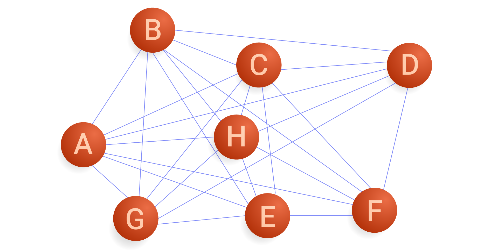

Data is the lifeblood of manufacturing innovation in the rapidly evolving landscape of Industry 4.0. Yet, traditional systems often struggle with data silos and rigid point-to-point integrations, making it difficult for businesses to adapt to new demands. The Unified Namespace (UNS) offers a game-changing solution: a centralised hub for seamless data exchange, decoupling data producers and consumers to unlock unparalleled flexibility and scalability.

This whitepaper introduces the Unified Namespace (UNS) as the cornerstone of modern industrial data management. By adopting UNS, manufacturers can simplify data architecture, foster innovation, and future-proof their operations. FlowFuse, a low-code platform purpose-built for industrial applications, accelerates this transformation. Its intuitive interface and native support for MQTT brokers empower organisations to adopt UNS efficiently and iteratively.

Whether you’re starting small or looking to scale, get actionable insights and best practices for adopting UNS with FlowFuse. Discover how to harness the power of UNS to drive efficiency, innovation, and growth in the era of Industry 4.0

## Why Decoupling Matters for Modern Manufacturing

Imagine two machines in a factory that are tightly connected. One cuts metal pieces and the other welds them together. They're set up to work perfectly in sync: the cutter makes a specific shape, and the welder is programmed to join those exact shapes. Now, what if you want to change the shape of the metal pieces? With tightly coupled machines, you'd have to reprogram both. Adjusting the cutter is easy, but the welder might need recalibrations. It's like two pieces of a puzzle that fit perfectly, but if one changes, the other becomes useless.

This is similar to tight coupling in software. When systems are tightly coupled, they depend heavily on each other's specific details. Making changes in one part often leads to a cascade of problems in other parts. It's like a domino effect, making the whole system rigid and difficult to adapt. In contrast, loosely coupled systems are more like building blocks. You can change or replace one block without affecting the others too much.

The UNS brings decades of learnings from the computer sciences into industrial applications, chief among which is the loose coupling of data producers and consumers. Decoupling allows producers and consumers to operate independently. New data sources or consumers can be added or removed without disruptions to operating systems. This flexibility is essential in dynamic manufacturing environments where systems evolve, by adding new use cases like AI or changing software vendors.

## Transitioning to the UNS

Extracting tightly coupled data producers and consumers for a UNS is a process that involves decoupling applications that directly communicate with each other and instead routing their data through the UNS. This is often an iterative process because of the complexities of untangling these dependencies.

The process starts with the identification of tightly coupled components, like services, SaaS applications, or enterprise data applications. A simple whiteboard exercise can quickly identify data that, when made accessible through UNS, can be used to improve existing applications and create new ones. On a technical level, point-to-point data connections or shared files are generally good places to start.

An adapter is likely needed when transitioning point-to-point connections to the Pub/Sub model of the UNS. At FlowFuse we believe Node-RED is the best middleware available, though any middleware that can communicate effectively on the original protocol and UNS should work. To ensure a smooth transition, maintain the original connection while migrating data to the UNS. Once the new system is fully operational, you can safely remove the original connections.

{data-zoomable}{class="max-w-lg mx-auto"}
_Point to point vs. Pub/Sub model_

Migrating the first connection to the UNS is a noble exercise, though it will likely have little business value. Value is unlocked for the business as more data becomes available to the UNS. Continuing the transition iteratively will unlock exponential benefits. It is a process that will need continuous investment.

## Adopting the UNS in a few easy steps

### Step 1: Analyse your edge, select your broker

Choosing the right broker is crucial when constructing your first UNS. This decision should be heavily influenced by your existing Edge infrastructure. Consider the specific devices and protocols already deployed at the edge - your broker must seamlessly communicate with them.

Furthermore, evaluate the integration requirements of your SaaS solutions, such as Manufacturing Execution Systems (MES) or Enterprise Resource Planning (ERP) systems. These systems often rely on real-time data from the edge, so your broker must facilitate smooth data exchange between these layers.

Finally, your Human-Machine Interface (HMI) plays a vital role. The UNS broker should enable seamless integration with the HMI, allowing operators to visualise and interact with data from various sources in a unified manner. Ensuring compatibility and efficient communication between your chosen broker and the HMI platform is essential for a successful UNS implementation.

FlowFuse reduces the complexity of this critical decision. **FlowFuse can act as an adaptive layer, abstracting the complexities of different brokers and providing a standardized interface to various Edge devices and SaaS systems**. This allows for greater flexibility and reduces the dependence on a specific broker's capabilities. In such cases, FlowFuse often recommends MQTT as the UNS broker, citing its widespread adoption and mature ecosystem. It's worth noting that FlowFuse even includes a UNS-ready MQTT broker, further simplifying the implementation process.

### Step 2: Define a topic hierarchy

When events occur they’ll need digitalisation and publishing to the broker. The digital representation of such events is pushed to a topic. The topic is a forward slash (`/`) delimited string that can and should be used to provide context on the data being published. A well-structured topic hierarchy in a central broker, such as MQTT or Kafka, provides clarity on how the data is used and where it originates from.

The most commonly adopted standard to define the topic hierarchy follows the ISA-95 standard – in short it follows the physical structure of the operations. A high-level example is as below:

{data-zoomable}{class="max-w-lg mx-auto"}
_ISA-95 Equipment Hierarchy Model_

#### Understanding ISA-95

The ISA-95 standard provides a framework for integrating enterprise and control systems. It defines a hierarchical model consisting of five levels:
- **Level 0:** Process sensors and actuators
- **Level 1:** Basic control
- **Level 2:** Supervisory control
- **Level 3:** Manufacturing operations management
- **Level 4:** Business planning and logistics

By mirroring the ISA-95 model in the broker's topic structure, organizations can create a clear and efficient semantic structure that provides the stakeholders leveraging the published data the required context of received data. Here's a breakdown of how to map each level:

**Level 0 and 1: Device-Level Topics**

Each device or control loop should have its own topic. For instance, `/plant1/line1/machine1/temperature` or `/plant1/line1/valve1/status`. These topics are ideal for real-time monitoring, allowing for quick responses to changes in operational conditions.

**Level 2: Supervisory Control Topics**

Topics at this level aggregate data from lower levels for supervisory control and visualization. Examples include `/plant1/line1/overview` or `/plant1/line1/alarms`. This level can also incorporate topics for storing aggregated data for analysis and reporting one might query from historians or other data sources. For monitoring analytics to be published, one might publish these back on a machine level: `/plant1/line1/machine1/status`.

**Level 3: Manufacturing Operations Management Topics**

These topics focus on production processes and workflows. Examples include `/plant1/production/orders`, `/plant1/production/` batches, or `/plant1/quality/metrics`. This level facilitates coordination between different production units and enables higher-level decision-making.

**Level 4: Business Planning and Logistics Topics**

Topics at this level provide an enterprise-wide view of operations, integrating data from lower levels. These generally do longer fit the physical representation of operations and are expected to publish back on the topics on lower levels they influence directly like `/plant1/line1/workorders`.

**Level X: Enterprise wide digital Topic**

When the data sources are strictly digital, e.g. a SaaS product that’s shared among many sites or the whole organization, events might not fit in the structure listed above. These products generally have a digital location though, and it’s generally a good idea to inverse their URL (the digital location) as top level topic, for example: `/com.netsuite.system/`.

This organization of your topics creates a hierarchical structure that mirrors the physical plant layout, making it easy to understand and navigate. It also can be extended to accommodate new equipment and processes. Lastly, though likely most important, it facilitates integration with different systems and applications across the enterprise.

#### How Wildcards Influence Topic Hierarchy Design

When designing an MQTT topic hierarchy, it's essential to consider how wildcards will be used to subscribe to multiple topics simultaneously. Subscriptions on multiple topics are useful when aggregating data from multiple sites or resembling machines for roll-up analysis.

Two types of wildcards exist: the single-level wildcard (+), representing a single level in a topic hierarchy, and the multi-level wildcard (#), representing multiple levels. These wildcards enable subscribers to express interest in a range of topics, and more dynamic analytics are made possible through them.

The single-level wildcard replaces one level in a topic. Say the takt-time of multiple machines in one line should be subscribed to, `/plant1/line2/+/takt-time` would include these metrics. By using two single-level wildcards the whole plant can be understood `/plant1/+/+/takt-time`.

Multi-level wildcards allow for dynamic subscriptions to multiple levels. If all metrics for plant 1 are required, that would be /plant1/# and the subscriber would receive all topics under `/plant1`, including `/plant1/line1/temperature`, `/plant1/line1/pressure`, and `/plant1/line2/machine1/status`.

When choosing a broker other than MQTT, investigate what wildcards are available and how the data will be subscribed to for efficient scaling of your UNS.

### Step 3: Creating a Dedicated Development Environment within your UNS

The concept of a `/dev` topic prefix within a UNS system can be introduced for development purposes. In the realm of software development, the ability to experiment freely while closely simulating real-world conditions is invaluable. The proposed `/dev` topic prefix within the UNS structure aims to provide precisely this kind of sandbox environment. This would be designed to mirror the actual hierarchical structure of the enterprise's UNS, so developers could create, organize, and manipulate topics and data within `/dev` in a way that closely resembles the production environment. It would be a space where developers have the freedom to experiment without the fear of impacting live data or disrupting critical processes. This freedom encourages innovation and allows for the testing of new ideas and approaches. While providing a safe space for experimentation, the `/dev` environment would still adhere to the core principles and rules of the UNS. This ensures that the experience within `/dev` is as close as possible to the real-world conditions of the production environment.

The `/dev` space has many potential use cases. For example, developers could use it to rapidly prototype new features or applications, testing their functionality and integration within a simulated UNS environment. Additionally, new data schemas, message formats, or communication patterns could be thoroughly tested within `/dev` before being deployed to the production environment. The `/dev` space could also serve as a training ground for new developers, allowing them to familiarize themselves with the UNS structure and practices in a safe and controlled environment. Finally, developers could replicate issues encountered in the production environment within `/dev` to isolate the cause of problems and test potential solutions.

While the `/dev` space has many advantages, there are also important considerations to keep in mind. For example, while mirroring the production environment, the `/dev` space should be adequately isolated to prevent any unintended consequences or data leakage. Clear guidelines should be established for the management of data within the `/dev` space, including data retention policies and mechanisms for cleaning up test data. Additionally, access to the `/dev` environment should be carefully managed to ensure that only authorized personnel can use it for development purposes. The introduction of a `/dev` topic prefix within the UNS holds the potential to significantly enhance the development experience. By providing a safe, flexible, and realistic environment for experimentation, it empowers developers to innovate, test, and refine their solutions with confidence. However, it is important to remember that the `/dev` space is a powerful tool for development, and it should be used responsibly and in accordance with established best practices.

### Step 4: Start with a small UNS, and expand iteratively

Imagine a typical ISA-95 environment where you have various systems communicating with each other: a Level 2 SCADA system talking to a Level 3 Manufacturing Execution System (MES), and perhaps a separate historian collecting data from various sources. Traditionally, these systems would have point-to-point connections, leading to a complex web of integrations. For example, the SCADA system might use OPC UA to send data to the MES, while a separate MQTT connection feeds the historian. This approach can be difficult to manage, especially as the number of systems grows.

_Point-to-point connection_

With a UNS and FlowFuse, you can simplify this architecture significantly. The UNS acts as a central hub for all data and events. Instead of direct connections, each system connects to the FlowFuse broker, which manages the data distribution. Think of it like a universal translator for your factory floor. Now, the SCADA system publishes its tag data (e.g., temperature, pressure) to the UNS. The MES, subscribed to those same tags, receives the data in real time without needing to know the specifics of the SCADA system. Similarly, the historian can subscribe to any data point within the UNS, eliminating the need for separate connections.

{data-zoomable}{class="max-w-lg mx-auto"}
_Unified Namespace_

To implement your first connection, you'll need to install a FlowFuse agent on the edge to capture data on their native protocol and convert it first into a message to soon be sent to the broker. How this message is constructed depends on the producing protocol. Before sending the message it’s strongly recommended to add the context of the data. The physical location of the generated message is captured in the topic hierarchy and need not be added. However, units of measurement or data transformations applied might need to be contextualized. For example, if the data comes in at 100hz (every 10ms) and messages are sent at 5hz (every 200ms) it’s wise to add details about how this transformation is achieved. Add a timestamp if you’re sending just the last message, or add the average as a value and the number of values as context. Then you can publish your message using a standardized topic hierarchy.

On the other side of the point-to-point connection, a topic should be subscribed to, replacing the previous connection in place. The advantages are unlocked as soon as the second subscriber starts using the new data.

## When not to use your UNS

While the UNS architecture offers significant advantages for IIoT applications by simplifying data access and sharing, certain situations warrant alternative approaches:

1. **Latency Sensitivity:** UNS may introduce unacceptable delays for real-time systems requiring immediate responses, such as industrial automation where split-second decisions are crucial. Dedicated, low-latency solutions are preferable in these cases.

2. **Large Files and Binary Data:** UNS is optimized for small, text-based messages.  Transferring large files like images or videos can lead to inefficiencies and increased overhead.  Storing such data externally and sharing location references through UNS is more effective.

3. **Data Security and Access Control:** While UNS promotes connectivity, integrating sensitive data like customer information requires careful consideration.  Techniques like anonymization, hashing, and topic-based authentication are crucial to protect confidential data and comply with privacy regulations.

## Conclusion

We explored the crucial role of decoupling in modern manufacturing and how a UNS facilitates this transition. By providing a central hub for data exchange, UNS breaks down data silos and enables greater flexibility, scalability, and efficiency.

FlowFuse emerges as an ideal platform for simplifying UNS adoption. Its ability to abstract broker complexities, streamline data integration, and standardise interfaces empowers businesses to unlock the full potential of their industrial data. With FlowFuse, building a robust and future-proof UNS becomes a manageable and iterative process, paving the way for innovation and growth in the era of Industry 4.0.

## _Ready to transform your industrial data strategy?_

We’re happy to schedule a consultation with one of our experts to explore how UNS and FlowFuse can revolutionise your manufacturing operations. Our team will provide tailored insights, address your specific challenges, and guide you through the implementation process. Take the first step towards decoupling your data producers and consumers for greater flexibility, scalability, and innovation. [Click here](https://flowfuse.com/book-demo/) to book your consultation today and unlock the full potential of Industry 4.0 for your business.
